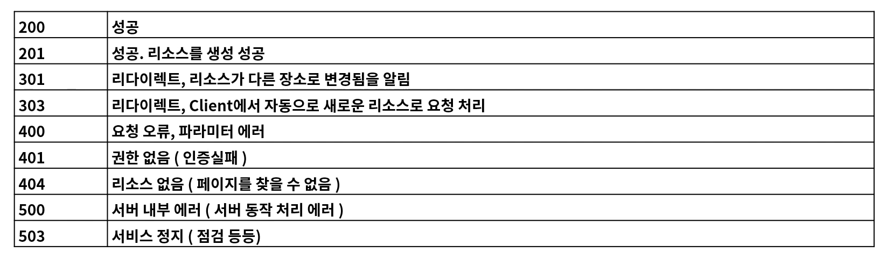
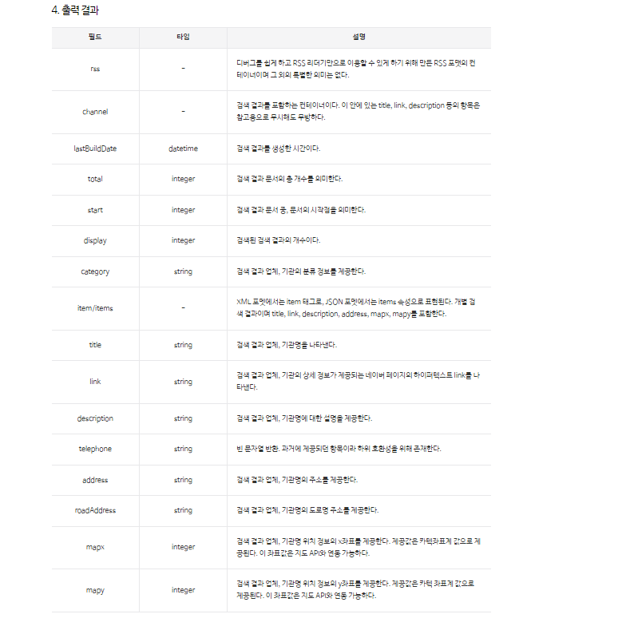
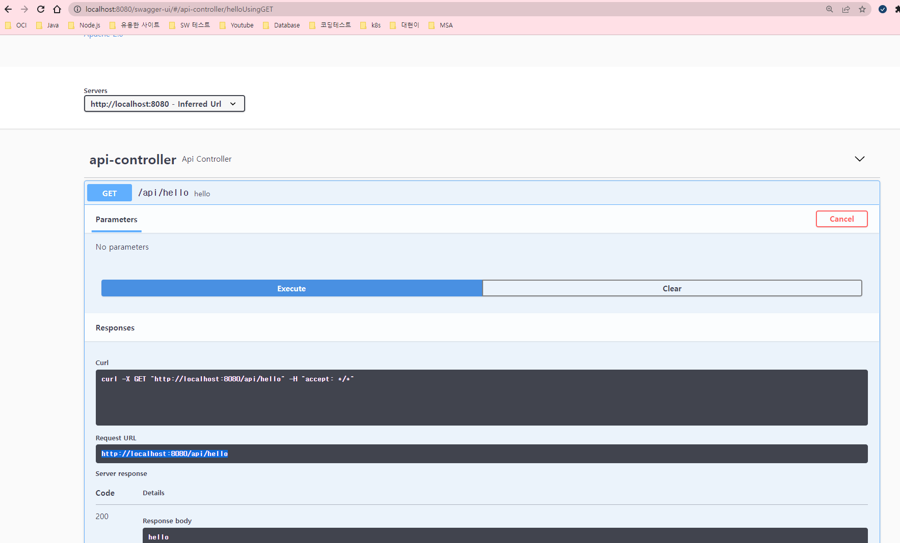

# IntelliJ 단축키 팁
- 코드 자동완성: ``Ctrl + Shift``
- 어플리케이션 실행
  - XXXApplication 클래스 선택 후, ``Ctrl + Shift + F10``
  - 다음 부터는 Run 시, ``Shift + F10``, Debug 시, ``Shift + F9``
- Code Generate for Constructor, Getter, Setter, toString etc: ``Alt + Ins``
- Settings 창 띄우기: ``Ctrl + Alt + s``
# IntelliJ 설정 팁
- 한글 관련 설정
  - IDE Encoding 관련
    - File > Settings (Ctrl + Alt + S) > Editor > File Encodings
    - Global Encoding, Project Encoding, Default encoding for properties files를 ``UTF-8`` 선택
  - 실행 시, ``Run``창의 한글이 깨지는 문제 해결 법
    - Help > Find Action (Ctrl+Shift+A)
    - ``custom vm``을 검색하고 [Edit Custom VM Options...] 클릭
    - ``-Dfile.encoding=UTF-8`` 추가
  - IntelliJ Restart 

출처: https://treasurebear.tistory.com/55 [나를 남기다]  
# Web 개발 개론
- World Wide Web, WWW, W3은 인터넷에 연결된 컴퓨터를 통해 사람들이 정보를 공유할 수 있는 전 세계적인 정보 공간
## Web의 기본 3가지 요소
- URI: Uniform Resource Identifier
  - 리소스 식별자
  - 특정 사이트
  - 특정 쇼핑 목록
  - 동영상 목록
  - 모든 정보에 접근할 수 있는 정보
- HTTP: Hypertext Transfer Protocol
  - Application Control
  - GET
  - POST
  - PUT
  - DELETE
  - OPTIONS
  - HEAD
  - TRACE
  - CONNECT
- HTML: Hyper Text Markup Language
 - 하이퍼 미디어 포맷
 - XML을 바탕으로 한 범용 문서 포맷
 - Chrome, Safari, Explorer에서 사용자가 알아보기 쉬운 형태로 표현
## REST
- **Representational State Transfer**의 약자
  - 자원의 상태 전달
### Rest의 특징  
- Client, Server
  - 클라이언트와 서버가 서로 독립적으로 분리되어 있어야 함
- Stateless
  - 요청에 대해서 클라이언트의 상태를 서버에 저장하지 않음
- Cache
  - 클라이언트는 서버의 응답을 Cache(임시저장) 할 수 있어야 함
  - 클라이언트가 Cache를 통해서 응답을 재사용할 수 있어야 함
  - 이를 통해 서버의 부하를 낮춤
- 계층화 (Layered System)    
  - 서버와 클라이언트 사이에 방화벽, 게이트웨이, Proxy 등 다양한 계층 형태로 구성이 가능해야 하며, 이를 확장할 수 있어야 함
- 인터페이스 일관성
  - 인터페이스의 일관성을 지키고, 아커텍처를 단순화시켜 작은 단위로 분리하여 클라이언트 서버가 독립적으로 개선 될 수 있어야 함
- Code on Demand (Optional)
  - 자바 애플릿, 자바스크립트, 플래시 등 특정한 기능을 서버로부터 클라이언트가 전달 받아 코드를 실행할 수 있어야 함
### REST를 잘 사용했는지 판단할 수 있는 근거
- 아래의 4가지 근거를 잘 갖춘 경우 **Restful**하다고 표현  
- 근거 01: 자원의 식별
  - 웹 기반의 REST에서는 리소스 접근을 할 때 URI를 사용
    - ``https://foo.co.kr/user/100``
    - Resource: user, 식별자: 100
- 근거 02: 메시지를 통한 리소스 조작
  - Web에서는 다양한 방식으로 데이터를 전달
    - 그 중에서 HTML, XML, JSON, TEXT 등이 있음
    - HTTP Header 부분에 content-type를 통해서 데이터 타입을 지정
  - 리소스 조작을 위해서 데이터 전체를 전달하지 않고, 메시지로 전달
    - 예: DB의 전화번호가 number라는 이름을 사용하다가, phone_number으로 변경되도 메시지에는 변경이 없어야 함
- 근거 03: 자기 서술적 메시지
  - 요청하는 데이터가 어떻게 처리되어져야 하는지 메시지에 포함
  - HTTP 기반의 REST는 HTTP Method와 Header 정보, URI의 포함되는 정보로 표현
    - GET: https://foo.co.kr/user/100, 사용자 정보 요청
    - POST: https://foo.co.kr/user, 사용자 정보 생성
    - PUT: https://foo.co.kr/user, 사용자 정보 생성 및 수정
    - DELETE: https://foo.co.kr/user/100, 사용자 정보 삭제
- 근거 04: Application 상태에 대한 엔진으로써 하이퍼미디어
  - 단순히 Client 요청에 대한 데이터만 응답해 주는 것이 아닌 관련된 리소스에 대한 Link 정보까지 같이 포함되어야 함
## URI 설계 패턴
- URI (Uniform Resource Identifier)
  - 인터넷에서 특정 자원을 나타내는 주소 값. 해당 값은 유일
  - 요청: https://www.fastcampus.co.kr/resource/sample/1
  - 응답: fastcampus.pdf, fastcampus.docx
- URL (Uniform Resource Locator)
  - 인터넷 상에서의 자원, 특정 파일이 어디에 위치하는지 식별하는 주소
  - 요청: https://www.fastcampus.co.kr/fastcampus.pdf
- URL은 URI의 하위 개념
### URI 설계 원칙 (RFC-3986)
- 슬래시 구분자(/)는 계층 관계를 나타내는데 사용
  - ``https://fastcampus.co.kr/classes/java/curriculums/web-master``
- URI 마지막 문자로 슬래시(/)는 포함하지 않음
  - ``https://fastcampus.co.kr/classes/java/curriculums/web-master/`` (X)
- 하이픈(-)은 URI 가독성을 높이는 데 사용
  - ``https://fastcampus.co.kr/classes/java/curriculums/web-master`` (O)
- 밑줄(_)은 사용하지 않음
  - ``https://fastcampus.co.kr/classes/java/curriculums/web_master`` (X)
- URI 경로에는 소문자가 적합
  - ``https://fastcampus.co.kr/classes/JAVA/curriculums/web-master``(X)
  - ``https://fastcampus.co.kr/classes/java/curriculums/web-master``(O)
- 파일 확장자는 URI에 포함하지 않음
  - ``https://fastcampus.co.kr/classes/java/curriculums/web-master.jsp``(X)
- 프로그래밍 언어에 의존적인 확장자를 사용하지 않음 (*.do)
  - ``https://fastcampus.co.kr/classes/java/curriculums/web-master.do``(X)
- 구현에 의존적인 경로를 사용하지 않음 (servlet)
  - ``https://fastcampus.co.kr/servlet/classes/java/curriculums/web-master``(X)
- 세션 ID를 포함하지 않음 (보안 이슈)
  - ``https://fastcampus.co.kr/classes/java/curriculums/web-master?session-id=abcdef``(X)
- 프로그래밍 언어의 Method 명을 이용하지 않음 (intro)
  - ``https://fastcampus.co.kr/classes/java/curriculums/web-master?action=intro`` (X)
- 명사에 단수형 보다는 복수형을 사용해야 함
  - 컬렉션에 대한 표현은 복수로 사용 (classes, curriculums)
  - ``https://fastcampus.co.kr/classes/java/curriculums/web-master`` (O)            
- controller 이름으로는 동사나 동사구를 사용
  - ``https://fastcampus.co.kr/classes/java/curriculums/web-master/re-order`` (O)
- 경로 부분 중, 변하는 부분은 유일한 값으로 대체 (Path Variable)
  - ``.../curriculums/web-master/lessons/{lesson-id}/users/{user-id}``
  - ``.../curriculums/web-master/lessons/2/users/100``
- CRUD 기능을 나타내는 것은 URI에 사용하지 않음
  - GET: ``.../curriculums/web-master/lessons/2/users/100/READ`` (X)
  - DELETE: ``.../curriculums/web-master/lessons/2/users/100`` (O)
- URI Query Parameter 디자인
  - URI 쿼리 부분으로 컬렉션 결과에 대해서 필터링할 수 있음
  - ``.../curriculums/web-master?chapter=2`` (O)
- URI 쿼리는 컬렉션 결과를 페이지로 구분하여 나타내는데 사용
  - ``.../curriculums/web-master?chapter=2&page=0&size=10&sort=asc`` (O)
- API에 있어서 서브 도메인은 일관성 있게 사용해야 한다
  - 도메인이 ``https://fastcampus.co.kr``인 경우, open api는 아래처럼 사용
    - ``https://api.fastcampus.co.kr``
    - ``https://api-fastcampus.co.kr``
- 클라이언트 개발자 포탈 서브 도메인은 일관성 있게 만듬
  - ``https://dev-fastcampus.co.kr``
  - ``https://developer-fastcampus.co.kr``
## HTTP Protocol
- HTTP(Hyper Text Transfer Protocol)로 RFC 2616에서 규정된 Web에서 데이터를 주고 받는 프로토콜
- 이름에는 하이퍼텍스트 전송용 프로토콜로 정의되어 있지만, 실제로는 HTML, XML, JSON, Image, Voice, Video, JavaScript, PDF등 다양한 컴퓨터에서 다룰 수 있는 것은 모두 전송할 수 있음
- HTTP는 TCP를 기반으로 한 REST의 특징을 모두 구현하고 있는 Web기반의 프로토콜
- HTTP는 메시지를 주고(Request) 받는(Response) 형태의 통신 방법

- HTTP 요청을 처리하는 8가지 Method (멱등성: 여러 번 요청해도 동일한 응답)

- HTTP Status Code: 응답의 상태를 나타내는 코드


# Spring Boot 시작하기
## Spring Boot 개념
- Spring Boot helps you to create ``stand-alone, production-grade Spring-based Applications`` that you can run. We take an optionated view of the Spring platform and third-party libraries, so that you can get started with minimum fuss. Most Sping Boot applications need ``very little Spring configuration``.
- You can use Spring Boot to create Java applications that can be started by using ``java -jar`` or more traditional war deployments. We also provide a command line tool that runs "spring scripts".
- Our primary goals are:
  - Provide a radically faster and widely accessible getting-started experience for all Spring development.
  - Be opinionated out of the box but get out of the way quickly as requirements start to diverge from the defaults.
  - Provide a range of non-functional features that are common to large classes of projects (such as embedded servers, security, metrics, health checks, and externalized configuration).
  - Absolutely no code generation and no requirement for XML configuration.
- https://docs.spring.io/spring-boot/docs/2.1.x/reference/html/getting-started-introducing-spring-boot.html
- Spring Boot는 단순히 실행되며, 프로덕션 제품 수준의 스프링 기반 어플리케이션을 쉽게 만들 수 있음
- Spring Boot 어플리케이션에는 Spring 구성이 거의 필요하지 않음
- ``Spring Boot java -jar로 실행하는 Java 어플리케이션``을 만들 수 있음 (tomcat를 내장)
- 주요 장점들
  - 어플리케이션 개발에 필수 요소들만을 모아 둠
  - 간단한 설정으로 개발 및 커스텀이 가능
  - 간단하고, 빠르게 어플리케이션 실행 및 배포가 가능
  - 대규모 프로젝트에 공통적인 비 기능적 기능도 제공 (보안, 모니터링 등등)
  - Spring에서 사용했던 불편한 설정들이 사라짐 (XML 설정 -> Annotation기반으로 구성 가능)
  - Spring 개발에 대해 빠르고, 광범위하게 적용할 수 있는 환경
  - 오랜 경험에서 나오는 안정적인 운영이 가능
- Build Tool (선택가능)

- Servlet Containers (선택가능)

- 스프링 프로젝트 생성 방법 (Spring Initializer - https://start.spring.io)

  - 프로젝트 생성 후, 다운로드 받아서 IntelliJ에서 Import하면 됨
## Spring Boot Library Dependency
- 사용자가 Spring Boot 라이브러리에 대해서 버전을 명시하면, 의존성이 있는 다른 라이브러리들은 알아서 필요한 버전을 다운로드 함
  ```groovy
  plugins {
      id 'org.springframework.boot' version '2.6.7'
      id 'io.spring.dependency-management' version '1.0.11.RELEASE'
      id 'java'
  }

  group = 'com.example'
  version = '0.0.1-SNAPSHOT'
  sourceCompatibility = '11'

  repositories {
      mavenCentral()
  }

  dependencies {
      implementation 'org.springframework.boot:spring-boot-starter-web'
      testImplementation 'org.springframework.boot:spring-boot-starter-test'
  }

  tasks.named('test') {
      useJUnitPlatform()
  }
  ```
- Spring Boot 라이브러리와 다른 라이브러리간의 의존성을 확인하는 방법 
  - ``https://spring.io/`` 에 접속 > ``Projects`` > ``Spring Boot`` > ``LEARN`` > ``Documentation`` > 특정 버전의 ``Reference Doc`` 선택 > ``Dependency Versions`` 선택

## Hello World API를 만들어 보기
### Rest Client 설치하기
- Chrome Web Store > 스토어 검색 > rest api client
  - ``Talend API Tester - Free Edition`` 설치
  - 설치 후, 화면 우측에 ``확장 프로그램`` 아이콘에서 해당 프로그램 선택
### SpringBoot Project 생성하기
- ``https://start.spring.io/``에 접속하기

  - Gradle Project 선택
  - SpringBoot 2.6.7 선택
  - Artifact에 "hello"를 입력
  - Packaging에 Jar를 선택
  - Java Version에 ``11``을 선택
  - Add Dependencies
    - Spring Web 선택
  - Generate 선택 후, 생성된 zip 파일을 다운로드
    - 압축을 푼 후, ``D:\Workspace\springboot\practices\hello``로 복사
  - ``D:\Workspace\springboot\practices\hello`` 폴더에서 ``build.gradle`` 파일을 IntelliJ로 Open
    - IntellJ 우측 하단의 ``Show all``을 클릭하면, 현재 진행되는 상황을 볼 수 있음
    - IntellJ 우측 상단의 ``Gradle``을 클릭하면, Jar 파일들의 Dependency들을 확인 가능
      - 새로운 Jar를 추가했을 때, 새로고침 버튼을 눌러 ``Reload All Gradle Projects``를 수행할 수 있음
  - ``src > main > java > com.example.hello > HelloApplication``을 선택 후, 실행
  - 만약 서버의 Port를 변경하고 싶다면?
    - ``src > main > resources > application.properties``에서 ``server.port=9090``을 입력
- Controller 클래스 작성
  - ``com.example.hello`` 아래에 ``controller`` 패키지 생성
  - 해당 패키지에서 새로운 클래스 ``ApiController`` 생성
  - 클래스명 위에 ``@RestController`` Annotation을 추가해서 Bean으로 등록
  - 클래스명 위에 ``@RequestMapping("/api")`` Annotation을 추가해서 URL을 맵핑시킴
  - ``hello()`` 메소드를 작성하고, ``@GetMapping("/hello")``을 통해 Get Method와 URL을 명시
    - 해당 메소드는 ``http://localhost:9090/api/hello`` URL에 맵핑
```java
package com.example.hello.controller;

import org.springframework.web.bind.annotation.GetMapping;
import org.springframework.web.bind.annotation.RequestMapping;
import org.springframework.web.bind.annotation.RestController;

@RestController
@RequestMapping("/api")
public class ApiController {
    @GetMapping("/hello")
    public String hello() {
        return "hello spring boot!";
    }
}
```
- Talend API Tester로 테스트
    
  - 왼쪽 하단의 ``+ Project``를 클릭하여 새로운 프로젝트 생성
  - ``Add a request``를 이용해서 새로운 Request 생성: Request 명을 지정
  - ``Open a request``를 이용해서 해당 Request를 Open 
  - Method를 선택한 후, URI를 입력해서 Send해서 결과값을 확인
  - 서버에서 결과값을 문자열로 Return
    - Response Header의 Content-type이 ``Content-Type:	text/plain;charset=UTF-8``
## GET API

- Annotation
  - ``@GetMapping("/hello")``: ``@GetMapping(path = "/hello")``와 동일
  - ``@RequestMapping(path = "/hello", method = RequestMethod.GET)``: RequestMapping은 모든 메소드(GET, POST, PUT, DELETE, PATCH, HEAD...)에 사용가능하므로, method를 명시해야 함
- Request 전달 방법  
  - 방법1: Path Variable
    - ``@GetMapping(path = "/path-variable/{name}")``처럼, URI의 Path값이 변함 
    - 메소드의 인자에 대해서 ``@PathVariable`` annotation으로 명시
    - 제한 사항: ``@GetMapping``의 ``{ }``안에 입력한 값과 ``@PathVariable``의 인자의 변수명이 동일해야함
      - 다르게 사용하고 싶은 경우, ``@PathVariable``의 name 속성을 이용하여 명시 가능
  - 방법2: Query Parameter
    - URI의 ``?`` 뒤에 위치하는 ``key=value`` 형태의 값들
    - 여러 개의 값들은 ``&`` 연산자를 이용해서 연결
    - Controller에서 인자 처리 방법
      - Key 별로 받는 방법
        - ``@RequestParam 변수타입 key`` 형태로 개별적으로 key에 해당하는 변수를 선언
        - 변수가 많은 경우에 적용하기 힘듬
      - Map를 사용하는 방법
        - ``@RequestParam Map<String, String> ``을 통해서 key, value 형태로 받음
      - DTO를 선언해서 사용하는 방법: 가장 일반적인 방법
        - ``UserRequest userRequest``처럼, ``@RequestParam``없이 사용
        - Return type을 DTO로 사용하는 경우, JSON 형태로 전달 
```java
package com.example.hello.controller;

@RestController
@RequestMapping("/api/get")
public class GetApiController {
    @GetMapping(path = "/hello")  // http://localhost:9090/api/get/hello
    public String hello() {
        return "hello";
    }

    @RequestMapping(path = "/hi", method = RequestMethod.GET) // http://localhost:9090/api/get/hi
    public String hi() {
        return "hi";
    }

    // http://localhost:9090/api/get/path-variable/{name}
    @GetMapping(path = "/path-variable/{name}")
    public String pathVariable(@PathVariable String name) {
        System.out.println("PathVariable : " + name);
        return name;
    }

    // http://localhost:9090/api/get/path-variable2/{name}
    @GetMapping(path = "/path-variable2/{id}")
    public String pathVariable2(@PathVariable(name = "id") String pathName) {
        System.out.println("PathVariable2 : " + pathName);
        return pathName;
    }

    // http://localhost:90900/api/get/query-param?user=steve&email=steve@gmail.com&age=30
    @GetMapping(path = "/query-param")
    public String queryParam(@RequestParam Map<String, String> queryParams) {
        StringBuilder sb = new StringBuilder();
        queryParams.entrySet().forEach(entry -> {
            System.out.println("key: " + entry.getKey() + " value: " + entry.getValue());
            sb.append(entry.getKey() + "=" + entry.getValue() + "\n");
        });
        return sb.toString();
    }

    // http://localhost:90900/api/get/query-param02?user=steve&email=steve@gmail.com&age=30
    @GetMapping(path = "/query-param02")
    public String queryParam02(@RequestParam String name, @RequestParam String email, @RequestParam int age) {
        return name + "," + email + "," + age;
    }

    // http://localhost:90900/api/get/query-param03?user=steve&email=steve@gmail.com&age=30
    @GetMapping(path = "/query-param03")
    public String queryParam03(UserRequest userRequest) {
        return userRequest.toString();
    }
}

package com.example.hello.dto;

public class UserRequest {
    private String name;
    private String email;
    private int age;

    public void setName(String name) {
        this.name = name;
    }

    public void setEmail(String email) {
        this.email = email;
    }

    public void setAge(int age) {
        this.age = age;
    }

    public String getEmail() {
        return email;
    }

    public int getAge() {
        return age;
    }

    public String getName() {
        return name;
    }

    @Override
    public String toString() {
        return "UserRequest{" +
                "name='" + name + '\'' +
                ", email='" + email + '\'' +
                ", age=" + age +
                '}';
    }
}
```
## POST API

### JSON
- DataType
  - string
  - number
  - boolean
  - object: ``{ }``
  - array: ``[ ]``
- 표현 방식은 일반적으로 snake case 형태로 표현: 단어 구분 시, ``_``를 사용
  - camel case 형태로 사용할 수도 있음
```json
// user 상세 정보
{
  "phone_number": "010-1111-2222",  // "phoneNumber": "value2"
  "age": 10,
  "is_agree": false,
  "account": {
    "email": "gusami@gmail.com",
    "password": "1234"
  }
}

// users를 조회하는 경우
{
  "user_list": [
    {
      "account": "abcd",
      "password": "1235"
    },
    {
      "account": "aaaaa",
      "password": "1234"
    },
    {
      "account": "bbbbb",
      "password": "2wee"
    }
  ]
}
```
- Annotation
  - ``@PostMapping("/post")``: ``@PostMapping(path = "/post")``와 동일
  - ``@RequestMapping(path = "/post", method = RequestMethod.POST)``
    - RequestMapping은 모든 메소드(GET, POST, PUT, DELETE, PATCH, HEAD...)에 사용가능
    - method를 명시해야 함
- Request Body를 읽는 법
  - Map를 사용하는 방법
    - ``@RequestBody Map<String, Object> ``을 통해서 key, value 형태로 받음
  - DTO를 사용하는 방법
    - ``@RequestBody PostRequestDTO postRequestDTO``처럼 객체에 맵핑된 값을 받음
    - DTO의 변수명이 client request body의 json의 property key와 일치하여야 함
      - 일치하지 않는 경우, Jackson 또는 gson library를 사용해서 맵핑 시킴
- 실습 예제: client가 snake case의 property key값을 가지고, DTO는 camel case인 경우
  - 설정을 하지 않으면 null값이 읽힘
  - 해결 방법 01
    - 각 필드마다 ``@JsonProperty("phone_number")``처럼 request의 property key값을 명시
    - ``private String OTP;``처럼 필드가 약어인 경우에도 사용 가능
  - 해결 방법 02
    - ``@JsonNaming(value = PropertyNamingStrategy.SnakeCaseStrategy.class)``처럼 Class 전체에 명시: Deprecated된 방법
```json
// Client Request Body
{
  "account": "user01",
  "email": "gusami@gmail.com",
  "address": "서울시 하계동",
  "password": "abcd",
  "phone_number": "010-1111-2222",
  "OTP": "12345"
}
```
```java
package com.example.post.controller;
....
@RestController
@RequestMapping("/api")
public class PostApiController {
    @PostMapping("/post")
    public void post(@RequestBody Map<String, Object> requestData) {
        requestData.entrySet().forEach(item -> {
            System.out.println("key: " + item.getKey() + " value: " + item.getValue());
        });
    }

    @PostMapping("/post-dto")
    public void postWithDTO(@RequestBody PostRequestDTO postRequestDTO) {
        System.out.println(postRequestDTO);
    }
}


package com.example.post.dto;

import com.fasterxml.jackson.annotation.JsonProperty;

public class PostRequestDTO {
    private String account;
    private String email;
    private String address;
    private String password;
    @JsonProperty("phone_number") // request body의 Property의 key가 "phone_number"
    private String phoneNumber;
    @JsonProperty("OTP") // request body의 Property의 key가 "OTP"
    private String OTP;
    public String getPhoneNumber() {
        return phoneNumber;
    }

    public void setPhoneNumber(String phoneNumber) {
        this.phoneNumber = phoneNumber;
    }

    @Override
    public String toString() {
        return "PostRequestDTO{" +
                "account='" + account + '\'' +
                ", email='" + email + '\'' +
                ", address='" + address + '\'' +
                ", password='" + password + '\'' +
                ", phoneNumber='" + phoneNumber + '\'' +
                ", OTP='" + OTP + '\'' +
                '}';
    }

    public void setAccount(String account) {
        this.account = account;
    }

    public void setEmail(String email) {
        this.email = email;
    }

    public void setAddress(String address) {
        this.address = address;
    }

    public void setPassword(String password) {
        this.password = password;
    }

    public String getAccount() {
        return account;
    }

    public String getEmail() {
        return email;
    }

    public String getAddress() {
        return address;
    }

    public String getPassword() {
        return password;
    }
}
```
## PUT API

- Resource가 없으면 생성하고, 있으면 기존 데이터를 업데이트 처리
  - 멱등성이 성립
- Annotation
  - ``@PutMapping("/put")``: ``@PutMapping(path = "/put")``와 동일
  - ``@RequestMapping(path = "/put", method = RequestMethod.PUT)``
    - RequestMapping은 모든 메소드(GET, POST, PUT, DELETE, PATCH, HEAD...)에 사용가능
    - method를 명시해야 함
- Request Body를 읽는 법
  - DTO를 사용하는 방법
    - ``@RequestBody PutRequestDTO putRequestDTO``처럼 객체에 맵핑된 값을 받음
    - DTO의 변수명이 client request body의 json의 property key와 일치하여야 함
      - 일치하지 않는 경우, Jackson 또는 gson library를 사용해서 맵핑 시킴
- 실습 예제: client가 snake case의 property key값을 가지고, DTO는 camel case인 경우
  - 설정을 하지 않으면 null값이 읽힘
  - 해결 방법 01
    - 각 필드마다 ``@JsonProperty("phone_number")``처럼 request의 property key값을 명시
    - ``private String OTP;``처럼 필드가 약어인 경우에도 사용 가능
  - 해결 방법 02
    - ``@JsonNaming(value = PropertyNamingStrategy.SnakeCaseStrategy.class)``처럼 Class 전체에 명시: Deprecated된 방법
```json
// Client Request Header
Content-Type: application/json
// Client Request Body
{
  "name": "gusami",
  "age": 10,
  "car_list": [
    { 
      "name": "BMW",
      "car_number": "86노 1234"
    },
    { 
      "name": "Benz",
      "car_number": "43호 4321"
    }
  ]
}
```
```json
// Controller에서 DTO object를 Return하면, 알아서 CamelCase에서 snake case로 변환해서 내려감
// Client Response Header
Content-Type:	application/json
// Client Response Body
{
  "name": "gusami",
  "age": 10,
  "car_list":[
    {
      "name": "BMW",
      "car_number": "86노 1234"
    },
    {
      "name": "Benz",
      "car_number": "43호 4321"
    }
  ]
}
```
```java
package com.example.put.controller;
......
@RestController
@RequestMapping("/api")
public class PutApiController {
    @PutMapping("/put")
    public PutRequestDTO put(@RequestBody PutRequestDTO putRequestDTO) {
        System.out.println(putRequestDTO);

        return putRequestDTO;
    }

    @PutMapping("/put/{userId}")
    public PutRequestDTO put(@RequestBody PutRequestDTO putRequestDTO,
                             @PathVariable(name = "userId") Long id) {
        System.out.println(putRequestDTO);
        System.out.println(id);
        return putRequestDTO;
    }
}

package com.example.put.dto;
.....
@JsonNaming(value = PropertyNamingStrategy.SnakeCaseStrategy.class)
public class PutRequestDTO {
    private String name;
    private int age;
    private List<CarDTO> carList;

    public String getName() {
        return name;
    }

    public int getAge() {
        return age;
    }

    public List<CarDTO> getCarList() {
        return carList;
    }

    public void setName(String name) {
        this.name = name;
    }

    public void setAge(int age) {
        this.age = age;
    }

    public void setCarList(List<CarDTO> carList) {
        this.carList = carList;
    }

    @Override
    public String toString() {
        return "PutRequestDTO{" +
                "name='" + name + '\'' +
                ", age=" + age +
                ", carList=" + carList +
                '}';
    }
}


package com.example.put.dto;

public class CarDTO {
    private String name;
    @JsonProperty("car_number")
    private String carNumber;

    public String getName() {
        return name;
    }

    public String getCarNumber() {
        return carNumber;
    }

    public void setName(String name) {
        this.name = name;
    }

    public void setCarNumber(String carNumber) {
        this.carNumber = carNumber;
    }

    @Override
    public String toString() {
        return "CarDTO{" +
                "name='" + name + '\'' +
                ", carNumber='" + carNumber + '\'' +
                '}';
    }
}
```
## DELETE API

- Resource를 삭제 시, 사용
  - 멱등성이 성립
  - 삭제할 데이타가 없더라도, 200 OK를 응답: 멱등성이 성립하므로
- Annotation
  - ``@DeleteMapping("/delete")``: ``@DeleteMapping(path = "/delete")``와 동일
  - ``@RequestMapping(path = "/delete", method = RequestMethod.DELETE)``: RequestMapping은 모든 메소드(GET, POST, PUT, DELETE, PATCH, HEAD...)에 사용가능하므로, method를 명시해야 함
- Request 전달 방법  
  - 방법1: Path Variable (일반적인 방법)
    - ``@DeleteMapping("/delete/{userId}")``처럼, URI의 Path값이 변함 
    - 메소드의 인자에 대해서 ``@PathVariable`` annotation으로 명시
    - 제한 사항: ``@DeleteMapping``의 ``{ }``안에 입력한 값과 ``@PathVariable``의 인자의 변수명이 동일해야함
      - 다르게 사용하고 싶은 경우, ``@PathVariable``의 name 속성을 이용하여 명시 가능
  - 방법2: Query Parameter
    - URI의 ``?`` 뒤에 위치하는 ``key=value`` 형태의 값들
    - 여러 개의 값들은 ``&`` 연산자를 이용해서 연결
    - Controller에서 인자 처리 방법
      - Key 별로 받는 방법 (일반적인 방법)
        - ``@RequestParam 변수타입 key`` 형태로 개별적으로 key에 해당하는 변수를 선언
        - 변수가 많은 경우에 적용하기 힘듬
      - Map를 사용하는 방법 (일반적이지 않음)
        - ``@RequestParam Map<String, String> ``을 통해서 key, value 형태로 받음        
      - DTO를 선언해서 사용하는 방법 (일반적이지 않음)
        - ``UserRequest userRequest``처럼, ``@RequestParam``없이 사용
        - Return type을 DTO로 사용하는 경우, JSON 형태로 전달
```java
package com.example.delete.controller;
......
@RestController
@RequestMapping("/api")
public class DeleteApiController {
    @DeleteMapping("/delete/{userId}")
    public void delete(@PathVariable String userId, @RequestParam String account) {
        System.out.println(userId);
        System.out.println(account);
    }
}
```
## Response를 내려주는 다양한 방법
### 문자열로 Response하기
- 서버
```java
package com.example.response.controller;

@RestController
@RequestMapping("/api")
public class ApiController {
    @GetMapping("/text")
    public String text(@RequestParam String account) {
        return account;
    }
}
```
- 클라이언트

  - ``Content-Type: text/plain;charset=UTF-8``로 응답: 기본 encoding은 UTF-8임
### JSON로 Response하기
- Client로 내려가는 JSON의 문자열의 기본 인코딩은 "UTF-8"
- Client의 json 문자열 Request가 오면, 서버에서는 ObjectMapper에 의해 DTO object로 바뀜
  - JSON 문자열 Request -> ObjectMapper -> DTO Object
- 서버에서 Response가 DTO object로 전달하면, ObjectMapper를 거쳐 json 문자열로 변환되어 Client로 전달
  - DTO Object -> ObjectMapper -> JSON 문자열 Response
- 서버  
```java
package com.example.response.controller;

@RestController
@RequestMapping("/api")
public class ApiController {
    @PostMapping("/json")
    public User json(@RequestBody User user) {
        return user;
    }
}

package com.example.response.dto;

public class User {
    private String name;
    private int age;
    private String phoneNumber;
    private String address;

    @Override
    public String toString() {
        return "User{" +
                "name='" + name + '\'' +
                ", age=" + age +
                ", phoneNumber='" + phoneNumber + '\'' +
                ", address='" + address + '\'' +
                '}';
    }

    public void setName(String name) {
        this.name = name;
    }

    public void setAge(int age) {
        this.age = age;
    }

    public void setPhoneNumber(String phoneNumber) {
        this.phoneNumber = phoneNumber;
    }

    public void setAddress(String address) {
        this.address = address;
    }

    public String getName() {
        return name;
    }

    public int getAge() {
        return age;
    }

    public String getPhoneNumber() {
        return phoneNumber;
    }

    public String getAddress() {
        return address;
    }
}
```
- 클라이언트

  - ``Content-Type:	application/json``로 응답: 기본 encoding은 UTF-8임
- Snake case(client)와 Camel case(Server DTO) 변환
  - 해결 방법 01: 해당 필드에 ``@JsonProperty("phone_number")``처럼 request의 property key값을 직접 명시
    - ``private String OTP;``처럼 필드가 약어인 경우에도 사용 가능
  - 해결 방법 02
    - ``@JsonNaming(value = PropertyNamingStrategy.SnakeCaseStrategy.class)``처럼 Class 전체에 명시: Deprecated된 방법
### ResponseEntity<T>로 Response하기
- 제일 선호되는 방법
- 응답되는 값들을 사용자의 입맛에 맞게 커스터마이징이 가능함
- HTTP Status code를 명시할 수 있음
  - Put Method의 경우, Create/Update에 사용 가능하고 Create 성공 시 일반적으로 201을 응답
- Response Header 값도 추가할 수 있음
- Response Body에 데이터를 넣어 줄 수 있음
- Server
```java
package com.example.response.controller;

@RestController
@RequestMapping("/api")
public class ApiController {
    @PutMapping("/put")
    public ResponseEntity<User> put(@RequestBody User user) {
        return ResponseEntity.status(HttpStatus.CREATED).body(user);
    }
}

package com.example.response.dto;

import com.fasterxml.jackson.annotation.JsonProperty;

public class User {
    private String name;
    private int age;
    @JsonProperty("phone_number")
    private String phoneNumber;
    private String address;

    @Override
    public String toString() {
        return "User{" +
                "name='" + name + '\'' +
                ", age=" + age +
                ", phoneNumber='" + phoneNumber + '\'' +
                ", address='" + address + '\'' +
                '}';
    }

    public void setName(String name) {
        this.name = name;
    }

    public void setAge(int age) {
        this.age = age;
    }

    public void setPhoneNumber(String phoneNumber) {
        this.phoneNumber = phoneNumber;
    }

    public void setAddress(String address) {
        this.address = address;
    }

    public String getName() {
        return name;
    }

    public int getAge() {
        return age;
    }

    public String getPhoneNumber() {
        return phoneNumber;
    }

    public String getAddress() {
        return address;
    }
}
```
- 클라이언트
  
### HTML Page을 Response하기
- ``@RestController``가 아닌 ``@Controller``로 Controller를 Annotation해야 함
- 메소드를 ``@RequestMapping``로 Annotation해야 함
- return 값이 문자열인 경우, html 파일이름이라 생각하고, ``src/resource/static`` 폴더에 해당 html 파일을 찾아감
- 서버
```java
package com.example.response.controller;

@Controller
public class PageController {
    @RequestMapping("/main")
    public String main() {
        return "main.html";
    }
}
```
```html
<!-- src/resources/static/main.html -->
<!DOCTYPE html>
<html lang="en">
<head>
    <meta charset="UTF-8">
    <title>Title</title>
</head>
<body>
Main Html Spring Boot
</body>
</html>
```
- 클라이언트


#### @Controller에서 JSON을 내려주기
- ``@Controller``은 일반적으로 HTML을 내려주는 용도로 사용
- ``@ResponseBody`` Annotation을 통해서 DTO를 JSON형태로 내려 줄 수도 있음
- 서버
```java
package com.example.response.controller;

@Controller
public class PageController {    
    @ResponseBody
    @GetMapping("/user")
    public User user() {
        var user = new User();
        user.setName("KyuSham Kim");
        user.setAddress("서울시 하계동");
        return user;
    }
}

package com.example.response.dto;

public class User {
    private String name;
    private Integer age;
    @JsonProperty("phone_number")
    private String phoneNumber;
    private String address;

    @Override
    public String toString() {
        return "User{" +
                "name='" + name + '\'' +
                ", age=" + age +
                ", phoneNumber='" + phoneNumber + '\'' +
                ", address='" + address + '\'' +
                '}';
    }

    public void setName(String name) {
        this.name = name;
    }

    public void setAge(Integer age) {
        this.age = age;
    }

    public void setPhoneNumber(String phoneNumber) {
        this.phoneNumber = phoneNumber;
    }

    public void setAddress(String address) {
        this.address = address;
    }

    public String getName() {
        return name;
    }

    public Integer getAge() {
        return age;
    }

    public String getPhoneNumber() {
        return phoneNumber;
    }

    public String getAddress() {
        return address;
    }
}
```
- 클라이언트

  - setXXX()로 명시하지 않은 값들은 null값이 내려감
- 서버에서 Response할 때, Null값의 필드가 내려가지 않도록 설정 가능
  - ``@JsonInclude(JsonInclude.Include.NON_NULL)``사용
  - 다양한 옵션을 통해 빈문자열도 내려가지 않도록 설정 가능
- 서버  
```java
package com.example.response.controller;

@Controller
public class PageController {    
    @ResponseBody
    @GetMapping("/user")
    public User user() {
        var user = new User();
        user.setName("KyuSham Kim");
        user.setAddress("서울시 하계동");
        return user;
    }
}

package com.example.response.dto;

@JsonInclude(JsonInclude.Include.NON_NULL)
public class User {
    private String name;
    private Integer age;
    @JsonProperty("phone_number")
    private String phoneNumber;
    private String address;

    @Override
    public String toString() {
        return "User{" +
                "name='" + name + '\'' +
                ", age=" + age +
                ", phoneNumber='" + phoneNumber + '\'' +
                ", address='" + address + '\'' +
                '}';
    }

    public void setName(String name) {
        this.name = name;
    }

    public void setAge(Integer age) {
        this.age = age;
    }

    public void setPhoneNumber(String phoneNumber) {
        this.phoneNumber = phoneNumber;
    }

    public void setAddress(String address) {
        this.address = address;
    }

    public String getName() {
        return name;
    }

    public Integer getAge() {
        return age;
    }

    public String getPhoneNumber() {
        return phoneNumber;
    }

    public String getAddress() {
        return address;
    }
}
```
- 클라이언트: null값 필드는 내려오지 않음

## ObjectMapper
- JSON 문자열을 Java Object로 변환 또는 Java Object를 JSON 문자열로 변환
- controller에서 JSON 문자열의 Request를 Java Object로 변환 (자동)
- controller에서 Java Object를 JSON 문자열의 Response로 변환 (자동)
- 사용 방법
  - ObjectMapper가 Java Object를 JSON 문자열로 변경 시, 필드에 대한 getXXX() 메소드를 사용
    - Java Class에 필드에 대한 getXXX()를 정의해야 함
    - 필드가 아닌 별도의 getXXX() 메소드를 정의하면 에러가 발생
      - 메소드 이름에 get 접두어를 빼고 정의해야함
  - ObjectMapper가 JSON 문자열을 Java Object로 변경 시, Default 생성자를 사용
    - Java Class에 Default 생성자를 정의해야 함    
```java
package com.example.objectmapper;

import com.example.objectmapper.dto.User;
import com.fasterxml.jackson.core.JsonProcessingException;
import com.fasterxml.jackson.databind.ObjectMapper;
import org.junit.jupiter.api.Test;
import org.springframework.boot.test.context.SpringBootTest;

@SpringBootTest
class ObjectMapperApplicationTests {

	@Test
	void contextLoads() throws JsonProcessingException {
		// Text 형태의 JSON -> Java Object
        // Java Object -> Text 형태의 JSON
		var objectMapper = new ObjectMapper();

		// object -> json text
		var user = new User("KyuSham", 45, "010-2222-3333");
		var text = objectMapper.writeValueAsString(user);
		System.out.println(text);

		// json text -> object
		var objectUser = objectMapper.readValue(text, User.class);
		System.out.println(objectUser);
		// json text -> object
	}
}

package com.example.objectmapper.dto;

import com.fasterxml.jackson.annotation.JsonProperty;

public class User {
    private String name;
    private int age;
    @JsonProperty("phone_number")
    private String phoneNumber;

    public User() {
    }

    public User(String name, int age, String phoneNumber) {
        this.name = name;
        this.age = age;
        this.phoneNumber = phoneNumber;
    }

    public String getName() {
        return name;
    }

    public int getAge() {
        return age;
    }

    public String getPhoneNumber() {
        return phoneNumber;
    }

    //public User getDefaultUser() {
    public User defaultUser() {
        return new User("Default", 0, "010-1111-1111");
    }

    @Override
    public String toString() {
        return "User{" +
                "name='" + name + '\'' +
                ", age=" + age +
                ", phoneNumber='" + phoneNumber + '\'' +
                '}';
    }
}
```
# Spring Internal
## Spring의 핵심
- Spring 1.0 Version은 2004년 3월 출시
  - 20년 가까이 자바 엔터프라이즈 에플리케이션 개발의 최고의 자리를 수성
- Spring Framework의 구성은 20여 가지 모듈로 구성
  - https://spring.io/projects/spring-framework
  - 이러한 모듈들은 스프링의 핵심 기능(DI, AOP etc)을 제공해 주며, 필요한 모듈만 선택하여 사용 가능
- 현재는 Monorithic에서 마이크로 서비스 아키텍처(MSA)로 변환 중
  - 여기에 맞춰 스프링도 진화하고 있는 상태
- 여러 가지 모듈이 있지만, ``SpringBoot, Spring Cloud, Spring Data, Spring Batch, Spring Security``에 중점을 둠  
- Spring의 과제는 "테스트의 용이성", "느슨한 결합"에 중점을 두고 개발
- 2000년대 초의 자바 EE Application은 작성/테스트가 매우 어려웠으며, 한번 테스트 하기가 번거로웠음
  - 이로 인하여, 느슨한 결합이 된 애플리케이션 개발이 힘든 상태였으며, 특히 데이터 베이스와 같이 외부에 의존성을 두는 경우, 단위 테스트가 불가능하였음
- IoC의 등장
  - 스프링이 다른 프레임워크와 가장 큰 차이점이 IoC를 통한 개발 진행
- AOP
  - AOP를 사용하여 로깅, 트랜잭션 관리, Security에서의 적용 등 AspectJ와 같이 완벽하게 구현된 AOP와 통합하여 사용 가능
- Spring의 특징

## IoC/DI 
- IoC (Inversion Of Control)
  - Spring에서는 일반적인 Java 객체를 new로 생성하여 개발자가 관리하는 것이 아닌 Spring Container에 모두 맡김
  - 즉, 개발자에서 프레임워크로 객체 관리 제어의 권한이 넘어 갔음으로 ``제어의 역전``이라고 함
- DI (Dependency Injection)의 장점
  - 객체들간의 의존성으로부터 격리시켜 코드 테스트에 용이함
  - DI를 통하여 불가능한 상황을 Mock와 같은 기술을 통하여 안정적으로 테스트가 가능함
  - 코드를 확장하거나 변경할 때 영향을 최소화함 (추상화)
  - 순환참조를 막을 수 있음
- 생성자를 통한 Dependency Injection 실습
```java
package com.company.ioc;
...
public class Main {
    public static void main(String[] args) {
        String url = "www.naver.com/books/it?page=10&size=20&name=spring-boot";

        try {
            Encoder encoder = new Encoder(new UrlEncoder());
            String urlResult = encoder.encode(url);
            System.out.println(urlResult);
        } catch (UnsupportedEncodingException e) {
            e.printStackTrace();
        }
    }
}

package com.company.ioc.util;
...
public class Encoder {
    private IEncoder encoder;

    public Encoder(IEncoder encoder) {
        this.encoder = encoder;
    }

    public String encode(String message) throws UnsupportedEncodingException {
        return encoder.encode(message);
    }
}

package com.company.ioc.util;
...
public interface IEncoder {
    String encode(String message) throws UnsupportedEncodingException;
}

package com.company.ioc.util;
...
public class Base64Encoder implements IEncoder {

    @Override
    public String encode(String message) throws UnsupportedEncodingException {
        return Base64.getEncoder().encodeToString(message.getBytes());
    }
}

package com.company.ioc.util;
...
public class UrlEncoder implements IEncoder {
    public String encode(String message) throws UnsupportedEncodingException {
        return URLEncoder.encode(message, "UTF-8");
    }
}
```
- IoC 실습 (1): Application Context를 통해 직접 Bean Object 가져오기
  - ``@Component``를 클래스 이름 위에 Annotation처리: Bean Object로 Spring에 의해서 관리됨
  - Dependency Injection: 3가지 방법으로 가능
    - 변수
    - 생성자
    - setXXX() 메소드 
  - Spring Framework에서 Bean으로 등록된 Object를 꺼내는 방법
    - ``ApplicationContextAware``를 구현한 클래스를 정의
    - 해당 클래스를 ``@Componet``를 통해 Bean Object로 등록
    - Implement된 setApplicationContext() 메소드를 통해 Spring Framework으로부터 ApplicationContext를 입력 받음
    - 해당 클래스의 정적메소드를 통해 ApplicationContext를 사용
```java
package com.example.springioc;
......
@SpringBootApplication
public class SpringIocApplication {

	public static void main(String[] args)
	{
		SpringApplication.run(SpringIocApplication.class, args);

		// Base64 encoding
		try {
			ApplicationContext context = ApplicationContextProvider.getContext();

			Base64Encoder base64Encoder = context.getBean(Base64Encoder.class);
			UrlEncoder urlEncoder = context.getBean(UrlEncoder.class);

			String url = "www.naver.com/books/it?page=10&size=20&name=spring-boot";
			Encoder encoder = new Encoder(base64Encoder);
			String urlResult = encoder.encode(url);

			System.out.println("Base64 encodedUrl: " + urlResult);

			encoder.setEncoder(urlEncoder);
			urlResult = encoder.encode(url);
			System.out.println("UrlEncoder encodedUrl: " + urlResult);
		} catch (UnsupportedEncodingException e) {
			e.printStackTrace();
		}
	}
}

package com.example.springioc.context;
....
@Component
public class ApplicationContextProvider implements ApplicationContextAware {
    private static ApplicationContext context;

    @Override
    public void setApplicationContext(ApplicationContext applicationContext) throws BeansException {
        context = applicationContext;
    }

    public static ApplicationContext getContext() {
        return context;
    }
}

package com.example.springioc.util;
....
public class Encoder {
    private IEncoder encoder;

    public Encoder(IEncoder encoder) {
        this.encoder = encoder;
    }

    public void setEncoder(IEncoder encoder) {
        this.encoder = encoder;
    }

    public String encode(String message) throws UnsupportedEncodingException {
        return encoder.encode(message);
    }
}

package com.example.springioc.util;
....
public interface IEncoder {
    String encode(String message) throws UnsupportedEncodingException;
}

package com.example.springioc.util;
....
@Component
public class Base64Encoder implements IEncoder {

    @Override
    public String encode(String message) throws UnsupportedEncodingException {
        return Base64.getEncoder().encodeToString(message.getBytes());
    }
}

package com.example.springioc.util;
....
@Component
public class UrlEncoder implements IEncoder {
    public String encode(String message) throws UnsupportedEncodingException {
        return URLEncoder.encode(message, "UTF-8");
    }
}
```
- IoC 실습 (2): Interface를 구현한 여러 Bean Object들 중 하나 선택하기
  - ``Encoder`` 클래스도 ``@Component``를 통해 Bean Object로 등록
  - ``IEncoder``를 구현한 클래스가 ``Base64Encoder``와 ``UrlEncoder``로 두 개인 경우
  - 실행 시, 에러가 발생함. Dependency Injection이 실패
```java
package com.example.springioc.util;
....
@Component
public class Encoder {
    private IEncoder encoder;

    public Encoder(IEncoder encoder) {
        this.encoder = encoder;
    }

    public void setEncoder(IEncoder encoder) {
        this.encoder = encoder;
    }

    public String encode(String message) throws UnsupportedEncodingException {
        return encoder.encode(message);
    }
}
```
  - 실행 결과
```bash
***************************
APPLICATION FAILED TO START
***************************

Description:

Parameter 0 of constructor in com.example.springioc.util.Encoder required a single bean, but 2 were found:
	- base64Encoder: defined in file [D:\Workspace\springboot\practices\spring-ioc\build\classes\java\main\com\example\springioc\util\Base64Encoder.class]
	- urlEncoder: defined in file [D:\Workspace\springboot\practices\spring-ioc\build\classes\java\main\com\example\springioc\util\UrlEncoder.class]


Action:

Consider marking one of the beans as @Primary, updating the consumer to accept multiple beans, or using @Qualifier to identify the bean that should be consumed
```
  - 해결 방법: ``Encoder`` 클래스의 생성자 주입에 ``@Qualifier``을 사용해서 Bean Object Id를 명시
    - Bean Class에 별도로 ``@Component`` value를 통해 이름을 명시하지 않으면, 클래스 이름 첫글자가 소문자로 된 이름을 사용
```java
package com.example.springioc;
....
@SpringBootApplication
public class SpringIocApplication {

	public static void main(String[] args)
	{
		SpringApplication.run(SpringIocApplication.class, args);

		// Base64 encoding
		try {
			ApplicationContext context = ApplicationContextProvider.getContext();

			String url = "www.naver.com/books/it?page=10&size=20&name=spring-boot";
			Encoder encoder = context.getBean(Encoder.class);
			String urlResult = encoder.encode(url);
			System.out.println("encodedUrl: " + urlResult);
		} catch (UnsupportedEncodingException e) {
			e.printStackTrace();
		}
	}
}

package com.example.springioc.context;
....
@Component
public class ApplicationContextProvider implements ApplicationContextAware {
    private static ApplicationContext context;

    @Override
    public void setApplicationContext(ApplicationContext applicationContext) throws BeansException {
        context = applicationContext;
    }

    public static ApplicationContext getContext() {
        return context;
    }
}
package com.example.springioc.util;
....
@Component
public class Encoder {
    private IEncoder encoder;

    //public Encoder(@Qualifier("urlEncoder") IEncoder encoder) {
    public Encoder(@Qualifier("base64encoder") IEncoder encoder) {
        this.encoder = encoder;
    }

    public void setEncoder(IEncoder encoder) {
        this.encoder = encoder;
    }

    public String encode(String message) throws UnsupportedEncodingException {
        return encoder.encode(message);
    }
}
package com.example.springioc.util;
....
public interface IEncoder {
    String encode(String message) throws UnsupportedEncodingException;
}

package com.example.springioc.util;
....
@Component("base64encoder")
public class Base64Encoder implements IEncoder {

    @Override
    public String encode(String message) throws UnsupportedEncodingException {
        return Base64.getEncoder().encodeToString(message.getBytes());
    }
}

package com.example.springioc.util;
....
@Component
public class UrlEncoder implements IEncoder {
    public String encode(String message) throws UnsupportedEncodingException {
        return URLEncoder.encode(message, "UTF-8");
    }
}
```
- IoC 실습 (3): 여러 개의 Encoder를 함께 사용하고 싶을 때, 직접 구성하기
  - ``Encoder`` 클래스에 존재하는 ``@Component`` annotation을 제거
  - ``@Configuration``을 사용하는 클래스를 정의
    - 각각의 Encoder에 ``@Bean``에 별도의 이름을 부여하고, 메소드를 정의
```bash
package com.example.springioc;
....
@SpringBootApplication
public class SpringIocApplication {

	public static void main(String[] args)
	{
		SpringApplication.run(SpringIocApplication.class, args);

		// Base64 encoding
		try {
			ApplicationContext context = ApplicationContextProvider.getContext();

			String url = "www.naver.com/books/it?page=10&size=20&name=spring-boot";
			Encoder encoder = context.getBean("url-encoder", Encoder.class);
			String urlResult = encoder.encode(url);
			System.out.println("encodedUrl: " + urlResult);
		} catch (UnsupportedEncodingException e) {
			e.printStackTrace();
		}
	}
}

package com.example.springioc.config;
....
@Configuration
public class AppConfig {
    @Bean("base64-encoder")
    public Encoder encoder(Base64Encoder base64Encoder) {
        return new Encoder(base64Encoder);
    }

    @Bean("url-encoder")
    public Encoder encoder(UrlEncoder urlEncoder) {
        return new Encoder(urlEncoder);
    }
}

package com.example.springioc.context;
....
@Component
public class ApplicationContextProvider implements ApplicationContextAware {
    private static ApplicationContext context;

    @Override
    public void setApplicationContext(ApplicationContext applicationContext) throws BeansException {
        context = applicationContext;
    }

    public static ApplicationContext getContext() {
        return context;
    }
}

package com.example.springioc.util;
....
public class Encoder {
    private IEncoder encoder;

    public Encoder(IEncoder encoder) {
        this.encoder = encoder;
    }

    public void setEncoder(IEncoder encoder) {
        this.encoder = encoder;
    }

    public String encode(String message) throws UnsupportedEncodingException {
        return encoder.encode(message);
    }
}

package com.example.springioc.util;
....
public interface IEncoder {
    String encode(String message) throws UnsupportedEncodingException;
}

package com.example.springioc.util;
....
@Component
public class Base64Encoder implements IEncoder {

    @Override
    public String encode(String message) throws UnsupportedEncodingException {
        return Base64.getEncoder().encodeToString(message.getBytes());
    }
}

package com.example.springioc.util;
....
@Component
public class UrlEncoder implements IEncoder {
    public String encode(String message) throws UnsupportedEncodingException {
        return URLEncoder.encode(message, "UTF-8");
    }
}
```
## AOP (Aspect Oriented Programming)
- 관점지향 프로그램
- Spring의 MVC Web application은 Web Layer, Business Layer, Data Layer로 정의
  - Web Layer: REST API를 제공하며, Client 중심의 로직 적용
  - Business Layer: 내부 정책에 따른 logic를 개발하며, 주로 해당 부분을 개발
  - Data Layer: 데이터베이스 및 외부와의 연동을 처리
- 횡단 관심: 메소드 인자 로깅, 실행시간 로깅, 메소드 인코딩 등에 사용 가능 

- 주요 Annotation

| Annotation | 의미 |
| --------- | ----------- |
| @Aspect | 자바에서 널리 사용하는 AOP Framework에 포함되며 AOP를 정의하는 Class에 할당 |
| @Pointcut | 기능을 어디에 적용시킬지 결정. 메소드, Annotation 등 AOP를 적용시킬 지점을 설정 |
| @Before | 메소드를 실행하기 이전 |
| @After | 메소드가 성공적으로 실행 후, 예외가 발생되더라도 실행 |
| @AfterReturning | 메소드 호출 성공 실행 시(Not Throws) |
| @AfterThrowing | 메소드 호출 실패 예외 발생 (Throws) |
| @Around | Before/After 모두 제어 |
### AOP 실습 사례 (1)
- 메소드의 입력 인자와 Return Object 정보 남기기
- ``build.gradle``에 AOP와 관련된 dependency를 추가한 후
  - ``implementation 'org.springframework.boot:spring-boot-starter-aop'`` 추가
  - intelliJ 화면 우측의 gradle 버튼을 클릭한 후, 새로고침 버튼 클릭
  - 새로운 Dependency를 반영해서 빌드가 됨
```java
...
dependencies {
	implementation 'org.springframework.boot:spring-boot-starter-web'
	implementation 'org.springframework.boot:spring-boot-starter-aop'
	testImplementation 'org.springframework.boot:spring-boot-starter-test'
}
```
- ``@Pointcut`` 사용법 (1)
  - https://www.baeldung.com/spring-aop-pointcut-tutorial
  - ``com.example.aop.controller`` 패키지 아래의 모든 메소드의 실행에 대한 Pointcut 추가
    - ``@Pointcut("execution(* com.example.aop.controller..*.*(..))")``
      - ``execution``, which matches method execution join points
      - the first wildcard(``*``) matches any return value
      - the first ``..`` matches any packages
      - the second wildcard(``*``) matches any class name
      - the third wildcard(``*``) matches any method name
      - the ``(..)`` pattern matches any number of parameters (zero or more).
- 소스 코드    
```java
package com.example.aop;
....
@SpringBootApplication
public class AopApplication {

	public static void main(String[] args) {
		SpringApplication.run(AopApplication.class, args);
	}

}

package com.example.aop.aop;
....
@Aspect
@Component
public class ParameterAop {
    @Pointcut("execution(* com.example.aop.controller..*.*(..))")
    private void pointCutMethod() {

    }

    @Before("pointCutMethod()")
    public void before(JoinPoint joinPoint) {
        System.out.println("#### Before calling method ####");
        MethodSignature methodSignature = (MethodSignature)joinPoint.getSignature();
        Method method = methodSignature.getMethod();
        System.out.println("Method name: " + method.getName());
        Object[] args = joinPoint.getArgs();
        for (Object obj: args) {
            System.out.printf("argument type: %s, value: %s\n", obj.getClass().getSimpleName(), obj);
        }
    }

    @AfterReturning(value = "pointCutMethod()", returning = "returnObj")
    public void afterReturn(JoinPoint joinPoint, Object returnObj) {
        System.out.println("####After returning method ####");
        System.out.println("return object: " + returnObj);
    }
}

package com.example.aop.controller;
....
@RestController
@RequestMapping("/api")
public class RestApiController {
    @GetMapping("/get/{id}")
    public String get(@PathVariable Long id, @RequestParam String name) {
        System.out.printf("get method id: %s, name: %s\n", id, name);
        return id + "/" + name;
    }

    @PostMapping("/post")
    public User post(@RequestBody User user) {
        System.out.println("post method: " + user);
        return user;
    }
}

package com.example.aop.dto;

public class User {
    private String id;
    private String password;
    private String email;

    public String getId() {
        return id;
    }

    public void setId(String id) {
        this.id = id;
    }

    public String getPassword() {
        return password;
    }

    public void setPassword(String password) {
        this.password = password;
    }

    public String getEmail() {
        return email;
    }

    public void setEmail(String email) {
        this.email = email;
    }

    @Override
    public String toString() {
        return "User{" +
                "id='" + id + '\'' +
                ", password='" + password + '\'' +
                ", email='" + email + '\'' +
                '}';
    }
}
```
- 수행 결과
```bash
.....
#### Before calling method ####
Method name: get
argument type: Long, value: 100
argument type: String, value: steve
get method id: 100, name: steve
####After returning method ####
return object: 100/steve
#### Before calling method ####
Method name: post
argument type: User, value: User{id='gusami32', password='ehalthf93', email='gusami32@gmail.com'}
post method: User{id='gusami32', password='ehalthf93', email='gusami32@gmail.com'}
####After returning method ####
return object: User{id='gusami32', password='ehalthf93', email='gusami32@gmail.com'}
```
### AOP 실습 사례 (2)
- 메소드의 실행 시간 남기기
- Annotation을 정의해서 생성하고, 해당 Annotation을 사용하는 메소드에 대해서 실행 시간 남기기
  - ``@Timer`` annotation을 ``ElementType.TYPE, ElementType.METHOD``에 사용가능하도록 정의
- ``@Pointcut`` 사용법 (2)
  - https://www.baeldung.com/spring-aop-pointcut-tutorial
  - 특정 Annotation을 붙인 Method와 Class에 대해서만 Pointcut 추가
    - ``@Pointcut("@annotation(com.example.aop.annotation.Timer)")``
- 소스
  - ``com.example.aop.controller``의 하위패키지에 존재하는 클래스의 ``@Timer`` annotation이 있는 메소드에 대해서 실행시간을 로깅
  - 실제 메소드가 아닌 AOP의 ``@Around`` annotation을 사용해서 로깅    
  - ``@Around`` annotation을 사용하는 메소드는 ``ProceedingJoinPoint`` 타입의 인자를 사용
```java
package com.example.aop;
....
@SpringBootApplication
public class AopApplication {
	public static void main(String[] args) {
		SpringApplication.run(AopApplication.class, args);
	}
}

package com.example.aop.controller;
....
@RestController
@RequestMapping("/api")
public class RestApiController {
    @GetMapping("/get/{id}")
    public String get(@PathVariable Long id, @RequestParam String name) {
        System.out.printf("get method id: %s, name: %s\n", id, name);
        return id + "/" + name;
    }

    @PostMapping("/post")
    public User post(@RequestBody User user) {
        System.out.println("post method: " + user);
        return user;
    }

    @Timer
    @DeleteMapping("/delete")
    public void delete() {
        try {
            // db logic. It takes 2 seconds.
            Thread.sleep(1000 * 2);
        } catch (InterruptedException e) {
            e.printStackTrace();
        }
    }
}

package com.example.aop.aop;
....
@Aspect
@Component
public class TimerAop {
    @Pointcut("execution(* com.example.aop.controller..*.*(..))")
    private void pointCutMethod() {
    }

    @Pointcut("@annotation(com.example.aop.annotation.Timer)")
    private void enableTimer() {
    }

    // 두 개의 Point Cut을 동시에 적용
    // 결국, com.example.aop.controller아래의 Package에서 @Timer annotation을 사용한 메소드에 대해서 실행시간을 측정
    @Around("pointCutMethod() && enableTimer()")
    public void around(ProceedingJoinPoint joinPoint) {
        try {
            StopWatch stopWatch = new StopWatch();
            stopWatch.start();
            // 실제 메소드를 호출
            Object result = joinPoint.proceed();
            stopWatch.stop();
            MethodSignature methodSignature = (MethodSignature)joinPoint.getSignature();
            Method method = methodSignature.getMethod();
            System.out.printf("Total Execution Time for Method name: %s is [%f]seconds\n",
                    method.getName(), stopWatch.getTotalTimeSeconds());
        } catch (Throwable e) {
            e.printStackTrace();
        }
    }
}

package com.example.aop.aop;
....
@Aspect
@Component
public class ParameterAop {
    @Pointcut("execution(* com.example.aop.controller..*.*(..))")
    private void pointCutMethod() {

    }

    @Before("pointCutMethod()")
    public void before(JoinPoint joinPoint) {
        System.out.println("#### Before calling method ####");
        MethodSignature methodSignature = (MethodSignature)joinPoint.getSignature();
        Method method = methodSignature.getMethod();
        System.out.println("Method name: " + method.getName());
        Object[] args = joinPoint.getArgs();
        for (Object obj: args) {
            System.out.printf("argument type: %s, value: %s\n", obj.getClass().getSimpleName(), obj);
        }
    }

    @AfterReturning(value = "pointCutMethod()", returning = "returnObj")
    public void afterReturn(JoinPoint joinPoint, Object returnObj) {
        System.out.println("####After returning method ####");
        System.out.println("return object: " + returnObj);
    }
}

package com.example.aop.annotation;
....
@Target({ElementType.TYPE, ElementType.METHOD})
@Retention(RetentionPolicy.RUNTIME)
public @interface Timer {
}

package com.example.aop.dto;

public class User {
    private String id;
    private String password;
    private String email;

    public String getId() {
        return id;
    }

    public void setId(String id) {
        this.id = id;
    }

    public String getPassword() {
        return password;
    }

    public void setPassword(String password) {
        this.password = password;
    }

    public String getEmail() {
        return email;
    }

    public void setEmail(String email) {
        this.email = email;
    }

    @Override
    public String toString() {
        return "User{" +
                "id='" + id + '\'' +
                ", password='" + password + '\'' +
                ", email='" + email + '\'' +
                '}';
    }
}
```
### AOP 실습 사례 (3)
- 메소드의 입력값을 변환해 보기: 잘 사용하지는 않음
- 사용 예
  - 암호화된 값이 들어오면 복호화한 후, 메소드로 전달
  - 메소드의 리턴값을 다시 암호화해서 외부로 전달
- Annotation을 정의해서 생성하고, 해당 Annotation을 사용하는 메소드에 대해서 실행 시간 남기기
  - ``@Decoder`` annotation을 ``ElementType.TYPE, ElementType.METHOD``에 사용가능하도록 정의
- ``@Pointcut`` 사용법
  - https://www.baeldung.com/spring-aop-pointcut-tutorial
  - 특정 Annotation을 붙인 Method와 Class에 대해서만 Pointcut 추가
    - ``@Pointcut("@annotation(com.example.aop.annotation.Decoder)")``
- 소스
```java
package com.example.aop;
....
@SpringBootApplication
public class AopApplication {

	public static void main(String[] args) {
		SpringApplication.run(AopApplication.class, args);
		// email 주소의 인코딩 값을 확인		
		//System.out.println(Base64.getEncoder().encodeToString(("gusami32@gmail.com".getBytes(StandardCharsets.UTF_8))));
	}

}

package com.example.aop.aop;
....
@Aspect
@Component
public class DecoderAop {
    @Pointcut("execution(* com.example.aop.controller..*.*(..))")
    private void pointCutMethod() {
    }

    @Pointcut("@annotation(com.example.aop.annotation.Decoder)")
    private void enableDecoder() {
    }

    // 두 개의 Point Cut을 동시에 적용
    // 결국, com.example.aop.controller아래의 Package에서 @Decoder annotation을 사용한 메소드에 대해서 적용
    @Before("pointCutMethod() && enableDecoder()")
    public void before(JoinPoint joinPoint) {
        Object[] args = joinPoint.getArgs();

        for (Object arg: args) {
            if (arg instanceof User) {
                // 객체 형변환
                User user = User.class.cast(arg);
                try {
                    System.out.println("Before Decoding: " + user.getEmail());
                    String email = new String(Base64.getDecoder().decode(user.getEmail()), "UTF-8");
                    user.setEmail(email);
                    System.out.println("After Decoding: " + user.getEmail());
                } catch (UnsupportedEncodingException e) {
                    e.printStackTrace();
                }
            }
        }
    }

    // 두 개의 Point Cut을 동시에 적용
    // 결국, com.example.aop.controller아래의 Package에서 @Decoder annotation을 사용한 메소드에 대해서 적용
    @AfterReturning(value = "pointCutMethod() && enableDecoder()", returning = "returnObj")
    public void afterReturning(JoinPoint joinPoint, Object returnObj) {
        if (returnObj instanceof User) {
            User user = User.class.cast(returnObj);
            System.out.println("Before Encoding: " + user.getEmail());
            String base64Email = Base64.getEncoder().encodeToString(user.getEmail().getBytes());
            user.setEmail(base64Email);
            System.out.println("After Encoding: " + user.getEmail());
        }
    }
}

package com.example.aop.annotation;
....
@Target({ElementType.TYPE, ElementType.METHOD})
@Retention(RetentionPolicy.RUNTIME)
public @interface Decoder {
}

package com.example.aop.controller;
....
@RestController
@RequestMapping("/api")
public class RestApiController {
    @GetMapping("/get/{id}")
    public String get(@PathVariable Long id, @RequestParam String name) {
        System.out.printf("get method id: %s, name: %s\n", id, name);
        return id + "/" + name;
    }

    @PostMapping("/post")
    public User post(@RequestBody User user) {
        System.out.println("post method: " + user);
        return user;
    }

    @Timer
    @DeleteMapping("/delete")
    public void delete() {
        try {
            // db logic. It takes 2 seconds.
            Thread.sleep(1000 * 2);
        } catch (InterruptedException e) {
            e.printStackTrace();
        }
    }

    @Decoder
    @PutMapping("/put")
    public User put(@RequestBody User user) {
        System.out.println("put method: " + user);
        return user;
    }
}

package com.example.aop.dto;

public class User {
    private String id;
    private String password;
    private String email;

    public String getId() {
        return id;
    }

    public void setId(String id) {
        this.id = id;
    }

    public String getPassword() {
        return password;
    }

    public void setPassword(String password) {
        this.password = password;
    }

    public String getEmail() {
        return email;
    }

    public void setEmail(String email) {
        this.email = email;
    }

    @Override
    public String toString() {
        return "User{" +
                "id='" + id + '\'' +
                ", password='" + password + '\'' +
                ", email='" + email + '\'' +
                '}';
    }
}
```
- REST Client

- 서버 출력
```bash
...
Before Decoding: Z3VzYW1pMzJAZ21haWwuY29t
After Decoding: gusami32@gmail.com
put method: User{id='gusami32', password='ehalthf93', email='gusami32@gmail.com'}
Before Encoding: gusami32@gmail.com
After Encoding: Z3VzYW1pMzJAZ21haWwuY29t
```
## ObjectMapper
- Client와 JSON형태로 데이터를 주고 받은 때는 반드시 ``UTF-8`` 인코딩을 사용해라!
  - Windows의 경우, MSWIN949가 기본으로 사용되므로, 설정을 모두 변경
  - Mac OS의 경우, UTF-8이 기본 인코딩이므로 문제가 없음
- Json Node에 접근하는 방법을 알아보자
- Gson도 Jackson ObjectMapper과 유사한 역할 수행
- SpringBoot Project가 아니라 Java Project로 실습
  - IntelliJ > New > Project > Gradle > Java > Next > 상세 정보 > finish

- ``build.gradle``에 dependency를 추가하는 법
  - Google에서 ``maven repository`` 검색 > https://mvnrepository.com/ 접속
  - Search에서 필요한 library를 검색
  - object mapper 검색 > usage가 제일 높은 ``Jackson Databind`` 선택
  - 최신 버전에서 가까운 것 중에 사용률이 높은 것을 선택
  - ``Gradle`` Tab를 선택
    - name 속성이 실제 jar 파일명
    - group 속성은 Package명
  - 복사 후, ``build.gradle``의 dependencies에 추가 후, ``Load Gradle Changes`` 클릭
- Json Formatter & Validator
  - 주어진 문자열이 정상적인 JSON 형태인지 검증
  - https://jsonformatter.curiousconcept.com/
    
- 실습
  - JSON 문자열을 읽어서 특정 Object로 바로 Mapping하지 않고, Json Node에 접근 가능
  - 배열과 같은 Type은 TypeReference를 이용하여 원하는 Java 타입(Array, List, Set)으로 변경 가능
  - 특정 Node 값을 읽을 수도 있고, 변경할 수도 있음
    - JsonNode의 메소드들은 읽기만 가능하므로, 하위 클래스인 ObjectNode로 변경 가능
```java
import com.fasterxml.jackson.core.JsonProcessingException;
import com.fasterxml.jackson.core.type.TypeReference;
import com.fasterxml.jackson.databind.JsonNode;
import com.fasterxml.jackson.databind.ObjectMapper;
import com.fasterxml.jackson.databind.node.ArrayNode;
import com.fasterxml.jackson.databind.node.ObjectNode;
import dto.Car;
import dto.User;

import java.util.ArrayList;
import java.util.List;
import java.util.Set;

public class Main {
    public static void main(String[] args) {
        ObjectMapper objectMapper = new ObjectMapper();

        User user = new User();
        user.setName("홍길동");
        user.setAge(10);

        List<Car> carList = new ArrayList<>();

        Car car1 = new Car();
        car1.setName("K5");
        car1.setCarNumber("11가 1111");
        car1.setType("sedan");
        carList.add(car1);

        Car car2 = new Car();
        car2.setName("Q5");
        car2.setCarNumber("22가 2222");
        car2.setType("suv");
        carList.add(car2);

        user.setCarList(carList);

        System.out.println("=========================================================================================");
        System.out.println(user);

        String json = null;
        try {
            //json = objectMapper.writeValueAsString(user);
            json = objectMapper.writerWithDefaultPrettyPrinter().writeValueAsString(user);
            System.out.println("=====================================================================================");
            System.out.printf("json string: %s\n", json);

            // JSON 문자열에서 JSON Node에 Access하기
            JsonNode rootNode = objectMapper.readTree(json);
            String name = rootNode.get("name").asText();
            int age = rootNode.get("age").asInt();
            System.out.println("=====================================================================================");
            System.out.printf("name: %s, age: %d\n", name, age);

            // JSON의 배열은 ArrayNode를 통해서 접근
            JsonNode carListNode = rootNode.get("car_list");
            ArrayNode arrayNode = (ArrayNode)carListNode;

            // TypeReference를 통해 원하는 Type으로 변경
            Car[] carArray = objectMapper.convertValue(arrayNode, new TypeReference<Car[]>(){});
            System.out.println("=====================================================================================");
            System.out.print("car array: [");
            for (Car car: carArray) {
                System.out.printf("%s ", car);
            }
            System.out.println("]");

            // TypeReference를 통해 원하는 Type으로 변경
            List<Car> carList1 = objectMapper.convertValue(arrayNode, new TypeReference<List<Car>>(){});
            System.out.println("=====================================================================================");
            System.out.printf("car list: %s\n", carList1);

            // TypeReference를 통해 원하는 Type으로 변경
            Set<Car> carSet = objectMapper.convertValue(arrayNode, new TypeReference<Set<Car>>(){});
            System.out.println("=====================================================================================");
            System.out.printf("car set: %s\n", carSet);

            // JsonNode는 값을 변경하는 메소드를 제공하지 않지만, ObjectNode는 메소드를 제공
            // ObjectNode가 JsonNode의 하위 클래스
            // AOP 또는 filter, intercepter에서 특정 데이터 값을 수정 가능
            ObjectNode objectNode = (ObjectNode) rootNode;
            objectNode.put("name", "steve");
            objectNode.put("age", 20);
            System.out.println("=====================================================================================");
            System.out.println(objectNode.toPrettyString());
        } catch (JsonProcessingException e) {
            e.printStackTrace();
        }
    }
}

package dto;
import com.fasterxml.jackson.annotation.JsonProperty;
import java.util.List;

public class User {
    private String name;
    private int age;
    @JsonProperty("car_list")
    private List<Car> carList;

    public String getName() {
        return name;
    }

    public void setName(String name) {
        this.name = name;
    }

    public int getAge() {
        return age;
    }

    public void setAge(int age) {
        this.age = age;
    }

    public List<Car> getCarList() {
        return carList;
    }

    public void setCarList(List<Car> carList) {
        this.carList = carList;
    }

    @Override
    public String toString() {
        return "User{" +
                "name='" + name + '\'' +
                ", age=" + age +
                ", carList=" + carList +
                '}';
    }
}

package dto;
import com.fasterxml.jackson.annotation.JsonProperty;

public class Car {
    private String name;
    @JsonProperty("car_number")
    private String carNumber;
    @JsonProperty("TYPE")
    private String type;

    public String getName() {
        return name;
    }

    public void setName(String name) {
        this.name = name;
    }

    public String getCarNumber() {
        return carNumber;
    }

    public void setCarNumber(String carNumber) {
        this.carNumber = carNumber;
    }

    public String getType() {
        return type;
    }

    public void setType(String type) {
        this.type = type;
    }

    @Override
    public String toString() {
        return "Car{" +
                "name='" + name + '\'' +
                ", carNumber='" + carNumber + '\'' +
                ", type='" + type + '\'' +
                '}';
    }
}
```
```bash
# 출력 결과
=========================================================================================
User{name='홍길동', age=10, carList=[Car{name='K5', carNumber='11가 1111', type='sedan'}, Car{name='Q5', carNumber='22가 2222', type='suv'}]}
=====================================================================================
json string: {
  "name" : "홍길동",
  "age" : 10,
  "car_list" : [ {
    "name" : "K5",
    "car_number" : "11가 1111",
    "TYPE" : "sedan"
  }, {
    "name" : "Q5",
    "car_number" : "22가 2222",
    "TYPE" : "suv"
  } ]
}
=====================================================================================
name: 홍길동, age: 10
=====================================================================================
car array: [Car{name='K5', carNumber='11가 1111', type='sedan'} Car{name='Q5', carNumber='22가 2222', type='suv'} ]
=====================================================================================
car list: [Car{name='K5', carNumber='11가 1111', type='sedan'}, Car{name='Q5', carNumber='22가 2222', type='suv'}]
=====================================================================================
car set: [Car{name='K5', carNumber='11가 1111', type='sedan'}, Car{name='Q5', carNumber='22가 2222', type='suv'}]
=====================================================================================
{
  "name" : "steve",
  "age" : 20,
  "car_list" : [ {
    "name" : "K5",
    "car_number" : "11가 1111",
    "TYPE" : "sedan"
  }, {
    "name" : "Q5",
    "car_number" : "22가 2222",
    "TYPE" : "suv"
  } ]
}
```
## SpringBoot Annotations
| Annotation | 의미 |
| --------- | ----------- |
| @SpringBootApplication | SpringBoot application으로 설정 |
| @Controller | View를 제공하는 Controller로 설정 |
| @RestController | REST API를 제공하는 Controller로 설정 |
| @RequestMapping | URL 주소를 맵핑 (클래스와 메소드에 모두 사용가능)|
| @GetMapping | Http GetMethod URL 주소 맵핑 |
| @PostMapping | Http PostMethod URL 주소 맵핑 |
| @PutMapping | Http PutMethod URL 주소 맵핑 |
| @DeleteMapping | Http DeleteMethod URL 주소 맵핑 |
| @RequestParam | URL Query Parameter 맵핑 |
| @RequestBody | Http Body를 Parsing 맵핑 |
| @Valid | POJO Java Class의 검증 |
| @Configuration | 동일한 Interface의 2개 이상의 bean을 등록할 때 설정 |
| @Component | 1개의 Class 단위로 등록할 때 사용 |
| @Bean | 1개의 외부 library로부터 생성한 객체를 등록 시 메소드에 사용 |
| @Autowired | Dependency Injection을 위한 곳에 사용 |
| @Qualifier | @Autowired 사용 시, 동일한 Interface의 bean이 2개 이상일 때 명시적 사용 |
| @Resource | @Autowired + @Qualifier의 개념으로 이해 |
| @Aspect | AOP. 자바에서 널리 사용하는 AOP Framework에 포함되며 AOP를 정의하는 Class에 할당 |
| @Pointcut | AOP. 기능을 어디에 적용시킬지 결정. 메소드, Annotation 등 AOP를 적용시킬 지점을 설정 |
| @Before | AOP. 메소드를 실행하기 이전 |
| @After | AOP. 메소드가 성공적으로 실행 후, 예외가 발생되더라도 실행 |
| @AfterReturning | AOP. 메소드 호출 성공 실행 시(Not Throws) |
| @AfterThrowing | AOP. 메소드 호출 실패 예외 발생 (Throws) |
| @Around | AOP. Before/After 모두 제어. 예외 발생 포함 |
# 스프링 기능의 활용
## SpringBoot Validation
- Validation이란?
  - Validation은 프로그래밍에 있어서 가장 필요한 부분입니다. 특히 Java에서는 null 값에 대해서 접근하려고 할 때 ``Null Pointer Exception``이 발생하기 때문에, 이러한 부분을 방지하기 위해서 미리 검증을 하는 과정을 Validation이라고 한다.
  - 단순하게는 아래와 같은 코드들이다.
```java
public void run(String account, String pw, int age) {
  if (account == null || pw == null) {
    return;
  }

  if (age <= 0) {
    return;
  }

  // 정상 로직 수행
}
```
- Valication 시 주의 사항
  - 검증해야 할 값이 많은 경우, 코드의 길이가 길어진다
  - 구현에 따라서 달라질 수 있지만, Service Logic와의 분리가 필요하다
  - 흩어져 있는 경우, 어디에서 검증을 하는지 알기 어려우며, 재사용의 한계가 있다
  - 구현에 따라 달라질 수 있지만, 검증 Logic이 변경되는 경우 테스트 코드 등 참조하는 클래스에서 Logic이 변경되어야 하는 부분이 발생할 수 있다
- Important Validation Annotation

| Annotation | 의미 | 특징 |
| --------- | ----------- | ----------- |
| @Size | 문자 길이 측정 | Int Type에는 불가 |
| @NotNull | null 불가 | |
| @NotEmpty | null, "" 불가 | |
| @NotBlank | null, "", " " 불가 | |
| @Past | 과거 날짜 | |
| @PastOrPresent | 오늘이거나 과거 날짜 | |
| @Future | 미래 날짜 | |
| @FutureOrPresent | 오늘이거나 미래 날짜 | |
| @Pattern | 정규식 적용 | |
| @Email | 이메일 형식인지 검사 | |
| @Max | 최대값 | |
| @Min | 최소값 | |
| @AssertTrue/False | 별도 Logic 적용 | |
| @Valid | 해당 object validation 실행 | |
- bean validation spec
  - https://beanvalidation.org/2.0-jsr380/
- gradle dependencies
  - ``implementation("org.springframework.boot;spring-boot-starter-validation")``
- 정규표현식 예
  - 핸드폰번호 정규표현식: ``^\\d{2,3}-\\d{3,4}-\\d{4}$``
- Controller Method의 인자값이 ``@RequestBody``인 경우, 사용 방법  
  - 인자에 ``@Valid``를 붙여야 Object Validation
    - 예: ``public ResponseEntity<User> user(@Valid @RequestBody User user) {}``
  - DTO class이 필드에 사용하고자 하는 annotation을 붙여줌
  - Validation이 실패한 경우
    - 클라이언트에 HTTPStatus 400이 전달
    - 클라이언트에 전달되는 Reponse Body는 아래의 Json 처럼 전달
    - 원인은 서버의 로그를 통해 확인 가능
```json
{
  "timestamp": "2022-05-21T03:54:47.706+00:00",
  "status": 400,
  "error": "Bad Request",
  "path": "/api/user"
}
```    
- Controller Method에 ``BindingResult`` 인자를 추가해서 실제 에러 정보를 추출하는 것도 가능
  - 실습 코드 참조
- Validation Annotation에 ``message`` 속성을 추가하여 사용자가 원하는 메시지를 입력 가능
- 실습
```bash
# build.gradle
implementation group: 'org.springframework.boot', name: 'spring-boot-starter-validation', version: '2.6.6'
```
```java
package com.example.validation;
....
@SpringBootApplication
public class ValidationApplication {

	public static void main(String[] args) {
		SpringApplication.run(ValidationApplication.class, args);
	}

}

package com.example.validation.controller;
....
@RestController
@RequestMapping("/api")
public class ApiController {
    @PostMapping("/user")
    public ResponseEntity<User> user(@Valid @RequestBody User user) {
        System.out.println(user);

// manual check
//        if (user.getAge() > 50) {
//            return ResponseEntity.status(HttpStatus.BAD_REQUEST).body(user);
//        }

        return ResponseEntity.ok(user);
    }

    @PostMapping("/user2")
    public ResponseEntity<Object> user(@Valid @RequestBody User user, BindingResult bindingResult) {
        System.out.println(user);
        if (bindingResult.hasErrors()) {
            StringBuilder sb = new StringBuilder();
            bindingResult.getAllErrors().forEach(error -> {
                FieldError fieldError = (FieldError) error;
                String message = error.getDefaultMessage();
                System.out.printf("Validation error - field: %s, message: %s\n", fieldError.getField(), message);
                sb.append("Validation error - field: ").append(fieldError.getField());
                sb.append(", message: ").append(message).append("\n");
            });

            return ResponseEntity.status(HttpStatus.BAD_REQUEST).body(sb.toString());
        }

        return ResponseEntity.ok(user);
    }
}

package com.example.validation.dto;
....
public class User {
    @NotBlank(message = "이름은 필수 입려사항입니다")
    private String name;
    @Max(value = 100, message = "나이는 100살이하이어야 합니다")
    private int age;
    @Email
    private String email;
    @Pattern(regexp ="^\\d{2,3}-\\d{3,4}-\\d{4}$", message = "핸드폰 번호의 양식과 맞지 않습니다.")
    private String phoneNumber;

    public String getName() {
        return name;
    }

    public void setName(String name) {
        this.name = name;
    }

    public int getAge() {
        return age;
    }

    public void setAge(int age) {
        this.age = age;
    }

    public String getEmail() {
        return email;
    }

    public void setEmail(String email) {
        this.email = email;
    }

    public String getPhoneNumber() {
        return phoneNumber;
    }

    public void setPhoneNumber(String phoneNumber) {
        this.phoneNumber = phoneNumber;
    }

    @Override
    public String toString() {
        return "User{" +
                "name='" + name + '\'' +
                ", age=" + age +
                ", email='" + email + '\'' +
                ", phoneNumber='" + phoneNumber + '\'' +
                '}';
    }
}
```


## SpringBoot Custom Validation 생성 방법
- Custom Validation
  - 방법1: 메소드에 ``@AssertTrue``와 ``@AssertFalse`` annotation을 붙인 후, Custom Logic 적용 가능
  - 방법2: 사용자가 새로운 Annotation을 정의한 후, ConstraintValidator를 구현하여 재사용이 가능한 Custom Logic 적용 가능
- ``@AssertTrue``와 ``@AssertFalse`` 사용 방법
  - 필드에 annotation되면, 해당 값이 True 또는 False인지 검증
  - 메소드에 annotation되면, 해당 메소드를 SpringBoot Framework가 필요한 상황에서 호출해 보는 것으로 보임
    - **단, 메소드가 isXXXX()처럼 is로 시작되어야 함**
- 방법1: 메소드에 ``@AssertTrue``를 사용한 예
  - 문제점은 DTO class마다 해당 메소드가 존재하므로, 중복이 발생할 수 있음
    - 더 좋은 방법은 Annotation을 직접 만들어 주면 됨
```java
package com.example.validation.dto;
....
public class User {
    @NotBlank(message = "이름은 필수 입려사항입니다")
    private String name;
    @Max(value = 100, message = "나이는 100살이하이어야 합니다")
    private int age;
    @Email
    private String email;
    @Pattern(regexp ="^\\d{2,3}-\\d{3,4}-\\d{4}$", message = "핸드폰 번호의 양식과 맞지 않습니다.")
    private String phoneNumber;

    @Size(min =6, max = 6)
    private String reqYearMonth; //yyyyMM

    public String getName() {
        return name;
    }

    public void setName(String name) {
        this.name = name;
    }

    public int getAge() {
        return age;
    }

    public void setAge(int age) {
        this.age = age;
    }

    public String getEmail() {
        return email;
    }

    public void setEmail(String email) {
        this.email = email;
    }

    public String getPhoneNumber() {
        return phoneNumber;
    }

    public void setPhoneNumber(String phoneNumber) {
        this.phoneNumber = phoneNumber;
    }

    public String getReqYearMonth() {
        return reqYearMonth;
    }

    public void setReqYearMonth(String reqYearMonth) {
        this.reqYearMonth = reqYearMonth;
    }

    @AssertTrue(message = "연월에 맞는 형식(yyyyMM)이어야 합니다")
    public boolean isReqYearMonthValidation() {
        String tempDate = getReqYearMonth() + "01";
        try {
            LocalDate localDate = LocalDate.parse(tempDate, DateTimeFormatter.ofPattern("yyyyMMdd"));
            return true;
        } catch (DateTimeParseException exception) {
            return false;
        }
    }

    @Override
    public String toString() {
        return "User{" +
                "name='" + name + '\'' +
                ", age=" + age +
                ", email='" + email + '\'' +
                ", phoneNumber='" + phoneNumber + '\'' +
                ", reqYearMonth='" + reqYearMonth + '\'' +
                '}';
    }
}
```
- 방법2: Annotation을 직접 만드는 예
  - ``@Email``을 참조해서 만들어 보자
  - 여러 DTO에서 사용가능하기 때문에 중복을 피할 수 있음
  - Step 01: 사용자 정의 Annotation을 생성
    - ``@Constraint(validatedBy = {YearMonthValidator.class})``처럼, Step 02의 Validation class을 명시해줘야 함 
  - Step 02: 해당 Annotation을 사용하는 ``ConstraintValidator<A extends Annotation, T>``을 구현한 클래스를 정의
  - Step 03: 해당 Annotation을 관련 Field에 적용
```java
package com.example.validation;
....
@SpringBootApplication
public class ValidationApplication {

	public static void main(String[] args) {
		SpringApplication.run(ValidationApplication.class, args);
	}

}

package com.example.validation.controller;
....
@RestController
@RequestMapping("/api")
public class ApiController {
    @PostMapping("/user")
    public ResponseEntity<User> user(@Valid @RequestBody User user) {
        System.out.println(user);
        return ResponseEntity.ok(user);
    }

    @PostMapping("/user2")
    public ResponseEntity<Object> user(@Valid @RequestBody User user, BindingResult bindingResult) {
        System.out.println(user);
        if (bindingResult.hasErrors()) {
            StringBuilder sb = new StringBuilder();
            bindingResult.getAllErrors().forEach(error -> {
                FieldError fieldError = (FieldError) error;
                String message = error.getDefaultMessage();
                System.out.printf("Validation error - field: %s, message: %s\n", fieldError.getField(), message);
                sb.append("Validation error - field: ").append(fieldError.getField());
                sb.append(", message: ").append(message).append("\n");
            });

            return ResponseEntity.status(HttpStatus.BAD_REQUEST).body(sb.toString());
        }

        return ResponseEntity.ok(user);
    }
}

package com.example.validation.dto;
....
public class User {
    @NotBlank(message = "이름은 필수 입려사항입니다")
    private String name;
    @Max(value = 100, message = "나이는 100살이하이어야 합니다")
    private int age;
    @Email
    private String email;
    @Pattern(regexp ="^\\d{2,3}-\\d{3,4}-\\d{4}$", message = "핸드폰 번호의 양식과 맞지 않습니다.")
    private String phoneNumber;

    //@Size(min =6, max = 6)
    @YearMonth(pattern = "yyyyMM", message = "연월에 맞는 형식(yyyyMM)이어야 합니다")
    private String reqYearMonth; //yyyyMM

    public String getName() {
        return name;
    }

    public void setName(String name) {
        this.name = name;
    }

    public int getAge() {
        return age;
    }

    public void setAge(int age) {
        this.age = age;
    }

    public String getEmail() {
        return email;
    }

    public void setEmail(String email) {
        this.email = email;
    }

    public String getPhoneNumber() {
        return phoneNumber;
    }

    public void setPhoneNumber(String phoneNumber) {
        this.phoneNumber = phoneNumber;
    }

    public String getReqYearMonth() {
        return reqYearMonth;
    }

    public void setReqYearMonth(String reqYearMonth) {
        this.reqYearMonth = reqYearMonth;
    }

    /*
    @AssertTrue(message = "연월에 맞는 형식(yyyyMM)이어야 합니다")
    public boolean isReqYearMonthValidation() {
        String tempDate = getReqYearMonth() + "01";
        try {
            LocalDate localDate = LocalDate.parse(tempDate, DateTimeFormatter.ofPattern("yyyyMMdd"));
            return true;
        } catch (DateTimeParseException exception) {
            return false;
        }
    }*/

    @Override
    public String toString() {
        return "User{" +
                "name='" + name + '\'' +
                ", age=" + age +
                ", email='" + email + '\'' +
                ", phoneNumber='" + phoneNumber + '\'' +
                ", reqYearMonth='" + reqYearMonth + '\'' +
                '}';
    }
}

package com.example.validation.annotation;

import com.example.validation.validator.YearMonthValidator;

import javax.validation.Constraint;
import javax.validation.Payload;
import java.lang.annotation.Retention;
import java.lang.annotation.Target;

import static java.lang.annotation.ElementType.*;
import static java.lang.annotation.ElementType.TYPE_USE;
import static java.lang.annotation.RetentionPolicy.RUNTIME;

@Constraint(validatedBy = {YearMonthValidator.class})
@Target({ METHOD, FIELD, ANNOTATION_TYPE, CONSTRUCTOR, PARAMETER, TYPE_USE })
@Retention(RUNTIME)
public @interface YearMonth {
    String message() default "지정한 년월 형식에 맞는 데이터이어야 합니다";

    Class<?>[] groups() default { };

    Class<? extends Payload>[] payload() default { };

    String pattern() default "yyyyMM";
}

package com.example.validation.validator;

import com.example.validation.annotation.YearMonth;
import javax.validation.ConstraintValidator;
import javax.validation.ConstraintValidatorContext;
import java.time.LocalDate;
import java.time.format.DateTimeFormatter;
import java.time.format.DateTimeParseException;

public class YearMonthValidator implements ConstraintValidator<YearMonth, String> {
    private String pattern;

    @Override
    public void initialize(YearMonth constraintAnnotation) {
        ConstraintValidator.super.initialize(constraintAnnotation);
        // 구현 사항
        this.pattern = constraintAnnotation.pattern();
    }

    @Override
    public boolean isValid(String value, ConstraintValidatorContext context) {
        // 구현 사항
        String tempDate = value + "01";
        try {
            LocalDate localDate = LocalDate.parse(tempDate, DateTimeFormatter.ofPattern(this.pattern + "dd"));
            return true;
        } catch (DateTimeParseException exception) {
            return false;
        }
    }
}
```
- 클래스 내부에 다른 Object를 참조하는 필드를 가지는 예
  - **주의 사항: ``@Valid``를 해당 필드에 붙여줘야 해당 필드가 참조하는 클래스의 필드도 Validation이 체크 됨**
```java
public class User {
    ....
    @Valid
    @JsonProperty("car_list")
    private List<Car> carList;
    ....
}
```
```java
package com.example.validation.dto;
....

public class User {
    @NotBlank(message = "이름은 필수 입려사항입니다")
    private String name;
    @Max(value = 100, message = "나이는 100살이하이어야 합니다")
    private int age;
    @Email
    private String email;
    @Pattern(regexp ="^\\d{2,3}-\\d{3,4}-\\d{4}$", message = "핸드폰 번호의 양식과 맞지 않습니다.")
    @JsonProperty("phone_number")
    private String phoneNumber;

    @YearMonth(pattern = "yyyyMM", message = "연월에 맞는 형식(yyyyMM)이어야 합니다")
    @JsonProperty("req_year_month")
    private String reqYearMonth; //yyyyMM

    @Valid
    @JsonProperty("car_list")
    private List<Car> carList;

    public String getName() {
        return name;
    }

    public void setName(String name) {
        this.name = name;
    }

    public int getAge() {
        return age;
    }

    public void setAge(int age) {
        this.age = age;
    }

    public String getEmail() {
        return email;
    }

    public void setEmail(String email) {
        this.email = email;
    }

    public String getPhoneNumber() {
        return phoneNumber;
    }

    public void setPhoneNumber(String phoneNumber) {
        this.phoneNumber = phoneNumber;
    }

    public String getReqYearMonth() {
        return reqYearMonth;
    }

    public void setReqYearMonth(String reqYearMonth) {
        this.reqYearMonth = reqYearMonth;
    }

    public List<Car> getCarList() {
        return carList;
    }

    public void setCarList(List<Car> carList) {
        this.carList = carList;
    }
    
    @Override
    public String toString() {
        return "User{" +
                "name='" + name + '\'' +
                ", age=" + age +
                ", email='" + email + '\'' +
                ", phoneNumber='" + phoneNumber + '\'' +
                ", reqYearMonth='" + reqYearMonth + '\'' +
                ", carList=" + carList +
                '}';
    }
}

package com.example.validation.dto;
....
public class Car {
    @NotBlank
    private String name;
    @NotBlank
    @JsonProperty("car_number")
    private String carNumber;
    @NotBlank
    @JsonProperty("TYPE")
    private String type;

    public String getName() {
        return name;
    }

    public void setName(String name) {
        this.name = name;
    }

    public String getCarNumber() {
        return carNumber;
    }

    public void setCarNumber(String carNumber) {
        this.carNumber = carNumber;
    }

    public String getType() {
        return type;
    }

    public void setType(String type) {
        this.type = type;
    }

    @Override
    public String toString() {
        return "Car{" +
                "name='" + name + '\'' +
                ", carNumber='" + carNumber + '\'' +
                ", type='" + type + '\'' +
                '}';
    }
}
```

## SpringBoot Exception
- Exception 처리: Web Application 입장에서 에러가 났을 때 내려 줄 수 있는 방법은 많지 않다
  - 방법1: 에러 페이지 (정확한 에러의 원인을 보여주지 않는 것이 좋음)
  - 방법2: 4XX Error or 5XX Error
  - 방법3: Client가 200외의 처리를 못할 때는 200을 내려주고, 별도의 에러 메시지 전달  
- Exception 처리 Annotation

| Annotation | 의미 |
| ----------------- | ---------------------------------------------------|
| @ControllerAdvice, @RestControllerAdvice | Global 예외 처리 및 특정 Package/Controller 예외처리 |
| @ExceptionHandler | 특정 Controller의 예외처리 |
- ``@ControllerAdvice`` vs ``@RestControllerAdvice``
  - https://javachoi.tistory.com/253
  - ``@ControllerAdvice``란?
    - ``@ExceptionHandler, @ModelAttribute, @InitBinder``가 적용된 메서드들을 AOP를 적용해 Controller 단에 적용하기 위한 Annotation
  - ``@RestControllerAdvice``란?
    - ``@ResponseBody + @ControllerAdvice => @RestControllerAdvice``
- Spring의 Default Global Exception Handler가 동작하면? 
  - Controller에서 Exception을 Throw하면?
    - HTTP Status code는 500 error가 발생
    - Response Body는 아래와 같은 형태임
```json
{
  "timestamp": "2022-05-21T03:51:09.108+00:00",
  "status": 500,
  "error": "Internal Server Error",
  "path": "/api/user"
}
```
  - Spring Validation이 실패한 경우
    - 클라이언트에 HTTPStatus 400이 전달
    - 클라이언트에 전달되는 Reponse Body는 아래의 Json 처럼 전달
    - 원인은 서버의 로그를 통해 확인 가능
```json
{
  "timestamp": "2022-05-21T03:54:47.706+00:00",
  "status": 400,
  "error": "Bad Request",
  "path": "/api/user"
}
```
- 사용자가 정의한 Global한 예외 처리 방법
  - 예외 처리 클래스에 ``@RestControllerAdvice`` 또는 ``@ControllerAdvice``를 붙임
    - ``@RestControllerAdvice``: 전체 시스템에 적용
    - ``@RestControllerAdvice(basePackages = "com.example.exception.controller")``: 특정 Package에 적용
    - ``@RestControllerAdvice(basePackageClasses = "XXX")``: 특정 클래스들에 적용
  - 처리 메소드에 ``@ExceptionHandler``를 붙이고, 처리하고자 하는 Exception 종류를 value에 명시    
- 사용자가 Controller에 Exception Handler 메소드를 정의하는 방법
  - Global한 ``@ExceptionHandler``가 있어서 중복되는 경우, Controller 클래스의 ``@ExceptionHandler``가 우선함
```java
package com.example.exception;
....
@SpringBootApplication
public class ExceptionApplication {

	public static void main(String[] args) {
		SpringApplication.run(ExceptionApplication.class, args);
	}

}

package com.example.exception.controller;
....
@RestController
@RequestMapping("/api")
public class ApiController {
    @GetMapping("/user")
    public User get(@RequestParam(required = true) String name,
                    @RequestParam(required = false) Integer age) {
        User user = new User();
        user.setName(name);
        user.setAge(age);

        // crate NullPointerException
        int newAge = age + 10;

        return user;
    }

    @PostMapping("/user")
    public User post(@Valid @RequestBody User user) {
        System.out.println(user);
        return user;
    }

    @ExceptionHandler(value = MethodArgumentNotValidException.class)
    public ResponseEntity<String> processMethodArgumentNotValidException(MethodArgumentNotValidException e) {
        System.out.println("*********Local Controller Advice for ApiController*******");
        System.out.println(e.getClass().getName());
        System.out.println(e.getLocalizedMessage());
        return ResponseEntity.status(HttpStatus.BAD_REQUEST).body("잘못된 형식의 인자값이 존재합니다.\n" + e.getLocalizedMessage());
    }
}

package com.example.exception.advice;
....
//@RestControllerAdvice
@RestControllerAdvice(basePackages = "com.example.exception.controller")
public class GlobalControllerAdvice {
    @ExceptionHandler(value = MethodArgumentNotValidException.class)
    public ResponseEntity<String> processMethodArgumentNotValidException(MethodArgumentNotValidException e) {
        System.out.println("*********Global Controller Advice for MethodArgumentNotValidException *******");
        System.out.println(e.getClass().getName());
        System.out.println(e.getLocalizedMessage());
        return ResponseEntity.status(HttpStatus.BAD_REQUEST).body("잘못된 형식의 인자값이 존재합니다.\n" + e.getLocalizedMessage());
    }

    @ExceptionHandler(value = Exception.class)
    public ResponseEntity<String> processException(Exception e) {
        System.out.println("*********Global Controller Advice for Exception *******");
        System.out.println(e.getClass().getName());
        System.out.println(e.getLocalizedMessage());
        return ResponseEntity.status(HttpStatus.INTERNAL_SERVER_ERROR).body("서버 내부의 에러가 발생하였습니다.");
    }
}

package com.example.exception.dto;
....
public class User {
    @NotEmpty
    @Size(min = 1, max = 100)
    private String name;
    @Min(1)
    @NotNull
    private Integer age;

    public String getName() {
        return name;
    }

    public void setName(String name) {
        this.name = name;
    }

    public Integer getAge() {
        return age;
    }

    public void setAge(Integer age) {
        this.age = age;
    }

    @Override
    public String toString() {
        return "User{" +
                "name='" + name + '\'' +
                ", age=" + age +
                '}';
    }
}
```


## Spring Boot Validation을 통한 모범 사례
- ``@RestControllerAdvice(basePackageClasses = xxx.class)``를 통한 특정 Controller용 사용자 정의 예외 처리
  - 예: ``@RestControllerAdvice(basePackageClasses = ApiController.class)``   
- ``@RequestBody``가 아닌 ``@RequestParam``에 Validation을 적용하는 방법
  - Step 01. 관련 Controller Class에 ``@Validated``를 annotate 처리
  - Step 02. 관련 Controller Class에 ``@Validated``를 annotate 처리
```java
@Validated
@RestController
@RequestMapping("/api")
public class ApiController {
    @GetMapping("/user")
    public User get(@Size(min = 1) String name,
                    @NotNull Integer age) {
        User user = new User();
        user.setName(name);
        user.setAge(age);
        return user;
    }
```
- 에러 메시지를 구조화해서 Client에게 응답하는 방법
  - dto에 Error Response를 구조화하는 클래스를 정의: ``ErrorResponse, ErrorDetail`` 클래스
  - 각 Exception마다 필요한 정보를 추출하는 로직 구현
- 실습
```java
package com.example.validationexample;
....
@SpringBootApplication
public class ValidationExampleApplication {

	public static void main(String[] args) {
		SpringApplication.run(ValidationExampleApplication.class, args);
	}

}

package com.example.validationexample.controller;
....

@Validated
@RestController
@RequestMapping("/api")
public class ApiController {
    @GetMapping("/user")
    public User get(@Size(min = 2, max = 50) String name,
                    @NotNull @Min(1) @Max(200) Integer age) {
        User user = new User();
        user.setName(name);
        user.setAge(age);

        Integer newAge = null;
        newAge += newAge;
        return user;
    }

    @PostMapping("/user")
    public User post(@Valid @RequestBody User user) {
        System.out.println(user);
        return user;
    }
}

package com.example.validationexample.dto;
....

public class User {
    @NotEmpty
    @Size(min = 1, max = 100)
    private String name;
    @Min(1)
    @NotNull
    private Integer age;

    public String getName() {
        return name;
    }

    public void setName(String name) {
        this.name = name;
    }

    public Integer getAge() {
        return age;
    }

    public void setAge(Integer age) {
        this.age = age;
    }

    @Override
    public String toString() {
        return "User{" +
                "name='" + name + '\'' +
                ", age=" + age +
                '}';
    }
}

package com.example.validationexample.advice;
....
@RestControllerAdvice(basePackageClasses = ApiController.class)
public class ApiControllerAdvice {
    @ExceptionHandler(value = ConstraintViolationException.class)
    public ResponseEntity<ErrorResponse> processConstraintViolationException(ConstraintViolationException e,
                                                                      HttpServletRequest request) {
        List<ErrorDetail> errorList = new ArrayList<>();
        e.getConstraintViolations().forEach(violation -> {
            Stream<Path.Node> stream = StreamSupport.stream(violation.getPropertyPath().spliterator(), false);
            List<Path.Node> nodeList = stream.collect(Collectors.toList());
            String argumentName = nodeList.get(nodeList.size() - 1).getName();
            Object invalidValue = violation.getInvalidValue();
            ErrorDetail errorMessage = new ErrorDetail(argumentName,
                    violation.getMessage(),
                    invalidValue == null ? "" : invalidValue.toString());

            errorList.add(errorMessage);
        });

        ErrorResponse errorResponse = new ErrorResponse(HttpStatus.BAD_REQUEST.toString(),
                request.getRequestURI(),
                "잘못된 형식의 인자값이 존재합니다",
                "FAIL",
                errorList);

        System.out.printf("exception occurred. exception class: %s, message: %s\n", e.getClass().getName(), e.getMessage());
        return ResponseEntity.status(HttpStatus.BAD_REQUEST).body(errorResponse);
    }

    @ExceptionHandler(value = MethodArgumentNotValidException.class)
    public ResponseEntity<ErrorResponse> processMethodArgumentNotValidException(MethodArgumentNotValidException e,
                                                                         HttpServletRequest request) {
        List<ErrorDetail> errorList = new ArrayList<>();

        BindingResult bindingResult = e.getBindingResult();
        bindingResult.getAllErrors().forEach(error -> {
            FieldError fieldError = (FieldError) error;
            String fieldName = fieldError.getField();
            Object value = fieldError.getRejectedValue();
            String message = fieldError.getDefaultMessage();

            ErrorDetail errorMessage = new ErrorDetail(fieldName, message, value.toString());
            errorList.add(errorMessage);
        });

        ErrorResponse errorResponse = new ErrorResponse(HttpStatus.BAD_REQUEST.toString(),
                request.getRequestURI(),
                "잘못된 형식의 인자값이 존재합니다",
                "FAIL",
                errorList);

        System.out.printf("exception occurred. exception class: %s, message: %s\n", e.getClass().getName(), e.getMessage());
        return ResponseEntity.status(HttpStatus.BAD_REQUEST).body(errorResponse);
    }

    @ExceptionHandler(value = Exception.class)
    public ResponseEntity<ErrorResponse> processException(Exception e, HttpServletRequest request) {
        ErrorResponse errorResponse = new ErrorResponse(HttpStatus.INTERNAL_SERVER_ERROR.toString(),
                request.getRequestURI(),
                "서버 내부의 에러가 발생하였습니다",
                "FAIL");

        System.out.printf("exception occurred. exception class: %s, message: %s\n", e.getClass().getName(), e.getMessage());
        return ResponseEntity.status(HttpStatus.INTERNAL_SERVER_ERROR).body(errorResponse);
    }
}

package com.example.validationexample.dto;

public class ErrorResponse {
    String statusCode;
    String requestUrl;
    String message;
    String resultCode;

    List<ErrorDetail> errorDetailList;

    public ErrorResponse(String statusCode, String requestUrl, String message, String resultCode) {
        this.statusCode = statusCode;
        this.requestUrl = requestUrl;
        this.message = message;
        this.resultCode = resultCode;
    }

    public ErrorResponse(String statusCode, String requestUrl, String message, String resultCode,
                         List<ErrorDetail> errorDetailList) {
        this(statusCode, requestUrl, message, resultCode);
        this.errorDetailList = errorDetailList;
    }

    public String getStatusCode() {
        return statusCode;
    }

    public void setStatusCode(String statusCode) {
        this.statusCode = statusCode;
    }

    public String getRequestUrl() {
        return requestUrl;
    }

    public void setRequestUrl(String requestUrl) {
        this.requestUrl = requestUrl;
    }

    public String getMessage() {
        return message;
    }

    public void setMessage(String message) {
        this.message = message;
    }

    public String getResultCode() {
        return resultCode;
    }

    public void setResultCode(String resultCode) {
        this.resultCode = resultCode;
    }

    public List<ErrorDetail> getErrorList() {
        return errorDetailList;
    }

    public void setErrorList(List<ErrorDetail> errorDetailList) {
        this.errorDetailList = errorDetailList;
    }

    @Override
    public String toString() {
        return "ErrorResponse{" +
                "statusCode='" + statusCode + '\'' +
                ", requestUrl='" + requestUrl + '\'' +
                ", message='" + message + '\'' +
                ", resultCode='" + resultCode + '\'' +
                ", errorList=" + errorDetailList +
                '}';
    }
}

package com.example.validationexample.dto;

public class ErrorDetail {
    private String field;
    private String message;
    private String invalidValue;

    public ErrorDetail(String field, String message, String invalidValue) {
        this.field = field;
        this.message = message;
        this.invalidValue = invalidValue;
    }

    public String getField() {
        return field;
    }

    public void setField(String field) {
        this.field = field;
    }

    public String getMessage() {
        return message;
    }

    public void setMessage(String message) {
        this.message = message;
    }

    public String getInvalidValue() {
        return invalidValue;
    }

    public void setInvalidValue(String invalidValue) {
        this.invalidValue = invalidValue;
    }

    @Override
    public String toString() {
        return "ErrorDetail{" +
                "field='" + field + '\'' +
                ", message='" + message + '\'' +
                ", invalidValue='" + invalidValue + '\'' +
                '}';
    }
}
```


## SpringBoot Filter와 Interceptor
- Spring MVC Request Life Cycle
  - Request -> Filter -> DispatcherServlet -> Interceptor -> AOP -> Controller 순으로 호출

### Filter
- Spring Framework에서 Client로부터 오는 요청/응답에 대해서 최초/최종 단계의 위치에 존재하는 영역
- Spring에 의해서 데이터가 변환되기 전의 순수한 Client의 요청과 Spring의 최종 응답 값을 확인 가능
- 순수한 Client의 요청과 Spring의 최종 응답 값을 변경할 수 있음
- **유일하게 ServletRequest, ServletRespons의 객체를 변환할 수 있음**
- **Spring Framework에서는 request/response의 Logging 용도로 활용**
- **Spring Framework에서는 인증과 관련된 Logic들을 해당 Filter에서 처리**
- 이를 선/후 처리함으로써, Service Business Logic와 분리시킴
- Filter를 학습하기 위한 프로젝트 생성: ``Lombok``을 Dependencies에 추가

- Lombok란?
  - ``@Getter``: Getter Method 코드 생성
  - ``@Setter``: Setter Method 코드 생성
  - ``@NoArgsConstructor``: 기본 생성자 코드 생성
  - ``@AllArgsConstructor``: 모든 Field를 인자로 갖는 생성자 코드 생성
  - ``@RequiredArgsConstructor``: 초기화 되지않은 final 필드나, ``@NonNull`` 이 붙은 필드에 대해 생성자를 생성
  - ``@Data``:  ``@ToString, @EqualsAndHashCode, @Getter / @Setter and @RequiredArgsConstructor``
  
- Lombok 사용을 위한 ``build.gradle`` 설정
  - ``annotationProcessor``
    - annotation processor로 Lombok 설정
  - ``compileOnly``
    - 컴파일 단계에서만 lombok를 사용 (실행시 필요 없음)
    - 컴파일 단계에서 hook에 의해 필요한 코드가 생성된 소스를 만들어 냄
```java
configurations {
	compileOnly {
		extendsFrom annotationProcessor
	}
}
...
dependencies {
    ....
	compileOnly 'org.projectlombok:lombok'
	annotationProcessor 'org.projectlombok:lombok'
}
```
- annotation processor이란?
  - 자바 컴파일러의 컴파일 단계에서, 유저가 정의한 어노테이션의 소스코드를 분석하고 처리하기 위해 사용되는 Hook
  - 컴파일 에러나 컴파일 경고를 만들어내거나, 소스코드(.java)와 바이트코드(.class)를 내보내기도 함
- ``SLF4J(Simple Logging Facade for Java)``란?

  - https://gmlwjd9405.github.io/2019/01/04/logging-with-slf4j.html  
  - ``Log4J`` 또는 ``Logback``과 같은 백엔드 Logging Framework의 facade pattern
  - 다양한 Logging Framework에 대한 추상화
  - ``SLF4J``는 추상 로깅 프레임워크이기 때문에 단독으로는 사용하지 않음
  - ``SLF4J`` api를 사용하면 구현체의 종류에 상관없이 일관된 로깅 코드를 작성할 수 있음
  - 배포할 때 원하는 Logging Framework를 선택할 수 있음
    - 예: ``logback/log4j/jdk14 - SLF4J - app``
    - 개발할 때, ``SLF4J`` API를 사용하여 로깅 코드를 작성한다.
    - 배포할 때, 바인딩된 Logging Framework가 실제 로깅 코드를 수행
  - Logging Framework 간에 쉬운 전환이 가능
  - SLF4J는 세 가지 모듈을 제공한다. (API / Binding / Bridging)
    - ``SLF4J`` API 활성화
      - ``slf4j-api-1.7.25.jar`` (2017년 기준)
      - ``slf4j-api-1.8.0-beta2.jar`` (2019년 기준)
    - ``SLF4J`` 바인딩(.jar)
      - **SLF4J 인터페이스를 로깅 구현체와 연결하는 어댑터 역할**을 하는 라이브러리
      - 사용하길 원하는 Logging Framework에 대한 SLF4J 바인딩을 추가해야 함
      - 반드시 한개만 바인딩해서 사용
    - ``SLF4J`` Bridging Modules
      - 다른 로깅 API로의 Logger 호출을 ``SLF4J 인터페이스로 연결(redirect)하여 SLF4J API가 대신 처리``할 수 있도록 하는 일종의 어댑터 역할을 하는 라이브러리
      - 다른 로깅 API -> Bridge(redirect) -> SLF4J API
- Filter를 구현하는 방법
  - ``javax.servlet.Filter``를 구현한 클래스를 정의
    - ``doFilter()`` 메소드를 재정의
    - ``doFilter()`` 메소드내에서 ``chain.doFilter()`` 앞뒤로 전처리와 후처리를 구현하면 됨
  - ``@Component`` annotation을 이용하여 Bean으로 등록
  - 
```java
@Component
public class GlobalFilter implements Filter {
    @Override
    public void doFilter(ServletRequest request, ServletResponse response, FilterChain chain) throws IOException, ServletException {
        // 전처리
        chain.doFilter(request, response);
        // 후처리
    }
}
```
- ServerRequest를 BufferedReader로 읽을 때와 ServerResponse를 BufferedWriter로 쓸 때의 문제점
  - BufferedReader, BufferedWriter의 offset이 끝까지 가버리면 처음부터 다시 읽을 방법이 없음
  - 해결책: Content를 Cache하는 ContentCachingRequestWrapper와 ContentCachingResponstWrapper를 이용하면 됨
```java
@Slf4j
@Component
public class GlobalFilter implements Filter {
    @Override
    public void doFilter(ServletRequest request, ServletResponse response, FilterChain chain) throws IOException, ServletException {
        // 전처리
        HttpServletRequest httpServletRequest = (HttpServletRequest)request;
        HttpServletResponse httpServletResponse = (HttpServletResponse)response;

        String uri = httpServletRequest.getRequestURI();
        BufferedReader bufferedReader = httpServletRequest.getReader();
        bufferedReader.lines().forEach(line -> {
            log.info("uri: {}, line: {}", uri, line);
        });

        chain.doFilter(request, response);
        // 후처리
    }
}
```
```bash
2022-05-24 15:04:33.779  INFO 2372 --- [nio-8080-exec-5] com.example.filter.filter.GlobalFilter   : uri: /api/user, line: {
2022-05-24 15:04:33.779  INFO 2372 --- [nio-8080-exec-5] com.example.filter.filter.GlobalFilter   : uri: /api/user, line:   "name": "전지현",
2022-05-24 15:04:33.779  INFO 2372 --- [nio-8080-exec-5] com.example.filter.filter.GlobalFilter   : uri: /api/user, line:   "age": 27
2022-05-24 15:04:33.779  INFO 2372 --- [nio-8080-exec-5] com.example.filter.filter.GlobalFilter   : uri: /api/user, line: }
2022-05-24 15:04:33.781 ERROR 2372 --- [nio-8080-exec-5] o.a.c.c.C.[.[.[/].[dispatcherServlet]    : Servlet.service() for servlet [dispatcherServlet] in context with path [] threw exception [Request processing failed; nested exception is java.lang.IllegalStateException: getReader() has already been called for this request] with root cause

java.lang.IllegalStateException: getReader() has already been called for this request
	at org.apache.catalina.connector.Request.getInputStream(Request.java:1074) ~[tomcat-embed-core-9.0.63.jar:9.0.63]
	at org.apache.catalina.connector.RequestFacade.getInputStream(RequestFacade.java:365) ~[tomcat-embed-core-9.0.63.jar:9.0.63]
	at org.springframework.http.server.ServletServerHttpRequest.getBody(ServletServerHttpRequest.java:214) ~[spring-web-5.3.20.jar:5.3.20]
	at org.springframework.web.servlet.DispatcherServlet.doDispatch(DispatcherServlet.java:1067) ~[spring-webmvc-5.3.20.jar:5.3.20]
	at org.springframework.web.servlet.DispatcherServlet.doService(DispatcherServlet.java:963) ~[spring-webmvc-5.3.20.jar:5.3.20]
	at javax.servlet.http.HttpServlet.service(HttpServlet.java:681) ~[tomcat-embed-core-9.0.63.jar:4.0.FR]
	at org.springframework.web.servlet.FrameworkServlet.service(FrameworkServlet.java:883) ~[spring-webmvc-5.3.20.jar:5.3.20]
	at javax.servlet.http.HttpServlet.service(HttpServlet.java:764) ~[tomcat-embed-core-9.0.63.jar:4.0.FR]
	at com.example.filter.filter.GlobalFilter.doFilter(GlobalFilter.java:26) ~[main/:na]
....    
```
- Content를 Cache하는 ContentCachingRequestWrapper와 ContentCachingResponstWrapper를 사용하는 방법
    - ``chain.doFilter()`` 이후에 cached된 content 내용을 확인할 수 있음
    - Cached content를 Response의 내용으로 넘겨주기 위해 ``contentCachingResponse.copyBodyToResponse()`` 호출해야 함
```java
package com.example.filter;
....
@SpringBootApplication
public class FilterApplication {

	public static void main(String[] args) {
		SpringApplication.run(FilterApplication.class, args);
	}

}

package com.example.filter.controller;
....
@Slf4j
@RestController
@RequestMapping("/api")
public class ApiController {
    @PostMapping("/user")
    public User user(@RequestBody User user) {
        log.info("User: {}", user);
        return user;
    }
}

package com.example.filter.dto;
....
@Data
@NoArgsConstructor
@AllArgsConstructor
public class User {
    private String name;
    private int age;
}

package com.example.filter.filter;
....
@Slf4j
@Component
public class GlobalFilter implements Filter {
    @Override
    public void doFilter(ServletRequest request, ServletResponse response, FilterChain chain) throws IOException, ServletException {
        ContentCachingRequestWrapper contentCachingRequest = new ContentCachingRequestWrapper((HttpServletRequest)request);
        ContentCachingResponseWrapper contentCachingResponse = new ContentCachingResponseWrapper((HttpServletResponse)response);

        chain.doFilter(contentCachingRequest, contentCachingResponse);

        String reqContent = new String(contentCachingRequest.getContentAsByteArray());
        log.info("request uri: {}, requestBody: {}", contentCachingRequest.getRequestURI(), reqContent);

        String resContent = new String(contentCachingResponse.getContentAsByteArray());
        int httpStatusCode = contentCachingResponse.getStatus();

        // should copy the cached content to response
        contentCachingResponse.copyBodyToResponse();
        log.info("response status: {}, responseBody: {}", httpStatusCode, resContent);

    }
}
```
```bash
# 아래와 같이 request와 response에 대해서 logging를 남길 수 있음
....
2022-05-24 22:47:36.040  INFO 27848 --- [nio-8080-exec-4] c.e.filter.controller.ApiController      : User: User(name=설현, age=27)
2022-05-24 22:47:36.041  INFO 27848 --- [nio-8080-exec-4] com.example.filter.filter.GlobalFilter   : request uri: /api/user, requestBody: { 
  "name": "설현",
  "age":27
}
2022-05-24 22:47:36.042  INFO 27848 --- [nio-8080-exec-4] com.example.filter.filter.GlobalFilter   : response status: 200, responseBody: {"name":"설현","age":27}
```

- 특정 URL에만 Filter 적용하기
  - main() 함수가 존재하는 클래스(``@SpringBootApplication``)에 ``@ServletComponentScan`` annotation 추가
  - Filter 클래스에 ``@WebFilter`` annotation을 이용하여 ``urlPatterns``을 지정
    - ``@WebFilter(urlPatterns = "/api/user/*")``: ``/api/user/*``에 맵핑되는 메소드에만 Filter 적용
    - Filter 클래스에서 ``@Component``는 삭제해야 함
```java
package com.example.filter;
....
@SpringBootApplication
@ServletComponentScan
public class FilterApplication {

	public static void main(String[] args) {
		SpringApplication.run(FilterApplication.class, args);
	}

}

package com.example.filter.filter;
....
@Slf4j
@WebFilter(urlPatterns = "/api/user/*")
public class GlobalFilter implements Filter {
    @Override
    public void doFilter(ServletRequest request, ServletResponse response, FilterChain chain) throws IOException, ServletException {
        ContentCachingRequestWrapper contentCachingRequest = new ContentCachingRequestWrapper((HttpServletRequest)request);
        ContentCachingResponseWrapper contentCachingResponse = new ContentCachingResponseWrapper((HttpServletResponse)response);

        chain.doFilter(contentCachingRequest, contentCachingResponse);

        String reqContent = new String(contentCachingRequest.getContentAsByteArray());
        log.info("request uri: {}, requestBody: {}", contentCachingRequest.getRequestURI(), reqContent);

        String resContent = new String(contentCachingResponse.getContentAsByteArray());
        int httpStatusCode = contentCachingResponse.getStatus();

        // should copy the cached content to response
        contentCachingResponse.copyBodyToResponse();
        log.info("response status: {}, responseBody: {}", httpStatusCode, resContent);

    }
}

package com.example.filter.controller;
....
@Slf4j
@RestController
@RequestMapping("/api")
public class ApiController {
    @PostMapping("/user")
    public User user(@RequestBody User user) {
        log.info("User: {}", user);
        return user;
    }
}

package com.example.filter.controller;
....
@Slf4j
@RestController
@RequestMapping("/api")
public class ApiTempController {
    @GetMapping("/temp")
    public String temp() {
        log.info("temp() called");
        return "temp";
    }
}
```
```bash
# 실행 결과
....
# /api/user Post Method called
2022-05-24 23:10:09.042  INFO 15188 --- [nio-8080-exec-5] c.e.filter.controller.ApiController      : User: User(name=설현, age=27)
2022-05-24 23:10:09.043  INFO 15188 --- [nio-8080-exec-5] com.example.filter.filter.GlobalFilter   : request uri: /api/user, requestBody: { 
  "name": "설현",
  "age":27
}
2022-05-24 23:10:09.043  INFO 15188 --- [nio-8080-exec-5] com.example.filter.filter.GlobalFilter   : response status: 200, responseBody: {"name":"설현","age":27}
# /api/temp Get Method called
2022-05-24 23:13:42.360  INFO 15188 --- [nio-8080-exec-6] c.e.filter.controller.ApiTempController  : temp() called
```
### Interceptor

- Interceptor란 Filter와 매우 유사한 형태로 존재하지만, 차이점은 Spring Context에 등록됨
  - Spring과 관련된 기능들을 사용 가능
  - 이미 Controller Mapping까지 이루어졌기 때문에, 맵핑된 Method 정보도 가지고 있음
  - Filter는 Web Application에 등록되기 때문에, Spring Context에 대한 내용은 알 수 없음
- AOP와 유사한 기능을 제공할 수 있으며, 주로 **인증 단계**를 처리하거나, **Logging**를 하는 데에 사용한다.
  - 강사의 경우, Logging은 Filter에서 하고, 인증은 Interceptor에서 처리
- 이를 선/후 처리함으로써, Service Business Logic와 분리시킴
#### Interceptor 실습
- Interceptor 구현
  - ``org.springframework.web.servlet.HandlerInterceptor``을 구현한 Interceptor Class 정의
    - ``preHandle(HttpServletRequest request, HttpServletResponse response, Object handler)`` 재정의 가능
      - Called after HandlerMapping determined an appropriate handler object, but before HandlerAdapter invokes the handler
    - ``void postHandle(HttpServletRequest request, HttpServletResponse response, Object handler,
			@Nullable ModelAndView modelAndView)`` 재정의 가능
      - Called after HandlerAdapter actually invoked the handler, but before the DispatcherServlet renders the view

    - ``void afterCompletion(HttpServletRequest request, HttpServletResponse response, Object handler,
			@Nullable Exception ex)`` 재정의 가능
      - Callback after completion of request processing, that is, after rendering the view. Will be called on any outcome of handler execution, thus allows for proper resource cleanup
  - Handler를 인자로 받아서 Annotation의 유무를 체크
```java
@Slf4j
@Component
public class AuthInterceptor implements HandlerInterceptor {
    @Override
    public boolean preHandle(HttpServletRequest request, HttpServletResponse response, Object handler) throws Exception {
        // 만약, Filter에서 아래와 같이 ContentCachingRequestWrapper를 생성해서 doFilter를 호출했다면, 입력인자 request를 ContentCachingRequestWrapper로 Casting 가능
        // ContentCachingRequestWrapper contentCachingRequest = new ContentCachingRequestWrapper((HttpServletRequest)request);
        // ContentCachingResponseWrapper contentCachingResponse = new ContentCachingResponseWrapper((HttpServletResponse)response);
        // chain.doFilter(contentCachingRequest, contentCachingResponse);
        // ---->
        // ContentCachingRequestWrapper contentCachingRequest = (ContentCachingRequestWrapper)request;
        String requestUri = request.getRequestURI();
        log.info("request uri: {}", requestUri);
        URI uri = UriComponentsBuilder.fromUriString(requestUri)
                .query(request.getQueryString())
                .build()
                .toUri();

        // Auth Annotation의 유무 체크
        boolean hasAnnotation = checkAnnotation(handler, Auth.class);
        log.info("hasAnnotation: {}", hasAnnotation);

        if (hasAnnotation) {
            String query = uri.getQuery();
            if (query.equals("password=1234")) {
                return true;
            }

            throw new AuthException("Password is invalid");
            // 만약, false를 return하면, controller handler method 까지 도달하지 못하고 에러는 발생 안함
            // return false;
        } else {
            return true;
        }
    }

    private boolean checkAnnotation(Object handler, Class clazz) {
        // Case 01: handler가 static resources(javascript, html, images 등)에 대한 요청이라면, 무조건 통과
        if (handler instanceof ResourceHttpRequestHandler) {
            return true;
        }

        // Case 02: handler가 일반적인 resources라면, annotation을 체크
        HandlerMethod handlerMethod = (HandlerMethod)handler;
        if (null != handlerMethod.getMethodAnnotation(clazz) || null != handlerMethod.getBeanType().getAnnotation(clazz)) {
            // Auth annotation이 있을 때는 true
            return true;
        }

        return false;
    }
}
```        
- 일반적으로 Annotation을 정의해서 필요한 Method 또는 클래스에만 Interceptor을 적용
  - 클래스에 Interceptor을 적용하는 것이 사용하기가 쉬움
```java
package com.example.interceptor.annotation;
....
@Documented
@Retention(RetentionPolicy.RUNTIME)
@Target({ElementType.TYPE, ElementType.METHOD})
public @interface Auth {
}

package com.example.interceptor.controller;
....
@RestController
@RequestMapping("/api/private")
@Auth
public class PrivateController {
    @GetMapping("/hello")
    public String hello() {
        return "private hello";
    }
}
```
- ``WebMvcConfigurer`` 구현 클래스
  - 필요한 API에 Inteceptor를 등록할 수 있음
```java
@Configuration
@RequiredArgsConstructor
public class MvcConfig implements WebMvcConfigurer {
    private final AuthInterceptor authInterceptor;

    @Override
    public void addInterceptors(InterceptorRegistry registry) {
        // Case 01. 모든 Client의 요청에 대해서 Interceptor을 동작시키고 싶을 때
        //registry.addInterceptor(authInterceptor);
        // Case 02. 특정 Client의 요청들에 대해서 Interceptor을 동작시키고 싶을 때. 
        //          addPathPatterns로 필요한 API를 지정
        registry.addInterceptor(authInterceptor).addPathPatterns("/api/private/*", "/api/public/*");
        // 여러 개의 interceptor을 순서대로 등록 가능. 등록한 순서대로 우선 순위를 가짐
        //registry.addInterceptor(xxxInterceptor).addPathPatterns("/api/text/*");
    }
}
```
- ``Interceptor``에서 Exception을 던지면, ``@ControllerAdvice, @RestControllerAdvice`` Exception handler에서 받아서 처리 가능
```java
@RestControllerAdvice
@Slf4j
public class GlobalExceptionHandler {
    @ExceptionHandler(AuthException.class)
    public ResponseEntity<String> processAuthException(AuthException e) {
        log.error("error: {}", e);
        return ResponseEntity.status(HttpStatus.UNAUTHORIZED).body(e.getMessage());
    }
}
```
- 전체 실습
```java
package com.example.interceptor;
....
@SpringBootApplication
public class InterceptorApplication {

	public static void main(String[] args) {
		SpringApplication.run(InterceptorApplication.class, args);
	}

}

package com.example.interceptor.controller;
....
@RestController
@RequestMapping("/api/private")
@Auth
@Slf4j
public class PrivateController {
    @GetMapping("/hello")
    public String hello()
    {
        log.info("/api/private/hello method called");
        return "private hello";
    }
}

package com.example.interceptor.controller;
....
@RestController
@RequestMapping("/api/public")
@Slf4j
public class PublicController {
    @GetMapping("/hello")
    public String hello()
    {
        log.info("/api/public/hello method called");
        return "public hello";
    }
}

package com.example.interceptor.annotation;
....
@Documented
@Retention(RetentionPolicy.RUNTIME)
@Target({ElementType.TYPE, ElementType.METHOD})
public @interface Auth {
}

package com.example.interceptor.config;
....
@Configuration
@RequiredArgsConstructor
public class MvcConfig implements WebMvcConfigurer {
    private final AuthInterceptor authInterceptor;

    @Override
    public void addInterceptors(InterceptorRegistry registry) {
        // Case 01. 모든 Client의 요청에 대해서 Interceptor을 동작시키고 싶을 때
        //registry.addInterceptor(authInterceptor);
        // Case 02. 특정 Client의 요청들에 대해서 Interceptor을 동작시키고 싶을 때. 
        //          addPathPatterns로 필요한 API를 지정
        registry.addInterceptor(authInterceptor).addPathPatterns("/api/private/*", "/api/public/*");
        // 여러 개의 interceptor을 순서대로 등록 가능. 등록한 순서대로 우선 순위를 가짐
        //registry.addInterceptor(xxxInterceptor).addPathPatterns("/api/text/*");
    }
}

package com.example.interceptor.interceptor;
....
@Slf4j
@Component
public class AuthInterceptor implements HandlerInterceptor {
    @Override
    public boolean preHandle(HttpServletRequest request, HttpServletResponse response, Object handler) throws Exception {
        // 만약, Filter에서 아래와 같이 ContentCachingRequestWrapper를 생성해서 doFilter를 호출했다면, 입력인자 request를 ContentCachingRequestWrapper로 Casting 가능
        // ContentCachingRequestWrapper contentCachingRequest = new ContentCachingRequestWrapper((HttpServletRequest)request);
        // ContentCachingResponseWrapper contentCachingResponse = new ContentCachingResponseWrapper((HttpServletResponse)response);
        // chain.doFilter(contentCachingRequest, contentCachingResponse);
        // ---->
        // ContentCachingRequestWrapper contentCachingRequest = (ContentCachingRequestWrapper)request;
        String requestUri = request.getRequestURI();
        log.info("request uri: {}", requestUri);
        URI uri = UriComponentsBuilder.fromUriString(requestUri)
                .query(request.getQueryString())
                .build()
                .toUri();

        // Auth Annotation의 유무 체크
        boolean hasAnnotation = checkAnnotation(handler, Auth.class);
        log.info("hasAnnotation: {}", hasAnnotation);

        if (hasAnnotation) {
            String query = uri.getQuery();
            if (query.equals("password=1234")) {
                return true;
            }

            throw new AuthException("Password is invalid");
            // 만약, false를 return하면, controller handler method 까지 도달하지 못하고 에러는 발생 안함
            // return false;
        } else {
            return true;
        }
    }

    private boolean checkAnnotation(Object handler, Class clazz) {
        // Case 01: handler가 static resources(javascript, html, images 등)에 대한 요청이라면, 무조건 통과
        if (handler instanceof ResourceHttpRequestHandler) {
            return true;
        }

        // Case 02: handler가 일반적인 resources라면, annotation을 체크
        HandlerMethod handlerMethod = (HandlerMethod)handler;
        if (null != handlerMethod.getMethodAnnotation(clazz) || null != handlerMethod.getBeanType().getAnnotation(clazz)) {
            // Auth annotation이 있을 때는 true
            return true;
        }

        return false;
    }
}

package com.example.interceptor.exception;

public class AuthException extends RuntimeException {
    public AuthException(String message) {
        super(message);
    }
}

package com.example.interceptor.handler;
....
@RestControllerAdvice
@Slf4j
public class GlobalExceptionHandler {
    @ExceptionHandler(AuthException.class)
    public ResponseEntity<String> processAuthException(AuthException e) {
        log.error("error: {}", e);
        return ResponseEntity.status(HttpStatus.UNAUTHORIZED).body(e.getMessage());
    }
}
```
```bash
2022-05-26 23:10:34.069  INFO 17252 --- [nio-8080-exec-1] o.s.web.servlet.DispatcherServlet        : Completed initialization in 1 ms
2022-05-26 23:10:34.088  INFO 17252 --- [nio-8080-exec-1] c.e.i.interceptor.AuthInterceptor        : request uri: /api/private/hello
2022-05-26 23:10:34.096  INFO 17252 --- [nio-8080-exec-1] c.e.i.interceptor.AuthInterceptor        : hasAnnotation: true
2022-05-26 23:10:34.105 ERROR 17252 --- [nio-8080-exec-1] c.e.i.handler.GlobalExceptionHandler     : error: {}

com.example.interceptor.exception.AuthException: Password is invalid
	at com.example.interceptor.interceptor.AuthInterceptor.preHandle(AuthInterceptor.java:44) ~[main/:na]
	at org.springframework.web.servlet.HandlerExecutionChain.applyPreHandle(HandlerExecutionChain.java:148) ~[spring-webmvc-5.3.20.jar:5.3.20]
	at org.springframework.web.servlet.DispatcherServlet.doDispatch(DispatcherServlet.java:1062) ~[spring-webmvc-5.3.20.jar:5.3.20]
	at org.springframework.web.servlet.DispatcherServlet.doService(DispatcherServlet.java:963) ~[spring-webmvc-5.3.20.jar:5.3.20]
	at org.springframework.web.servlet.FrameworkServlet.processRequest(FrameworkServlet.java:1006) ~[spring-webmvc-5.3.20.jar:5.3.20]
	at org.springframework.web.servlet.FrameworkServlet.doGet(FrameworkServlet.java:898) ~[spring-webmvc-5.3.20.jar:5.3.20]
	at javax.servlet.http.HttpServlet.service(HttpServlet.java:655) ~[tomcat-embed-core-9.0.63.jar:4.0.FR]
	at org.springframework.web.servlet.FrameworkServlet.service(FrameworkServlet.java:883) ~[spring-webmvc-5.3.20.jar:5.3.20]
	at javax.servlet.http.HttpServlet.service(HttpServlet.java:764) ~[tomcat-embed-core-9.0.63.jar:4.0.FR]
	at org.apache.catalina.core.ApplicationFilterChain.internalDoFilter(ApplicationFilterChain.java:227) ~[tomcat-embed-core-9.0.63.jar:9.0.63]
	at org.apache.catalina.core.ApplicationFilterChain.doFilter(ApplicationFilterChain.java:162) ~[tomcat-embed-core-9.0.63.jar:9.0.63]
	at org.apache.tomcat.websocket.server.WsFilter.doFilter(WsFilter.java:53) ~[tomcat-embed-websocket-9.0.63.jar:9.0.63]
	at org.apache.catalina.core.ApplicationFilterChain.internalDoFilter(ApplicationFilterChain.java:189) ~[tomcat-embed-core-9.0.63.jar:9.0.63]
	at org.apache.catalina.core.ApplicationFilterChain.doFilter(ApplicationFilterChain.java:162) ~[tomcat-embed-core-9.0.63.jar:9.0.63]
	at org.springframework.web.filter.RequestContextFilter.doFilterInternal(RequestContextFilter.java:100) ~[spring-web-5.3.20.jar:5.3.20]
	at org.springframework.web.filter.OncePerRequestFilter.doFilter(OncePerRequestFilter.java:117) ~[spring-web-5.3.20.jar:5.3.20]
	at org.apache.catalina.core.ApplicationFilterChain.internalDoFilter(ApplicationFilterChain.java:189) ~[tomcat-embed-core-9.0.63.jar:9.0.63]
	at org.apache.catalina.core.ApplicationFilterChain.doFilter(ApplicationFilterChain.java:162) ~[tomcat-embed-core-9.0.63.jar:9.0.63]
	at org.springframework.web.filter.FormContentFilter.doFilterInternal(FormContentFilter.java:93) ~[spring-web-5.3.20.jar:5.3.20]
	at org.springframework.web.filter.OncePerRequestFilter.doFilter(OncePerRequestFilter.java:117) ~[spring-web-5.3.20.jar:5.3.20]
	at org.apache.catalina.core.ApplicationFilterChain.internalDoFilter(ApplicationFilterChain.java:189) ~[tomcat-embed-core-9.0.63.jar:9.0.63]
	at org.apache.catalina.core.ApplicationFilterChain.doFilter(ApplicationFilterChain.java:162) ~[tomcat-embed-core-9.0.63.jar:9.0.63]
	at org.springframework.web.filter.CharacterEncodingFilter.doFilterInternal(CharacterEncodingFilter.java:201) ~[spring-web-5.3.20.jar:5.3.20]
	at org.springframework.web.filter.OncePerRequestFilter.doFilter(OncePerRequestFilter.java:117) ~[spring-web-5.3.20.jar:5.3.20]
	at org.apache.catalina.core.ApplicationFilterChain.internalDoFilter(ApplicationFilterChain.java:189) ~[tomcat-embed-core-9.0.63.jar:9.0.63]
	at org.apache.catalina.core.ApplicationFilterChain.doFilter(ApplicationFilterChain.java:162) ~[tomcat-embed-core-9.0.63.jar:9.0.63]
	at org.apache.catalina.core.StandardWrapperValve.invoke(StandardWrapperValve.java:197) ~[tomcat-embed-core-9.0.63.jar:9.0.63]
	at org.apache.catalina.core.StandardContextValve.invoke(StandardContextValve.java:97) ~[tomcat-embed-core-9.0.63.jar:9.0.63]
	at org.apache.catalina.authenticator.AuthenticatorBase.invoke(AuthenticatorBase.java:541) ~[tomcat-embed-core-9.0.63.jar:9.0.63]
	at org.apache.catalina.core.StandardHostValve.invoke(StandardHostValve.java:135) ~[tomcat-embed-core-9.0.63.jar:9.0.63]
	at org.apache.catalina.valves.ErrorReportValve.invoke(ErrorReportValve.java:92) ~[tomcat-embed-core-9.0.63.jar:9.0.63]
	at org.apache.catalina.core.StandardEngineValve.invoke(StandardEngineValve.java:78) ~[tomcat-embed-core-9.0.63.jar:9.0.63]
	at org.apache.catalina.connector.CoyoteAdapter.service(CoyoteAdapter.java:360) ~[tomcat-embed-core-9.0.63.jar:9.0.63]
	at org.apache.coyote.http11.Http11Processor.service(Http11Processor.java:399) ~[tomcat-embed-core-9.0.63.jar:9.0.63]
	at org.apache.coyote.AbstractProcessorLight.process(AbstractProcessorLight.java:65) ~[tomcat-embed-core-9.0.63.jar:9.0.63]
	at org.apache.coyote.AbstractProtocol$ConnectionHandler.process(AbstractProtocol.java:890) ~[tomcat-embed-core-9.0.63.jar:9.0.63]
	at org.apache.tomcat.util.net.NioEndpoint$SocketProcessor.doRun(NioEndpoint.java:1743) ~[tomcat-embed-core-9.0.63.jar:9.0.63]
	at org.apache.tomcat.util.net.SocketProcessorBase.run(SocketProcessorBase.java:49) ~[tomcat-embed-core-9.0.63.jar:9.0.63]
	at org.apache.tomcat.util.threads.ThreadPoolExecutor.runWorker(ThreadPoolExecutor.java:1191) ~[tomcat-embed-core-9.0.63.jar:9.0.63]
	at org.apache.tomcat.util.threads.ThreadPoolExecutor$Worker.run(ThreadPoolExecutor.java:659) ~[tomcat-embed-core-9.0.63.jar:9.0.63]
	at org.apache.tomcat.util.threads.TaskThread$WrappingRunnable.run(TaskThread.java:61) ~[tomcat-embed-core-9.0.63.jar:9.0.63]
	at java.base/java.lang.Thread.run(Thread.java:834) ~[na:na]

2022-05-26 23:10:45.096  INFO 17252 --- [nio-8080-exec-2] c.e.i.interceptor.AuthInterceptor        : request uri: /api/public/hello
2022-05-26 23:10:45.096  INFO 17252 --- [nio-8080-exec-2] c.e.i.interceptor.AuthInterceptor        : hasAnnotation: false
2022-05-26 23:10:45.101  INFO 17252 --- [nio-8080-exec-2] c.e.i.controller.PublicController        : /api/public/hello method called
```


### 비동기 처리하기
- ``Slf4j``의 Log Level 설정 방법
  - Package별로 Level을 구성 가능
  - https://docs.spring.io/spring-boot/docs/2.1.1.RELEASE/reference/html/boot-features-logging.html
  - https://www.baeldung.com/spring-boot-logging

```properties
# 시스템 전체에 INFO Level을 적용하고, com.example.async Package 하위는 TRACE Level 적용
logging.level.root=INFO
logging.level.com.example.async=TRACE
```
#### Annotation의 이해
- Step 01. 비동기로 동작시키기 위해서 ``@SpringBootApplication`` class에 ``@EnableAsync`` annotation을 추가
- Step 02. 비동기로 동작시킬 메소드에 ``@Async`` annotation을 추가
  - 해당 메소드는 별도의 쓰레드에서 비동기로 동작
```java
package com.example.async;
....
@SpringBootApplication
@EnableAsync
public class AsyncApplication {

	public static void main(String[] args) {
		SpringApplication.run(AsyncApplication.class, args);
	}

}

package com.example.async.controller;
....
@Slf4j
@RestController
@RequiredArgsConstructor
@RequestMapping("/api")
public class ApiController {
    private final AsyncService asyncService;

    @GetMapping("/hello")
    public String hello() {
        asyncService.hello();
        log.trace("return hello() method");
        return "hello";
    }
}

package com.example.async.service;
....
@Slf4j
@Service
public class AsyncService {
    @Async
    public void hello() {
        try {
            for (int i = 0; i < 10; i++) {
                Thread.sleep(2000);
                log.debug("Thread Sleep {}.......", i);
            }
        } catch (InterruptedException e) {
            e.printStackTrace();
        }
    }
}
```
- 호출 결과
```bash
2022-06-01 13:45:45.450 TRACE 9932 --- [nio-8080-exec-1] c.e.async.controller.ApiController       : return hello() method
2022-06-01 13:45:47.475 DEBUG 9932 --- [         task-1] com.example.async.service.AsyncService   : Thread Sleep 0.......
2022-06-01 13:45:49.488 DEBUG 9932 --- [         task-1] com.example.async.service.AsyncService   : Thread Sleep 1.......
2022-06-01 13:45:51.498 DEBUG 9932 --- [         task-1] com.example.async.service.AsyncService   : Thread Sleep 2.......
2022-06-01 13:45:53.500 DEBUG 9932 --- [         task-1] com.example.async.service.AsyncService   : Thread Sleep 3.......
2022-06-01 13:45:55.509 DEBUG 9932 --- [         task-1] com.example.async.service.AsyncService   : Thread Sleep 4.......
2022-06-01 13:45:57.517 DEBUG 9932 --- [         task-1] com.example.async.service.AsyncService   : Thread Sleep 5.......
2022-06-01 13:45:59.518 DEBUG 9932 --- [         task-1] com.example.async.service.AsyncService   : Thread Sleep 6.......
2022-06-01 13:46:01.520 DEBUG 9932 --- [         task-1] com.example.async.service.AsyncService   : Thread Sleep 7.......
2022-06-01 13:46:03.526 DEBUG 9932 --- [         task-1] com.example.async.service.AsyncService   : Thread Sleep 8.......
2022-06-01 13:46:05.529 DEBUG 9932 --- [         task-1] com.example.async.service.AsyncService   : Thread Sleep 9.......
```
#### CompletableFuture를 통한 결과 기다리기
- 비동기로 실행한 결과들을 CompletableFuture를 통해 동기화 시킬 수 있음
- Step 01. 비동기로 동작시키기 위해서 ``@SpringBootApplication`` class에 ``@EnableAsync`` annotation을 추가
- Step 02. 비동기로 동작시킬 메소드에 ``@Async`` annotation을 추가
  - 해당 메소드는 별도의 쓰레드에서 비동기로 동작
- Step 03. CompletableFuture를 객체를 사용 하기
```java
package com.example.async;
....
@SpringBootApplication
@EnableAsync
public class AsyncApplication {

	public static void main(String[] args) {
		SpringApplication.run(AsyncApplication.class, args);
	}

}

package com.example.async.controller;
....
@Slf4j
@RestController
@RequiredArgsConstructor
@RequestMapping("/api")
public class ApiController {
    private final AsyncService asyncService;

    @GetMapping("/hello")
    public String hello() {
        CompletableFuture<String> completableFuture = asyncService.run();
        log.trace("completableFuture returned");
        String result = null;
        try {
            result = completableFuture.get();
        } catch (InterruptedException e) {
            e.printStackTrace();
        } catch (ExecutionException e) {
            e.printStackTrace();
        }
        log.trace("result returned");
        return result;
    }
}

package com.example.async.service;
....
@Slf4j
@Service
public class AsyncService {
    @Async
    public CompletableFuture<String> run() {
        log.trace("run() method called");
        return new AsyncResult(hello()).completable();
    }
    public String hello() {
        try {
            for (int i = 0; i < 10; i++) {
                Thread.sleep(2000);
                log.debug("Thread Sleep {}.......", i);
            }
        } catch (InterruptedException e) {
            e.printStackTrace();
        }

        return "async hello";
    }
}
```
- 호출 결과
```bash
....
2022-06-01 17:42:49.305  INFO 21368 --- [nio-8080-exec-1] o.s.web.servlet.DispatcherServlet        : Completed initialization in 0 ms
2022-06-01 17:42:49.337 TRACE 21368 --- [nio-8080-exec-1] c.e.async.controller.ApiController       : completableFuture returned
2022-06-01 17:42:49.350 TRACE 21368 --- [         task-1] com.example.async.service.AsyncService   : run() method called
2022-06-01 17:42:51.366 DEBUG 21368 --- [         task-1] com.example.async.service.AsyncService   : Thread Sleep 0.......
2022-06-01 17:42:53.370 DEBUG 21368 --- [         task-1] com.example.async.service.AsyncService   : Thread Sleep 1.......
2022-06-01 17:42:55.377 DEBUG 21368 --- [         task-1] com.example.async.service.AsyncService   : Thread Sleep 2.......
2022-06-01 17:42:57.382 DEBUG 21368 --- [         task-1] com.example.async.service.AsyncService   : Thread Sleep 3.......
2022-06-01 17:42:59.393 DEBUG 21368 --- [         task-1] com.example.async.service.AsyncService   : Thread Sleep 4.......
2022-06-01 17:43:01.402 DEBUG 21368 --- [         task-1] com.example.async.service.AsyncService   : Thread Sleep 5.......
2022-06-01 17:43:03.403 DEBUG 21368 --- [         task-1] com.example.async.service.AsyncService   : Thread Sleep 6.......
2022-06-01 17:43:05.414 DEBUG 21368 --- [         task-1] com.example.async.service.AsyncService   : Thread Sleep 7.......
2022-06-01 17:43:07.424 DEBUG 21368 --- [         task-1] com.example.async.service.AsyncService   : Thread Sleep 8.......
2022-06-01 17:43:09.437 DEBUG 21368 --- [         task-1] com.example.async.service.AsyncService   : Thread Sleep 9.......
2022-06-01 17:43:09.438 TRACE 21368 --- [nio-8080-exec-1] c.e.async.controller.ApiController       : result returned
```
#### 사용자 ThreadPool을 통한 서비스의 실행
- 사용자가 생성한 ThreadPool을 Bean으로 등록해서 비동기 메소드를 직접 실행 가능
- Step 01. 사용자 ThreadPool 생성 및 Bean 등록
```java
@Configuration
public class AppConfig {
    @Bean("async-thread")
    public Executor asyncThread() {
        ThreadPoolTaskExecutor threadPoolTaskExecutor = new ThreadPoolTaskExecutor();
        threadPoolTaskExecutor.setMaxPoolSize(100);
        threadPoolTaskExecutor.setCorePoolSize(10);
        threadPoolTaskExecutor.setQueueCapacity(10);
        threadPoolTaskExecutor.setThreadNamePrefix("Async-");
        return threadPoolTaskExecutor;
    }
}
```
- Step 02. 비동기로 동작시킬 메소드에 ``@Async`` annotation과 함께 ThreadPool Bean을 지정
  - ``@Async("<bean name>")``
```java
@Slf4j
@Service
public class AsyncService {
    @Async("async-thread")
    public CompletableFuture<String> run() {
        log.trace("run() method called");
        return new AsyncResult(hello()).completable();
    }
    public String hello() {
        .....
        return "async hello";
    }
```
- 소스 코드
```java
package com.example.async;
....
@SpringBootApplication
@EnableAsync
public class AsyncApplication {

	public static void main(String[] args) {
		SpringApplication.run(AsyncApplication.class, args);
	}

}

package com.example.async.controller;
....
@Slf4j
@RestController
@RequiredArgsConstructor
@RequestMapping("/api")
public class ApiController {
    private final AsyncService asyncService;

    @GetMapping("/hello")
    public String hello() {
        CompletableFuture<String> completableFuture = asyncService.run();
        log.trace("completableFuture returned");
        String result = null;
        try {
            result = completableFuture.get();
        } catch (InterruptedException e) {
            e.printStackTrace();
        } catch (ExecutionException e) {
            e.printStackTrace();
        }
        log.trace("result returned");
        return result;
    }
}

package com.example.async.service;
....

@Slf4j
@Service
public class AsyncService {
    @Async("async-thread")
    public CompletableFuture<String> run() {
        log.trace("run() method called");
        return new AsyncResult(hello()).completable();
    }
    public String hello() {
        try {
            for (int i = 0; i < 10; i++) {
                Thread.sleep(2000);
                log.debug("Thread Sleep {}.......", i);
            }
        } catch (InterruptedException e) {
            e.printStackTrace();
        }

        return "async hello";
    }
}

package com.example.async.config;
....
@Configuration
public class AppConfig {
    @Bean("async-thread")
    public Executor asyncThread() {
        ThreadPoolTaskExecutor threadPoolTaskExecutor = new ThreadPoolTaskExecutor();
        threadPoolTaskExecutor.setMaxPoolSize(100);
        threadPoolTaskExecutor.setCorePoolSize(10);
        threadPoolTaskExecutor.setQueueCapacity(10);
        threadPoolTaskExecutor.setThreadNamePrefix("Async-");
        return threadPoolTaskExecutor;
    }
}
```
# Server to Server간의 연결
## Server to Server 통신을 하는 방법
- Backend Server가 Client 역할로 다른 Server에 연결하는 형태
  - RestTemplate
  - WebClient
  - Apache Client
  - ETC


## RestTemplate
### RestTemplate 실습 (1) - Get Method
- client와 server project를 각각 생성
#### RestTemplate Client
- client project 구성
  - client는 8080 port 사용
  - Slf4j log level을 ``DEBUG`` 적용
```properties
# application.properties
server.port=8080
logging.level.com.example.client=DEBUG
```
- Server Rest API 호출
  - ``T getForObject(URI url, Class<T> responseType)``
    - Get Method and return type T on url
```java
public String hello() {
    URI uri = UriComponentsBuilder
            .fromUriString("http://localhost:9090")
            .path("/api/server/hello")
            .encode()
            .build()
            .toUri();
    log.debug(uri.toString());

    RestTemplate restTemplate = new RestTemplate();
    // return String on Get Method with URI
    String result = restTemplate.getForObject(uri, String.class);
    return result;
}
```
  - ``ResponseEntity<T> getForEntity(URI url, Class<T> responseType) ``
    - Get Method and return ``ResponseEntity<T>`` on url
```java
public String hello() {
    URI uri = UriComponentsBuilder
            .fromUriString("http://localhost:9090")
            .path("/api/server/hello")
            .encode()
            .build()
            .toUri();
    log.debug(uri.toString());

    RestTemplate restTemplate = new RestTemplate();
    ResponseEntity<String> responseEntity = restTemplate.getForEntity(uri, String.class);
    log.debug("statusCode: {}, Body: {}", responseEntity.getStatusCode(), responseEntity.getBody());
    return responseEntity.getBody();
}
```
- UriComponentsBuilder을 이용해서 URI 정보를 설정
  - Server IP
  - Server Port
  - URI Path
  - Query Params
```java
public ResponseEntity<UserResponse> hello() {
    URI uri = UriComponentsBuilder
            .fromUriString("http://localhost:9090")
            .path("/api/server/hello")
            .queryParam("name", "steve")
            .queryParam("age", 10)
            .encode()
            .build()
            .toUri();
    log.debug(uri.toString());
    ....
}
```   
- 전체 Client 코드
```java
package com.example.client;
....
@SpringBootApplication
public class ClientApplication {

	public static void main(String[] args) {
		SpringApplication.run(ClientApplication.class, args);
	}

}

package com.example.client.controller;
....
@RestController
@RequestMapping("/api/client")
@RequiredArgsConstructor
public class ApiController {
    private final RestTemplateService restTemplateService;

    @GetMapping("/hello")
    public ResponseEntity<UserResponse> hello() {
        return restTemplateService.hello();
    }
}

package com.example.client.service;
....
@Slf4j
@Service
public class RestTemplateService {
    public ResponseEntity<UserResponse> hello() {
        URI uri = UriComponentsBuilder
                .fromUriString("http://localhost:9090")
                .path("/api/server/hello")
                .queryParam("name", "steve")
                .queryParam("age", 10)
                .encode()
                .build()
                .toUri();
        log.debug(uri.toString());

        RestTemplate restTemplate = new RestTemplate();
        // return String on Get Method with URI
        //String result = restTemplate.getForObject(uri, String.class);
        //return result;
        //ResponseEntity<String> responseEntity = restTemplate.getForEntity(uri, String.class);
        //log.debug("statusCode: {}, Body: {}", responseEntity.getStatusCode(), responseEntity.getBody());
        //return responseEntity.getBody();
        ResponseEntity<UserResponse> responseEntity = restTemplate.getForEntity(uri, UserResponse.class);
        log.debug("statusCode: {}, Body: {}", responseEntity.getStatusCode(), responseEntity.getBody());
        return responseEntity;
    }
}

package com.example.client.dto;
....
@Data
@AllArgsConstructor
@NoArgsConstructor
public class UserResponse {
    private String name;
    private int age;
}
```
- Terminal Output
```bash
....
2022-06-03 23:33:11.521 DEBUG 23872 --- [nio-8080-exec-2] c.e.client.service.RestTemplateService   : http://localhost:9090/api/server/hello?name=steve&age=10
2022-06-03 23:33:11.528 DEBUG 23872 --- [nio-8080-exec-2] c.e.client.service.RestTemplateService   : statusCode: 200 OK, Body: UserResponse(name=steve, age=10)
```
#### RestTemplate Server
- server project 구성
  - client는 9090 port 사용
  - Slf4j log level을 ``DEBUG`` 적용
```properties
# application.properties
server.port=9090
logging.level.com.example.server=DEBUG
```
- 전체 Server 코드
```java
package com.example.server;
....
@SpringBootApplication
public class ServerApplication {

	public static void main(String[] args) {
		SpringApplication.run(ServerApplication.class, args);
	}

}

package com.example.server.controller;
....
@RestController
@RequestMapping("/api/server")
public class ServerApiController {
//    @GetMapping("/hello")
//    public String hello() {
//        return "hello server";
//    }
    @GetMapping("/hello")
    public ResponseEntity<User> hello(@RequestParam String name, @RequestParam int age) {
        User user = new User(name, age);
        return ResponseEntity.status(HttpStatus.OK).body(user);
    }
}

package com.example.server.dto;
....
@Data
@AllArgsConstructor
public class User {
    private String name;
    private int age;
}
```
### RestTemplate 실습 (2) - Post Method
- client와 server project를 각각 생성
#### RestTemplate Client
- Path Variable을 사용하는 방법
  - ``UriComponents`` 클래스의 ``expand()`` 메소드의 인자들에 해당 값들을 명시
```java
URI uri = UriComponentsBuilder
            .fromUriString("http://localhost:9090")
            .path("/api/server/user/{userId}/name/{userName}")
            .encode()
            .build()
            .expand(100, "steve")
            .toUri();
log.debug(uri.toString());            
```
- Post Method를 사용하는 방법
  - ``postForObject()`` 또는 ``postForEntity()`` 메소드를 이용
```java
UserRequest userRequest = new UserRequest("steve", 10);
RestTemplate restTemplate = new RestTemplate();
ResponseEntity<UserResponse> responseEntity = restTemplate.postForEntity(uri, userRequest, UserResponse.class);
log.debug("statusCode: {}, Header: {}, Body: {}",
        responseEntity.getStatusCode(), responseEntity.getHeaders(), responseEntity.getBody());
```
- RestTemplate이 http body를 보내는 방법
  - RestTemplate에 내부에서 아래의 변환이 일어남
  - 내부의 object mapper에 의해 object를 json string로 변환 후, http body에 문자열을 실어 보냄
- 전체 Client 코드
```java
package com.example.client;
....
@SpringBootApplication
public class ClientApplication {
	public static void main(String[] args) {
		SpringApplication.run(ClientApplication.class, args);
	}
}

package com.example.client.controller;
....
@RestController
@RequestMapping("/api/client")
@RequiredArgsConstructor
public class ApiController {
    private final RestTemplateService restTemplateService;
    @PostMapping("/user")
    public ResponseEntity<UserResponse> user() {
        return restTemplateService.user();
    }
}

package com.example.client.service;
....
@Slf4j
@Service
public class RestTemplateService {
    // Path Variables example
    // http://localhost:9090/api/server/user/{userId}/name/{userName}
    public ResponseEntity<UserResponse> user() {
        URI uri = UriComponentsBuilder
                .fromUriString("http://localhost:9090")
                .path("/api/server/user/{userId}/name/{userName}")
                .encode()
                .build()
                .expand(100, "steve")
                .toUri();
        log.debug(uri.toString());

        // http body를 보내는 방법
        // RestTemplate에 의해서 아래의 변환이 일어남
        // object -> object mapper -> json string로 변환 후, http body의 json string에 넣어 줌
        UserRequest userRequest = new UserRequest("steve", 10);
        RestTemplate restTemplate = new RestTemplate();
        ResponseEntity<UserResponse> responseEntity = restTemplate.postForEntity(uri, userRequest, UserResponse.class);
        log.debug("statusCode: {}, Header: {}, Body: {}",
                responseEntity.getStatusCode(), responseEntity.getHeaders(), responseEntity.getBody());
        return responseEntity;
    }
}

package com.example.client.dto;
....
@Data
@AllArgsConstructor
@NoArgsConstructor
public class UserRequest {
    private String name;
    private int age;
}

package com.example.client.dto;
....
@Data
@AllArgsConstructor
@NoArgsConstructor
public class UserResponse {
    private String name;
    private int age;
}
```
- Client 실행 결과
```bash
...
2022-06-07 23:25:16.433  INFO 23988 --- [nio-8080-exec-2] o.s.web.servlet.DispatcherServlet        : Completed initialization in 1 ms
2022-06-07 23:25:16.472 DEBUG 23988 --- [nio-8080-exec-2] c.e.client.service.RestTemplateService   : http://localhost:9090/api/server/user/100/name/steve
2022-06-07 23:25:16.574 DEBUG 23988 --- [nio-8080-exec-2] c.e.client.service.RestTemplateService   : statusCode: 200 OK, Header: [Content-Type:"application/json", Transfer-Encoding:"chunked", Date:"Tue, 07 Jun 2022 14:25:16 GMT", Keep-Alive:"timeout=60", Connection:"keep-alive"], Body: UserResponse(name=steve, age=10)

```
#### RestTemplate Server
- 전체 Server 코드
```java
package com.example.server;
....
@SpringBootApplication
public class ServerApplication {

	public static void main(String[] args) {
		SpringApplication.run(ServerApplication.class, args);
	}

}

package com.example.server.controller;
....
@Slf4j
@RestController
@RequestMapping("/api/server")
public class ServerApiController {
    @PostMapping("/user/{userId}/name/{userName}")
    public ResponseEntity<User> post(@RequestBody User user, @PathVariable int userId, @PathVariable String userName) {
        log.debug("Path Variables userId: {}, userName: {}", userId, userName);
        log.debug("Request Body: {}", user);
        User newUser = new User(user.getName(), user.getAge());
        return ResponseEntity.ok().body(newUser);
    }
}

package com.example.server.dto;
....
@Data
@AllArgsConstructor
public class User {
    private String name;
    private int age;
}
```
- Server 실행 결과
```bash
....
2022-06-07 23:25:16.561 DEBUG 29176 --- [nio-9090-exec-1] c.e.s.controller.ServerApiController     : Path Variables userId: 100, userName: steve
2022-06-07 23:25:16.561 DEBUG 29176 --- [nio-9090-exec-1] c.e.s.controller.ServerApiController     : Request Body: User(name=steve, age=10)
```
### RestTemplate 실습 (3) - Header를 추가하는 방법
#### RestTemplate Client
- ``RequestEntity<T>`` 객체를 생성해서 ``RestTemplate``의 ``exchange()`` 메소드를 호출
```java
UserRequest userRequest = new UserRequest("steve", 10);
RequestEntity<UserRequest> requestEntity = RequestEntity
        .post(uri)
        .contentType(MediaType.APPLICATION_JSON)
        .header("x-authorization", "abcd")
        .header("custom-header", "ffffff")
        .body(userRequest);

RestTemplate restTemplate = new RestTemplate();
ResponseEntity<UserResponse> responseEntity = restTemplate.exchange(requestEntity, UserResponse.class);
log.debug("statusCode: {}, Header: {}, Body: {}",
        responseEntity.getStatusCode(), responseEntity.getHeaders(), responseEntity.getBody());
```
- 전체 Client 코드
```java
package com.example.client;
....
@SpringBootApplication
public class ClientApplication {

	public static void main(String[] args) {
		SpringApplication.run(ClientApplication.class, args);
	}

}

package com.example.client.controller;
....
@RestController
@RequestMapping("/api/client")
@RequiredArgsConstructor
public class ApiController {
    private final RestTemplateService restTemplateService;
    @PostMapping("/exchange")
    public ResponseEntity<UserResponse> exchange() {
        return restTemplateService.exchange();
    }
}

package com.example.client.service;
....
@Slf4j
@Service
public class RestTemplateService {
    public ResponseEntity<UserResponse> exchange() {
        URI uri = UriComponentsBuilder
                .fromUriString("http://localhost:9090")
                .path("/api/server/user/name/{userName}")
                .encode()
                .build()
                .expand("steve")
                .toUri();
        log.debug(uri.toString());

        // http body를 보내는 방법
        // RestTemplate에 의해서 아래의 변환이 일어남
        // object -> object mapper -> json string로 변환 후, http body의 json string에 넣어 줌
        UserRequest userRequest = new UserRequest("steve", 10);
        RequestEntity<UserRequest> requestEntity = RequestEntity
                .post(uri)
                .contentType(MediaType.APPLICATION_JSON)
                .header("x-authorization", "abcd")
                .header("custom-header", "ffffff")
                .body(userRequest);

        RestTemplate restTemplate = new RestTemplate();
        ResponseEntity<UserResponse> responseEntity = restTemplate.exchange(requestEntity, UserResponse.class);
        log.debug("statusCode: {}, Header: {}, Body: {}",
                responseEntity.getStatusCode(), responseEntity.getHeaders(), responseEntity.getBody());
        return responseEntity;
    }
}

package com.example.client.dto;
....
@Data
@AllArgsConstructor
@NoArgsConstructor
public class UserRequest {
    private String name;
    private int age;
}

package com.example.client.dto;
....
@Data
@AllArgsConstructor
@NoArgsConstructor
public class UserResponse {
    private String name;
    private int age;
}
```
- Client 실행 결과
```bash
...
2022-06-09 22:54:05.031  INFO 18376 --- [nio-8080-exec-1] o.s.web.servlet.DispatcherServlet        : Completed initialization in 2 ms
2022-06-09 22:54:05.061 DEBUG 18376 --- [nio-8080-exec-1] c.e.client.service.RestTemplateService   : http://localhost:9090/api/server/user/name/steve
2022-06-09 22:54:05.171 DEBUG 18376 --- [nio-8080-exec-1] c.e.client.service.RestTemplateService   : statusCode: 200 OK, Header: [Content-Type:"application/json", Transfer-Encoding:"chunked", Date:"Thu, 09 Jun 2022 13:54:05 GMT", Keep-Alive:"timeout=60", Connection:"keep-alive"], Body: UserResponse(name=steve, age=10)
```
#### RestTemplate Server
- ``Controller`` method의 인자에 ``@RequestHeader``를 이용하여 Header 값들을 추출할 수 있음
```java
@PostMapping("/user/name/{userName}")
public ResponseEntity<User> postWithHeader(@RequestBody User user,
                                            @PathVariable String userName,
                                            @RequestHeader("x-authorization") String authorization,
                                            @RequestHeader("custom-header") String customHeader) {
    log.debug("Path Variables userName: {}", userName);
    log.debug("Request Body: {}", user);
    log.debug("Request Header: x-authorization: {}, custom-header: {}", authorization, customHeader);
    User newUser = new User(user.getName(), user.getAge());
    return ResponseEntity.ok().body(newUser);
}
```
- 전체 서버 코드
```java
package com.example.server;
....
@SpringBootApplication
public class ServerApplication {

	public static void main(String[] args) {
		SpringApplication.run(ServerApplication.class, args);
	}

}

package com.example.server.controller;
....
@Slf4j
@RestController
@RequestMapping("/api/server")
public class ServerApiController {
....
    @PostMapping("/user/name/{userName}")
    public ResponseEntity<User> postWithHeader(@RequestBody User user,
                                               @PathVariable String userName,
                                               @RequestHeader("x-authorization") String authorization,
                                               @RequestHeader("custom-header") String customHeader) {
        log.debug("Path Variables userName: {}", userName);
        log.debug("Request Body: {}", user);
        log.debug("Request Header: x-authorization: {}, custom-header: {}", authorization, customHeader);
        User newUser = new User(user.getName(), user.getAge());
        return ResponseEntity.ok().body(newUser);
    }
}

package com.example.server.dto;
....
@Data
@AllArgsConstructor
public class User {
    private String name;
    private int age;
}
```
- Server 실행 결과
```bash
....
2022-06-09 22:54:05.158 DEBUG 12336 --- [nio-9090-exec-4] c.e.s.controller.ServerApiController     : Path Variables userName: steve
2022-06-09 22:54:05.158 DEBUG 12336 --- [nio-9090-exec-4] c.e.s.controller.ServerApiController     : Request Body: User(name=steve, age=10)
2022-06-09 22:54:05.158 DEBUG 12336 --- [nio-9090-exec-4] c.e.s.controller.ServerApiController     : Request Header: x-authorization: abcd, custom-header: ffffff
```
### RestTemplate 실습 (4) - 사용자 정의 Body Template를 사용하는 방법
- 아래와 같이 header는 고정하고, body의 경우 동적으로 개발자가 설정하고 싶은 경우
```json
{
    "header": {
        "response_code": "OK"
    },
    "body": {
        "book": "spring boot",
        "page": 1024
    }
}
```
- DTO를 정의할 때, 아래와 같이 body 부분을 ``Generic``를 사용
  - Front와 Interface를 고정해서 사용할 수 있기 때문에 유용함
```java
package com.example.server.dto;
....
@Data
@AllArgsConstructor
@NoArgsConstructor
public class Req<T> {
    private Header header;
    private T body;

    @Data
    @AllArgsConstructor
    @NoArgsConstructor
    public static class Header {
        private String responseCode;
    }
}
```  
- Controller의 입력 부분을 디버깅하는 방법
  - 해당 controller API의 마지막 인자에 HTTPEntity 인자를 넣어서 찍어보면 됨
```java
@PostMapping("/template/user/name/{userName}")
public ResponseEntity<Req<User>> postOnTemplate(
        @RequestBody Req<User> req,
        @PathVariable String userName,
        @RequestHeader("x-authorization") String authorization,
        @RequestHeader("custom-header") String customHeader,
        HttpEntity<String> entity) {
    log.debug("HttpEntity: {}", entity);
    ....
}
```
```bash
2022-06-18 12:08:04.218 DEBUG 5828 --- [nio-9090-exec-1] c.e.s.controller.ServerApiController     : HttpEntity: <[accept:"application/json, application/*+json", x-authorization:"abcd", custom-header:"ffffff", user-agent:"Java/11.0.11", host:"localhost:9090", connection:"keep-alive", content-length:"65", Content-Type:"application/json;charset=UTF-8"]>
```
#### RestTemplate Client
```java
package com.example.client;
....
@SpringBootApplication
public class ClientApplication {

	public static void main(String[] args) {
		SpringApplication.run(ClientApplication.class, args);
	}

}

package com.example.client.controller;
....
@RestController
@RequestMapping("/api/client")
@RequiredArgsConstructor
public class ApiController {
    private final RestTemplateService restTemplateService;
    
    @PostMapping("/exchangeOnTemplate")
    public ResponseEntity<Req<UserResponse>> exchangeOnTemplate() {
        return restTemplateService.exchangeOnTemplate();
    }
}

package com.example.client.service;
....
@Slf4j
@Service
public class RestTemplateService {
    public ResponseEntity<Req<UserResponse>> exchangeOnTemplate() {
        URI uri = UriComponentsBuilder
                .fromUriString("http://localhost:9090")
                .path("/api/server/template/user/name/{userName}")
                .encode()
                .build()
                .expand("steve")
                .toUri();
        log.debug(uri.toString());

        UserRequest userRequest = new UserRequest("steve", 10);
        Req<UserRequest> req = new Req<>();
        req.setHeader(new Req.Header());
        req.setBody(userRequest);

        // http body를 보내는 방법
        // RestTemplate에 의해서 아래의 변환이 일어남
        // object -> object mapper -> json string로 변환 후, http body의 json string에 넣어 줌
        RequestEntity<Req<UserRequest>> requestEntity = RequestEntity
                .post(uri)
                .contentType(MediaType.APPLICATION_JSON)
                .header("x-authorization", "abcd")
                .header("custom-header", "ffffff")
                .body(req);

        RestTemplate restTemplate = new RestTemplate();
        // Generic에 .class를 사용할 수 없음. 
        // ResponseEntity<Req<UserResponse>> response = restTemplate.exchange(requestEntity, Req<UserResponse>.class)
        // ParameterizedTypeReference의 익명 객체를 생성해서 넘겨주면 됨
        ResponseEntity<Req<UserResponse>> response = restTemplate.exchange(requestEntity,
                new ParameterizedTypeReference<Req<UserResponse>>(){});

        //return response.getBody();
        return response;
    }
}

package com.example.client.dto;

public class Req<T> {
    private Header header;
    private T body;
    public static class Header {
        private String responseCode;

        public String getResponseCode() {
            return responseCode;
        }

        public void setResponseCode(String responseCode) {
            this.responseCode = responseCode;
        }

        @Override
        public String toString() {
            return "Header{" +
                    "responseCode='" + responseCode + '\'' +
                    '}';
        }
    }

    public Header getHeader() {
        return header;
    }

    public void setHeader(Header header) {
        this.header = header;
    }

    public T getBody() {
        return body;
    }

    public void setBody(T body) {
        this.body = body;
    }

    @Override
    public String toString() {
        return "Req{" +
                "header=" + header +
                ", body=" + body +
                '}';
    }
}

package com.example.client.dto;
....
@Data
@AllArgsConstructor
@NoArgsConstructor
public class UserRequest {
    private String name;
    private int age;
}

package com.example.client.dto;
....
@Data
@AllArgsConstructor
@NoArgsConstructor
public class UserResponse {
    private String name;
    private int age;
}

```
#### RestTemplate Server
```java
package com.example.server;
....
@SpringBootApplication
public class ServerApplication {
	public static void main(String[] args) {
		SpringApplication.run(ServerApplication.class, args);
	}
}

package com.example.server.controller;
....
@Slf4j
@RestController
@RequestMapping("/api/server")
public class ServerApiController {
    @PostMapping("/template/user/name/{userName}")
    public ResponseEntity<Req<User>> postOnTemplate(
            @RequestBody Req<User> req,
            @PathVariable String userName,
            @RequestHeader("x-authorization") String authorization,
            @RequestHeader("custom-header") String customHeader,
            HttpEntity<String> entity) {
        log.debug("HttpEntity: {}", entity);
        log.debug("Path Variables userName: {}", userName);
        log.debug("Request Body: {}", req);
        log.debug("Request Header: x-authorization: {}, custom-header: {}", authorization, customHeader);
        User newUser = new User(req.getBody().getName(), req.getBody().getAge());
        Req<User> newReq = new Req<>();
        newReq.setHeader(new Req.Header("200"));
        newReq.setBody(newUser);
        return ResponseEntity.ok().body(newReq);
    }
}

package com.example.server.dto;
....
@Data
@AllArgsConstructor
@NoArgsConstructor
public class Req<T> {
    private Header header;
    private T body;

    @Data
    @AllArgsConstructor
    @NoArgsConstructor
    public static class Header {
        private String responseCode;
    }
}

package com.example.server.dto;
....
@Data
@AllArgsConstructor
public class User {
    private String name;
    private int age;
}
```
## Naver 지역 검색 API 연동해 보기
- Naver OpenAPI 연동해 보기
  - Google에서 ``Naver OpenAPI``로 검색
  - https://developers.naver.com/docs/common/openapiguide/
- Naver 지역 검색 서비스 이용해 보기
  - https://developers.naver.com/docs/serviceapi/search/local/local.md#%EC%A7%80%EC%97%AD
  - 화면에서 ``오픈 API 이용 신청`` 버튼 클릭

  - ClientID와 Client Secret를 발급 받음

  - API 호출 방법



  - Talend API Tester를 이용한 테스트

11:59
- Naver 지역 검색 결과값을 담기 위한 DTO Class 정의
  -  ``NaverRegionResponse`` class
- Client Id와 Client Secret를 Header 값을 전달
  - ``X-Naver-Client-Id``
  - ``X-Naver-Client-Secret``
  - ``RequestEntity``를 이용해서 Header 값을 전달
- 전체 서버 코드  
```java
package com.gusami.naveropenapitest;
....
@SpringBootApplication
public class NaverOpenApiTestApplication {
	public static void main(String[] args) {
		SpringApplication.run(NaverOpenApiTestApplication.class, args);
	}
}

package com.gusami.naveropenapitest.controller;
....
@RestController
@RequestMapping("/api")
@RequiredArgsConstructor
public class NaverOpenApiController {
    private final NaverOpenAPIService naverOpenAPIService;

    @GetMapping("/naver/search")
    public ResponseEntity<NaverRegionResponse> searchOnNaver(@RequestParam String keyword) {
        return naverOpenAPIService.searchOnNaver(keyword);
    }
}

package com.gusami.naveropenapitest.service;
....
@Service
public class NaverOpenAPIService {
    private static final String NaverClientId = "iRxZPRYmUEx5TIjkpF7O";
    private static final String NaverClientSecret = "AhMSrnHEwE";

    // https://openapi.naver.com/v1/search/local.json
    // ?query=%EC%9C%A8%EB%8F%99%EA%B3%B5%EC%9B%90
    // &display=5
    // &start=1
    // &sort=random
    public ResponseEntity<NaverRegionResponse> searchOnNaver(String keyword) {
        URI uri = UriComponentsBuilder
                .fromUriString("https://openapi.naver.com")
                .path("/v1/search/local.json")
                .queryParam("query", keyword)
                .queryParam("display", 5)
                .queryParam("start", 1)
                .queryParam("sort", "random")
                .encode()
                .build()
                .toUri();
        RestTemplate restTemplate = new RestTemplate();
        // Header를 넣기 위해 RequestEntity를 사용
        // Get Method는 전달할 body가 없으므로, Void 형태의 Generic를 사용
        RequestEntity<Void> requestEntity = RequestEntity
                .get(uri)
                .header("X-Naver-Client-Id", NaverClientId)
                .header("X-Naver-Client-Secret", NaverClientSecret)
                .build();

        ResponseEntity<NaverRegionResponse> responseEntity = restTemplate.exchange(requestEntity, NaverRegionResponse.class);
        return ResponseEntity.ok().body(responseEntity.getBody());
    }
}

package com.gusami.naveropenapitest.dto;
....
@Data
@NoArgsConstructor
public class NaverRegionResponse {
    //private LocalDateTime lastBuildDate;
    private int total;
    private int start;
    private int display;
    private Item[] items;
    @Data
    @NoArgsConstructor
    public static class Item {
        private String category;
        private String title;
        private String link;
        private String description;
        private String telephone;
        private String address;
        private String roadAddress;
        private int mapx;
        private int mapy;
    }
}
```
- 실행 결과

# JUnit 테스트
- TDD(Test-driven Development)
  - 테스트 주도 개발에서 사용
  - 코드의 유지 보수 및 운영 환경에서의 에러를 미리 방지하기 위해서 단위 별로 검증
- 단위 테스트
  - 작성한 코드가 기대하는 대로 동작하는지 검증하는 절차
- JUnit
  - Java 기반의 단위 테스트를 위한 Framework
  - Annotation 기반으로 Test를 지원하며, Assert를 통하여 ``(Expected Value, Real Value)``를 통해 검증
## Java Application의 JUnit 실습
### ``JUnit Juniper Test``를 위한 Annotation
- ``@Before``(JUnit 4)와 ``@BeforeEach``(JUnit 5)
  - Class 내에 존재하는 각각의 @Test를 실행하기 전에 매번 실행
- ``@BeforeClass``(JUnit 4)와 ``@BeforeAll``(JUnit 5)
  - 모든 테스트를 실행하기 전 딱 한번만 실행
  - ``static``으로 선언해야 함
- ``@After``(JUnit 4)와 ``@AfterEach``(JUnit 5)
  - Class 내에 존재하는 각각의 @Test를 실행한 후, 매번 실행
- ``@AfterClass``(JUnit 4)와 ``@AfterAll``(JUnit 5)
  - 모든 테스트를 실행한 후, 한번만 실행
  - ``static``으로 선언해야 함
- ``@Disabled``
  - 특정 메소드가 ``@Deprecated`` 되었거나, 테스트에 확실히 passed되는 경우가 아닐때 실행되지 않도록 처리하는 부분
  - 에러를 수정하거나 테스트를 제거하는 등 확실한 처리가 더 중요하지 @Disabled를 그대로 두는 것은 좋지 않음
- 예제  
```java
public class Test {

    @BeforeAll
    public static void beforeAll() {
        System.out.println("@BeforeAll");
    }

    @BeforeEach
    public void beforeEach() {
        System.out.println("@BeforeEach");
    }

    @Test
    public void test1(){
        System.out.println("@Test 1");
    }

    @Test
    public void test2(){
        System.out.println("@Test 2");
    }

    @AfterEach
    public void afterEach() {
        System.out.println("@AfterEach");
    }

    @AfterAll
    public static void afterAll() {
        System.out.println("@AfterAll");
    }
}
```
- 전체 플로우
```bash
@BeforeAll

@BeforeEach
@Test 1
@AfterEach

@BeforeEach
@Test 2
@AfterEach

@AfterAll
```
### 실습
- Java New Project 생성
  - IntelliJ > New Project > Gradle > Java (Project SDK: Java 11) > Project Name: ``calculator``
- 아래와 같은 ``build.gradle`` 파일이 자동 생성
  - Junit Test를 위한 ``jupiter library``가 이미 dependencies에 포함되어 있음
  - ``test`` 메소드에 ``useJUnitPlatform()`` lambda 함수가 선언되어 있어야 함
```groovy
plugins {
    id 'java'
}

group 'org.example'
version '1.0-SNAPSHOT'

repositories {
    mavenCentral()
}

dependencies {
    testImplementation 'org.junit.jupiter:junit-jupiter-api:5.7.0'
    testRuntimeOnly 'org.junit.jupiter:junit-jupiter-engine:5.7.0'
}

test {
    useJUnitPlatform()
}
```
- ``JUnit Test``를 원하는 Method에 ``@Test`` annotation을 붙여 줌  
```java
package impl;
....
class DollorCalculatorTest {
    @Test
    public void dollorTest() {
        MarketAPI marketAPI = new MarketAPI();
        Operator operator = new Operator(new DollorCalculator(marketAPI));

        Assertions.assertEquals(24000, operator.operateSum(10, 10));
        Assertions.assertEquals(0, operator.operateMinus(10, 10));
    }
}
```
- ``MarketAPI``에서 제공하는 ``getRealTimeRatio()``의 반환 값이 달라질 수 있기 때문에, 해당 Object를 Mocking 처리를 해서 반환 값을 달리 가져갈 수 있음    
- Mocking을 위해서 ``Mockito``를 사용
  - Step 1: ``maven repository``에서 검색해서 ``Mockito Core``와 ``Mockito JUnit Jupiter``를 적용해야 함
  - Step 2: ``gradle`` 새로고침한 후, Gradle의 ``Dependencies`` 항목을 확인
  - Step 3: ``Test class``에 ``@ExtendWith(MockitoExtension.class)``를 annotate 처리 
  - Step 4: Mocking을 원하는 Object를 Field로 정의한 후, ``@Mock`` annotation 처리
  - Step 5: ``@BeforeEach``와 ``@BeforeAll`` Annotation을 이용하여 테스트 실행전에 mock object의 method에 대한 리턴 값을 바꿔줄 수 있음
```groovy
....
dependencies {
    ....
    testImplementation 'org.mockito:mockito-core:4.6.1'
    testImplementation 'org.mockito:mockito-junit-jupiter:4.6.1'
    ....
}
....
```
```java
package impl;
....
@ExtendWith(MockitoExtension.class)
class DollorCalculatorTest {
    @Mock
    public MarketAPI marketAPI;

    @BeforeEach
    public void init() {
        Mockito.lenient().when(marketAPI.getRealTimeRatio()).thenReturn(3000);
    }    

    @Test
    public void mockTest() {
        MarketAPI marketAPI = new MarketAPI();
        Operator operator = new Operator(new DollorCalculator(marketAPI));

        Assertions.assertEquals(marketAPI.getRealTimeRatio() * 20,
                operator.operateSum(10, 10));
        Assertions.assertEquals(0, operator.operateMinus(10, 10));
    }
}
```
- 전체 소스
```groovy
plugins {
    id 'java'
}

group 'org.example'
version '1.0-SNAPSHOT'

repositories {
    mavenCentral()
}

dependencies {
    testImplementation 'org.junit.jupiter:junit-jupiter-api:5.7.0'
    testImplementation 'org.mockito:mockito-core:4.6.1'
    testImplementation 'org.mockito:mockito-junit-jupiter:4.6.1'
    testRuntimeOnly 'org.junit.jupiter:junit-jupiter-engine:5.7.0'
}

test {
    useJUnitPlatform()
}
```
```java
....
public class Main {
    public static void main(String[] args) {
        Operator operator = new Operator(new KRWCalculator());

        System.out.println("KRW Sum Result:" + operator.operateSum(10, 10));
        System.out.println("KRW Minus Result:" + operator.operateMinus(10, 10));

        MarketAPI marketAPI = new MarketAPI();
        operator = new Operator(new DollorCalculator(marketAPI));
        System.out.println("Dollor Sum Result:" + operator.operateSum(10, 10));
        System.out.println("Dollor Minus Result:" + operator.operateMinus(10, 10));
    }
}

package intf;

public interface Calculator {
    int sum(int x, int y);
    int minus(int x, int y);
}

package impl;
public class MarketAPI {
    protected int getRealTimeRatio() {
        // get ratio from naver, kakao
        return 1200;
    }
}

package impl;
....
public class DollorCalculator implements Calculator {
    private int ratio;
    private MarketAPI marketAPI;

    public DollorCalculator(MarketAPI marketAPI) {
        this.marketAPI = marketAPI;
        init();
    }

    private void init() {
        this.ratio = marketAPI.getRealTimeRatio();
    }

    @Override
    public int sum(int x, int y) {
        x *= ratio;
        y *= ratio;

        return x + y;
    }

    @Override
    public int minus(int x, int y) {
        x *= ratio;
        y *= ratio;

        return x - y;
    }
}

package impl;
....
public class KRWCalculator implements Calculator {
    private int ratio = 1;
    @Override
    public int sum(int x, int y) {
        x *= ratio;
        y *= ratio;

        return x + y;
    }

    @Override
    public int minus(int x, int y) {
        x *= ratio;
        y *= ratio;

        return x - y;
    }
}

package impl;
....
public class Operator {
    private Calculator calculator;

    public Operator(Calculator calculator) {
        this.calculator = calculator;
    }

    public int operateSum(int x, int y) {
        return calculator.sum(x, y);
    }

    public int operateMinus(int x, int y) {
        return calculator.minus(x, y);
    }
}

package impl;
....
@ExtendWith(MockitoExtension.class)
class DollorCalculatorTest {
    @Mock
    public MarketAPI marketAPI;

    @BeforeEach
    public void init() {
        Mockito.lenient().when(marketAPI.getRealTimeRatio()).thenReturn(3000);
    }

    @Test
    public void testHello() {
        System.out.println("hello");
    }

    @Test
    public void dollorTest() {
        MarketAPI marketAPI = new MarketAPI();
        Operator operator = new Operator(new DollorCalculator(marketAPI));

        Assertions.assertEquals(24000, operator.operateSum(10, 10));
        Assertions.assertEquals(0, operator.operateMinus(10, 10));
    }

    @Test
    public void mockTest() {
        MarketAPI marketAPI = new MarketAPI();
        Operator operator = new Operator(new DollorCalculator(marketAPI));

        Assertions.assertEquals(marketAPI.getRealTimeRatio() * 20,
                operator.operateSum(10, 10));
        Assertions.assertEquals(0, operator.operateMinus(10, 10));
    }
}
```
## SpringBoot Application의 JUnit 실습
- ``Spring Initializr``을 이용한 Gradle Project 생성
  - Gradle Project
  - Spring Boot 2.7.1
  - Packaging: Jar
  - Java 11 선택
  - Dependency로 ``lombok, Spring Web`` 선택
  - Artifact ``spring-calculator``
  - package ``com.example.calculator``로 수정
- 기본적으로 SpringBoot Application 프로젝트를 생성하면?
  - ``org.springframework.boot:spring-boot-starter-test`` dependency가 테스트를 위해 포함됨
    - Gradle을 살펴보면, ``spring-boot-starter-test`` 라이브러리는 아래의 Library들에 대한 dependency를 가짐
      - ``org.junit.jupiter:junit-jupiter:5.8.2``
      - ``org.mockito:mockito-core:4.5.1``
      - ``org.mockito:mockito-junit-jupiter:4.5.1``
  - test class의 ``useJUnitPlatform()`` 메소드를 가지고 있음
```groovy
.....
dependencies {
	implementation 'org.springframework.boot:spring-boot-starter-web'
	compileOnly 'org.projectlombok:lombok'
	annotationProcessor 'org.projectlombok:lombok'
	testImplementation 'org.springframework.boot:spring-boot-starter-test'
}

tasks.named('test') {
	useJUnitPlatform()
}
```
- ``@SpringBootTest``: 실제 SpringBoot를 실행시켜서 서버를 기동한 후, 테스트를 진행
```java
package com.example.calculator;
....
@SpringBootTest
class SpringCalculatorApplicationTests {

	@Test
	void contextLoads() {
	}

}
```
- Unit Test 작성 원칙
  - Fast
    - 단위 테스트는 가능한 빠르게 실행되어야 한다
    - 너무 느려 테스트 실행을 꺼리게 된다면 잘못된 테스트임
  - Independent
    - 단위 테스트는 ``객체의 상태, 메소드, 이전 테스트 상태, 다른 메소드의 결과`` 등에 의존해서는 안됨
    - 단위 테스트는 어떠한 순서로 실행되더라도 성공해야 함
  - Repeatable
    - 단위 테스트는 반복 가능해야 함
    - DB에 의존하게 되는 현상과 같이 여러 번 실행하는 경우 실패하면 안됨
  -
  - 참조 링크
    - https://galid1.tistory.com/772
    - https://dzone.com/articles/writing-your-first-unit-tests
    
- ``@Import``: 한 개 이상의 ``Component`` 클래스를 Spring Context로 Import하기 위해 사용
  - 참조: https://www.baeldung.com/spring-import-annotation 
  - 주로, 특정 ``@Configuration`` 클래스에서 다른 ``@Configuration`` 클래스들을 불러들이기 위해서 사용
- Test Mocking ``Mockito`` 라이브러리 사용법
  - https://jiwondev.tistory.com/185?category=874354  
- Mockito의 ``@Mock @MockBean @Spy @SpyBean`` Annotation 차이점
  - https://cobbybb.tistory.com/16
  - ``@Mockbean``
    - ``org.springframework.boot.test.mock.mockito.MockBean``에 존재
    - 경로를 봐도 알 수 있듯이 ``@Mock``과는 다르게 spring 영역에 있는 어노테이션
    - ``@MockBean``은 Spring Context에 mock객체를 등록하게 되고, 스프링 컨텍스트에 의해 ``@Autowired``가 동작할 때 등록된 mock객체를 사용할 수 있도록 동작
- Service Layer 테스트 작성 방법
  - ``@SpringBootTest``를 사용하지 않는 것이 좋음
  - https://galid1.tistory.com/772
- 특정 Service 테스트 실습
  - 개선필요: ``@SpringBootTest``를 사용하지 않는 것이 좋음
    - 참조링크: https://galid1.tistory.com/772
  - Bean을 만들 때 아래와 같이 구분
    - ``@MockBean``: 모든 메소드를 Mock으로 동작시킴
    - ``@SpykBean``: 특정 메소드를 Mock으로 동작시킴
    - ``@Autowired``: 모든 메소드를 실제 Bean으로 동작시킴
```java
package com.example.calculator.component;
....
@SpringBootTest
// @Import({MarketAPI.class, DollorCalculator.class})
class OperatorTest {
    @MockBean
    private MarketAPI marketAPI;

    @Autowired
    private Calculator calculator;

    @BeforeEach
    public void init() {
        Mockito.lenient().when(marketAPI.getRealTimeRatio()).thenReturn(2000);
        calculator.init();
    }

    @Test
    public void dollarCalculatorTest() {
        int sum = calculator.sum(10, 10);
        Assertions.assertEquals(40000, sum);

        int minus = calculator.minus(10, 10);
        Assertions.assertEquals(0, minus);
    }
}
```
- Controller Layer 테스트 작성 방법
  - ``@WebMvcTest`` annotation 사용
    - Spring Application Context를 완전하게 Start 시키지 않고, web layer를 테스트 하고 싶을 때 고려
      - Using this annotation will disable full auto-configuration and instead apply only configuration relevant to MVC tests
      - 포함되는 Bean: ``@Controller, @ControllerAdvice, @JsonComponent, Converter/GenericConverter, Filter, WebMvcConfigurer and HandlerMethodArgumentResolver beans``
      - 포함되지 않는 Bean: ``@Component, @Service or @Repository beans``
    - Present Layer 관련 컴포넌트만 스캔을 함
    - Service, Repository dependency가 필요한 경우에는 ``@MockBean``으로 주입받아 테스트를 진행
    - ``@SpringBootTest``의 경우 모든 Bean을 로드하기 때문에 테스트 구동 시간이 오래 걸리고, 테스트 단위가 크기 때문에 디버깅이 어려움
    - Controller Layer만 Slice Test 하고 싶을 때에는 ``@WebMvcTest``를 쓰는게 유용
  - ``MockMvc``
    - Application을 배포하지 않고도, Server의 MVC 동작을 테스트 할 수 있는 라이브러리
    - 주로 Controller 레이어 단위테스트에 많이 사용
  - ``@MockBean``
    - 말 그래도 가짜 객체
    - 해당 단위 테스트에만 집중할 수 있도록 도와줌
    - 여기서는 서비스를 ``MockBean``으로 선언하였고, 서비스 내 의존성 연결고리를 신경 안써도 되며, 서비스의 호출, 결과를 임의로 조작하여 테스트를 지원
  - 참조 링크: https://gom20.tistory.com/123  
 ```java
@WebMvcTest(ContentController.class)
class ContentControllerTest {

    @Autowired
    private MockMvc mockMvc;

    @MockBean
    private ContentService contentService;

    protected MediaType contentType =
            new MediaType(MediaType.APPLICATION_JSON.getType(), MediaType.APPLICATION_JSON.getSubtype(), StandardCharsets.UTF_8);

    @DisplayName("[API][GET] 게시글 리스트 조회")
    @Test
    void testGetAllContents() throws Exception {
        //given
        given(contentService.getAllContents())
                .willReturn(Arrays.asList(ContentDTO.builder()
                        .id(1L)
                        .name("user1")
                        .title("title1")
                        .build()));

        //when & then
        mockMvc.perform(get("/contents"))
                .andExpect(status().isOk())
                .andExpect(content().contentTypeCompatibleWith(MediaType.APPLICATION_JSON))
                .andExpect(jsonPath("$.data").isArray())
                .andExpect(jsonPath("$.data[0].name").value("user1"))
                .andExpect(jsonPath("$.data[0].title").value("title1"))
                .andExpect(jsonPath("$.code").value(ErrorCode.OK.getCode()))
                .andExpect(jsonPath("$.message").value(ErrorCode.OK.getMessage()));
    }

    @DisplayName("[API][GET] 게시글 상세 조회")
    @Test
    void testGetContentDetail() throws Exception {
        //given
        given(contentService.getContentDetail(any()))
                .willReturn(ContentDetailDTO.builder()
                        .id(1L)
                        .name("user1")
                        .title("title1")
                        .content("content1")
                        .build());

        //when & then
        mockMvc.perform(get("/contents/1"))
                .andExpect(status().isOk())
                .andExpect(content().contentTypeCompatibleWith(MediaType.APPLICATION_JSON))
                .andExpect(jsonPath("$.data.name").value("user1"))
                .andExpect(jsonPath("$.data.title").value("title1"))
                .andExpect(jsonPath("$.data.content").value("content1"))
                .andExpect(jsonPath("$.code").value(ErrorCode.OK.getCode()))
                .andExpect(jsonPath("$.message").value(ErrorCode.OK.getMessage()));
    }

    @DisplayName("[API][POST] 게시글 등록")
    @Test
    void testCreateContent() throws Exception {
        //given
        given(contentService.createContent(any()))
                .willReturn(CreateContent.Response.builder()
                        .name("user1")
                        .title("title1")
                        .content("content1")
                        .build());
        //when & then
        mockMvc.perform(post("/contents")
                        .contentType(MediaType.APPLICATION_JSON)
                        .accept(MediaType.APPLICATION_JSON)
                        .characterEncoding("UTF-8")
                        .content(
                                "{ \"name\" : \"user1\", \"title\" : \"test1\", \"content\": \"content1\"}"
                        ))
                .andExpect(status().isOk())
                .andExpect(content().contentTypeCompatibleWith(MediaType.APPLICATION_JSON))
                .andExpect(jsonPath("$.data.name").value("user1"))
                .andExpect(jsonPath("$.data.title").value("title1"))
                .andExpect(jsonPath("$.data.content").value("content1"))
                .andExpect(jsonPath("$.code").value(ErrorCode.OK.getCode()))
                .andExpect(jsonPath("$.message").value(ErrorCode.OK.getMessage()));
    }

    @DisplayName("[API][PUT] 게시글 수정")
    @Test
    void testUpdateContent() throws Exception {
        //given
        given(contentService.updateContent(any(), any()))
                .willReturn(ContentDetailDTO.builder()
                        .name("user1")
                        .title("title2")
                        .content("content2")
                        .build());
        //when & then
        mockMvc.perform(put("/contents/1")
                        .contentType(MediaType.APPLICATION_JSON)
                        .accept(MediaType.APPLICATION_JSON)
                        .characterEncoding("UTF-8")
                        .content(
                                "{ \"name\" : \"user1\", \"title\" : \"test2\", \"content\": \"content2\"}"
                        ))
                .andExpect(status().isOk())
                .andExpect(content().contentTypeCompatibleWith(MediaType.APPLICATION_JSON))
                .andExpect(jsonPath("$.data.name").value("user1"))
                .andExpect(jsonPath("$.data.title").value("title2"))
                .andExpect(jsonPath("$.data.content").value("content2"))
                .andExpect(jsonPath("$.code").value(ErrorCode.OK.getCode()))
                .andExpect(jsonPath("$.message").value(ErrorCode.OK.getMessage()));
    }

    @DisplayName("[API][DELETE] 게시글 삭제")
    @Test
    void testDeleteContent() throws Exception {
        //given
        given(contentService.deleteContent(any()))
                .willReturn(ContentDetailDTO.builder()
                        .name("user1")
                        .title("title2")
                        .content("content2")
                        .build());
        //when & then
        mockMvc.perform(delete("/contents/1")
                        .contentType(MediaType.APPLICATION_JSON)
                        .accept(MediaType.APPLICATION_JSON)
                        .characterEncoding("UTF-8"))
                .andExpect(status().isOk())
                .andExpect(content().contentTypeCompatibleWith(MediaType.APPLICATION_JSON))
                .andExpect(jsonPath("$.data.name").value("user1"))
                .andExpect(jsonPath("$.data.title").value("title2"))
                .andExpect(jsonPath("$.data.content").value("content2"))
                .andExpect(jsonPath("$.code").value(ErrorCode.OK.getCode()))
                .andExpect(jsonPath("$.message").value(ErrorCode.OK.getMessage()));
    }

    @DisplayName("[API][PUT][ERROR] 게시글 수정 / 제목 공란")
    @Test
    void givenInvalidParameter_whenRequestingUpdateContent_thenReturnsErorr() throws Exception {
        //given
        given(contentService.updateContent(any(), any()))
                .willThrow(new GeneralException(ErrorCode.BAD_REQUEST));
        //when & then
        mockMvc.perform(put("/contents/1")
                        .contentType(MediaType.APPLICATION_JSON)
                        .accept(MediaType.APPLICATION_JSON)
                        .characterEncoding("UTF-8")
                        .content(
                                "{ \"name\" : \"user1\", \"content\": \"content2\"}"
                        ))
                .andExpect(status().isOk())
                .andExpect(content().contentTypeCompatibleWith(MediaType.APPLICATION_JSON))
                .andExpect(jsonPath("$.code").value(ErrorCode.SPRING_INTERNAL_ERROR.getCode()))
                .andExpect(jsonPath("$.message").value(ErrorCode.SPRING_INTERNAL_ERROR.getMessage()));
    }

    @DisplayName("[API][POST][ERROR] 게시글 등록 / 이름 사이즈 초과")
    @Test
    void givenBlankName_whenRequestingCreateContent_thenReturnsErorr() throws Exception {
        //given
        given(contentService.createContent(any()))
                .willThrow(new GeneralException(ErrorCode.BAD_REQUEST));
        //when & then
        mockMvc.perform(post("/contents")
                        .contentType(MediaType.APPLICATION_JSON)
                        .accept(MediaType.APPLICATION_JSON)
                        .characterEncoding("UTF-8")
                        .content(
                                "{ \"name\" : \"user1234567891011111\", \"title\" : \"test2\", \"content\": \"content2\"}"
                        ))
                .andExpect(status().isOk())
                .andExpect(content().contentTypeCompatibleWith(MediaType.APPLICATION_JSON))
                .andExpect(jsonPath("$.code").value(ErrorCode.SPRING_INTERNAL_ERROR.getCode()))
                .andExpect(jsonPath("$.message").value(ErrorCode.SPRING_INTERNAL_ERROR.getMessage()));
    }
}
 ```  
- 특정 Controller 테스트 실습
  - ``@WebMvcTest(CalculatorApiController.class)``
    - ``CalculatorApiController.class``
      - CalculatorApiController와 관련된 Presentation Layer Bean들로 context를 구성
  - ``@Import({Operator.class, DollorCalculator.class})``
    - ``@Component`` annotation된 클래스들은 context에 포함되지 않았기 때문에, 강제로 Context에 Bean들을 Import 처리
  - ``MockMvc``
    - 서버의 MVC 동작을 대신 해주는 라이브러리
    - Method (``Get, Post, Put, Delete``)에 따라 사용하는 방법이 약간 다름
      - ``Get과 Delete``는 동일
      - ``Post와 Put``은 동일
  - ``@MockBean``
    - MarketAPI 객체만 Mock 형태로 사용하고, 나머지는 진짜 Bean들을 사용한다는 얘기
```java
package com.example.calculator.controller;
.....
@WebMvcTest(CalculatorApiController.class)
@Import({Operator.class, DollorCalculator.class})
class CalculatorApiControllerTest {
    // 아래의 형태로 작성시 context에 존재하지 않으므로, 에러 발생
    // @Autowired
    // Operator operator;

    @MockBean
    private MarketAPI marketAPI;

    @Autowired
    private MockMvc mockMvc;

    @BeforeEach
    public void init() {
        Mockito.when(marketAPI.getRealTimeRatio()).thenReturn(3000);
    }

    @Test
    public void sumTestOnGet() throws Exception {
        mockMvc.perform(MockMvcRequestBuilders.get("http://localhost:8080/api/sum")
                        .queryParam("x", "10")
                        .queryParam("y", "10"))
                .andExpect(MockMvcResultMatchers.status().isOk())
                .andExpect(MockMvcResultMatchers.content().string("60000"))
                .andDo(MockMvcResultHandlers.print());
    }

    @Test
    public void sumTestOnPost() throws Exception {
        Request request = new Request(20, 20);
        String jsonRequest = new ObjectMapper().writeValueAsString(request);

        mockMvc.perform(MockMvcRequestBuilders.post("http://localhost:8080/api/sum")
                        .contentType(MediaType.APPLICATION_JSON)
                        .content(jsonRequest))
                .andExpect(MockMvcResultMatchers.status().isOk())
                .andExpect(MockMvcResultMatchers.jsonPath("$.status").value("ok"))
                .andExpect(MockMvcResultMatchers.jsonPath("$.body.result").value(120000))
                .andDo(MockMvcResultHandlers.print());
    }
}
```
- 전체 실습 코드
```groovy
plugins {
	id 'org.springframework.boot' version '2.7.1'
	id 'io.spring.dependency-management' version '1.0.11.RELEASE'
	id 'java'
}

group = 'com.example'
version = '0.0.1-SNAPSHOT'
sourceCompatibility = '11'

configurations {
	compileOnly {
		extendsFrom annotationProcessor
	}
}

repositories {
	mavenCentral()
}

dependencies {
	implementation 'org.springframework.boot:spring-boot-starter-web'
	compileOnly 'org.projectlombok:lombok'
	annotationProcessor 'org.projectlombok:lombok'
	testImplementation 'org.springframework.boot:spring-boot-starter-test'
}

tasks.named('test') {
	useJUnitPlatform()
}
```
```java
package com.example.calculator.component;
....
@SpringBootTest
// @Import({MarketAPI.class, DollorCalculator.class})
class OperatorTest {
    @MockBean
    private MarketAPI marketAPI;

    @Autowired
    private Calculator calculator;

    @BeforeEach
    public void init() {
        Mockito.lenient().when(marketAPI.getRealTimeRatio()).thenReturn(2000);
        calculator.init();
    }

    @Test
    public void dollarCalculatorTest() {
        int sum = calculator.sum(10, 10);
        Assertions.assertEquals(40000, sum);

        int minus = calculator.minus(10, 10);
        Assertions.assertEquals(0, minus);
    }
}

package com.example.calculator.controller;
....
@WebMvcTest(CalculatorApiController.class)
@Import({Operator.class, DollorCalculator.class})
class CalculatorApiControllerTest {
    // 아래의 형태로 작성시 context에 존재하지 않으므로, 에러 발생
    // @Autowired
    // Operator operator;

    @MockBean
    private MarketAPI marketAPI;

    @Autowired
    private MockMvc mockMvc;

    @BeforeEach
    public void init() {
        Mockito.when(marketAPI.getRealTimeRatio()).thenReturn(3000);
    }

    @Test
    public void sumTestOnGet() throws Exception {
        mockMvc.perform(MockMvcRequestBuilders.get("http://localhost:8080/api/sum")
                        .queryParam("x", "10")
                        .queryParam("y", "10"))
                .andExpect(MockMvcResultMatchers.status().isOk())
                .andExpect(MockMvcResultMatchers.content().string("60000"))
                .andDo(MockMvcResultHandlers.print());
    }

    @Test
    public void sumTestOnPost() throws Exception {
        Request request = new Request(20, 20);
        String jsonRequest = new ObjectMapper().writeValueAsString(request);

        mockMvc.perform(MockMvcRequestBuilders.post("http://localhost:8080/api/sum")
                        .contentType(MediaType.APPLICATION_JSON)
                        .content(jsonRequest))
                .andExpect(MockMvcResultMatchers.status().isOk())
                .andExpect(MockMvcResultMatchers.jsonPath("$.status").value("ok"))
                .andExpect(MockMvcResultMatchers.jsonPath("$.body.result").value(120000))
                .andDo(MockMvcResultHandlers.print());
    }
}

package com.example.calculator;
....
@SpringBootTest
class SpringCalculatorApplicationTests {
	@Test
	void contextLoads() {
	}
}

package com.example.calculator;
....
@SpringBootApplication
public class SpringCalculatorApplication {

	public static void main(String[] args) {
		SpringApplication.run(SpringCalculatorApplication.class, args);
	}

}

package com.example.calculator.controller;
....
@RestController
@RequiredArgsConstructor
@RequestMapping("/api")
public class CalculatorApiController {
    private final Operator operator;

    @GetMapping("/sum")
    public int sum(@RequestParam int x, @RequestParam int y)
    {
        operator.operateInit();
        return operator.operateSum(x, y);
    }

    @GetMapping("/minus")
    public int minus(@RequestParam int x, @RequestParam int y)
    {
        operator.operateInit();
        return operator.operateMinus(x, y);
    }

    @PostMapping("/sum")
    public Response sumPost(@RequestBody Request req)
    {
        operator.operateInit();
        int result = operator.operateSum(req.getX(), req.getY());
        return new Response("ok", new Response.Body(result));
    }

    @PostMapping("/minus")
    public Response minusPost(@RequestBody Request req)
    {
        operator.operateInit();
        int result = operator.operateMinus(req.getX(), req.getY());
        return new Response("ok", new Response.Body(result));
    }
}

package com.example.calculator.component;
....
@Component
@RequiredArgsConstructor
public class Operator {
    private final Calculator calculator;

    public void operateInit() {
        calculator.init();
    }

    public int operateSum(int x, int y) {
        return calculator.sum(x, y);
    }

    public int operateMinus(int x, int y) {
        return calculator.minus(x, y);
    }
}

package com.example.calculator.intf;

public interface Calculator {
    void init();
    int sum(int x, int y);
    int minus(int x, int y);
}

package com.example.calculator.component;
....
@Component
@RequiredArgsConstructor
public class DollorCalculator implements Calculator {
    private int ratio;
    private final MarketAPI marketAPI;

    @Override
    public void init() {
        this.ratio = marketAPI.getRealTimeRatio();
    }

    @Override
    public int sum(int x, int y) {
        x *= ratio;
        y *= ratio;

        return x + y;
    }

    @Override
    public int minus(int x, int y) {
        x *= ratio;
        y *= ratio;

        return x - y;
    }
}

package com.example.calculator.component;
....
@Component
public class MarketAPI {
    public int getRealTimeRatio() {
        // get ratio from naver, kakao
        return 1200;
    }
}

package com.example.calculator.dto;

@Data
@AllArgsConstructor
@NoArgsConstructor
public class Request {
    private int x;
    private int y;
}

package com.example.calculator.dto;
....
@Data
@AllArgsConstructor
@NoArgsConstructor
public class Response {
    private String status = "ok";
    private Body body;

    @Data
    @AllArgsConstructor
    @NoArgsConstructor
    public static class Body {
        private int result;
    }
}
```
### Jacoco를 통한 Test Coverage 확인
- Jacoco
  - Java Code의 Code Coverage를 체크하는 라이브러리
  - 결과를 html, xml, csv로 확인이 가능
#### 실습
- ``build.gradle`` 파일 수정
  - ``plugins id``에 ``jacoco``를 추가
  - ``Gradle``의 ``Task`` 항목에 아래의 항목이 추가됨
    - Tasks > verification > jaacocoTestCoverageVerification
    - Tasks > verification > jaacocoTestReport
```groovy
plugins {
    ....
	id 'jacoco'
}
....
```    
- Jacoco의 Report를 얻기
  - ``Tasks > verification > test``가 먼저 실행되어야 함
  - ``Project`` 창에서 ``build > reports > tests > test``의 index.html을 브라우저로 열면 테스트 결과가 표시됨

  - ``Tasks > verification > jacocoTestReport`` 실행
  - ``Project`` 창에서 ``build > reports > jacoco > test > html``의 index.html을 브라우저로 열면 Test Coverage가 표시됨
   
# Swagger
## Swagger이란?
- 개발한 REST API를 편리하게 문서화해주고, 이를 통해서 관리 및 제3의 사용자가 편리하게 API를 호출해보고 테스트 할 수 있는 프로젝트
- SpringBoot에서는 ``springfox-boot-starter``를 ``gradle dependencies``에 추가함으로써 사용 가능
- **주의할 점은 운영환경과 같은 외부에 노출되면 안되는 곳에서 사용할 땐 주의해야 함**
- Swagger Annotation
  | Annotation | 의미 |
  | --------- | ----------- |
  | @Api | 클래스를 Swagger의 리소스로 표시 |
  | @ApiOperation | 특정 경로의 Operation Http 메소드 설명 |
  | @ApiParam | Operation Parameter에 Meta data 설명 |
  | @ApiResponse | Operation의 응답 지정 |
  | @ApiModelProperty | 모델의 속성 데이터를 설명 |
  | @ApiImplicitParam | 메소드 단위의 오퍼레이션 파라미터를 설명 |
  | @ApiImplicitParams |  |
## Swagger 설정하기
- 프로젝트 생성
  - ``spring initializr``를 이용하여 ``swagger`` 프로젝트 생성
    - ``lombok``과 ``Spring Web`` dependencies 추가
    - ``maven repository`` > ``springfox boot starter`` > ``springfox boot starter``의 dependency를 ``build.gradle``에 추가
      - ``springfox boot starter``가 최신 버전임
      - ``implementation 'io.springfox:springfox-boot-starter:3.0.0'``
        - ``gradle`` > ``Dependencies``에서 아래의 경로에 포함되어야 함
          - ``compileClassPath``
          - ``runtimeClassPath``
          - ``testCompileClassPath``
          - ``tersRuntimeClassPath``

    ```groovy
    plugins {
        id 'org.springframework.boot' version '2.7.3'
        id 'io.spring.dependency-management' version '1.0.13.RELEASE'
        id 'java'
    }

    group = 'com.example'
    version = '0.0.1-SNAPSHOT'
    sourceCompatibility = '11'

    configurations {
        compileOnly {
            extendsFrom annotationProcessor
        }
    }

    repositories {
        mavenCentral()
    }

    dependencies {
        implementation 'org.springframework.boot:spring-boot-starter-web'
        implementation 'io.springfox:springfox-boot-starter:3.0.0'
        compileOnly 'org.projectlombok:lombok'
        annotationProcessor 'org.projectlombok:lombok'
        testImplementation 'org.springframework.boot:spring-boot-starter-test'
    }

    tasks.named('test') {
        useJUnitPlatform()
    }
    ```
## Swagger 실습
- Step 01: ``Controller`` Class 정의
```java
package com.example.swagger.controller;
....
@RestController
@RequestMapping("/api")
public class ApiController {
    @GetMapping("/hello")
    public String hello() {
        return "hello";
    }
}
```
- Step 02: ``SwaggerApplication`` 시작: 에러 발생
    
  ```bash
  ...
  org.springframework.context.ApplicationContextException: Failed to start bean 'documentationPluginsBootstrapper'; nested exception is java.lang.NullPointerException
      at org.springframework.context.support.DefaultLifecycleProcessor.doStart(DefaultLifecycleProcessor.java:181) ~[spring-context-5.3.22.jar:5.3.22]
  ...
  ```  
  - Spring boot 2.6버전 이후에 ``spring.mvc.pathmatch.matching-strategy`` 값이 ``ant_path_matcher``에서 ``path_pattern_parser``로 변경되면서 몇몇 라이브러리(swagger포함)에 오류가 발생
    - ``application.yml``
    ```yaml
    spring:
    mvc:
      pathmatch:
        matching-strategy: ant_path_matcher
    ```
- Step 03: ``SwaggerApplication`` 시작 후, swagger api에 접속
  - ``http://localhost:8080/swagger-ui/``


- Step 04: ``@Api`` annotation을 class에 적용
  - 해당 클래스를 Swagger의 Resource로 Mark
  ```java
  package com.example.swagger.controller;
  .....
  @Api(tags = {"Sample APIs"})
  @RestController
  @RequestMapping("/api")
  public class ApiController {
      @GetMapping("/hello")
      public String hello() {
          return "hello";
      }
  }
  ```
  
- Step 05: ``plus()`` api 추가
  - ``@PathVariable``와 ``@RequestParam``을 동시에 사용
  ```java
  package com.example.swagger.controller;
  ....
  @Api(tags = {"Sample APIs"})
  @RestController
  @RequestMapping("/api")
  public class ApiController {
      ....
      @GetMapping("/plus/{x}")
      public int plus(@PathVariable int x, @RequestParam int y) {
          return x + y;
      }
  }
  ```
  
- Step 05-1
  - ``@ApiParam``을 이용하여 파라메터 메터 값 명시
    - ``value``: A brief description of the parameter
    - ``defaultValue``: 파라메터의 초기값. 별 의미 없음
  ```java
  package com.example.swagger.controller;
  ....

  @Api(tags = {"Sample APIs"})
  @RestController
  @RequestMapping("/api")
  public class ApiController {
      ....
      @GetMapping("/plus/{x}")
      public int plus(
              @ApiParam(value = "x값", defaultValue = "20")
              @PathVariable int x,
              @ApiParam(value = "y값", defaultValue = "5")
              @RequestParam int y) {
          return x + y;
      }
  }
  ```
  - ``@ApiImplicitParams``을 이용하여 파라메터 메터 값 명시
  ```java
  package com.example.swagger.controller;
  ....
  @Api(tags = {"Sample APIs"})
  @RestController
  @RequestMapping("/api")
  public class ApiController {      
      @ApiImplicitParams({
              @ApiImplicitParam(name = "x", value = "x값", required = true, dataType = "int", paramType = "path"),
              @ApiImplicitParam(name = "y", value = "y값", required = true, dataType = "int", paramType = "query")
      })
      @GetMapping("/plus/{x}")
      public int plus(
              @PathVariable int x,              
              @RequestParam int y) {
          return x + y;
      }
  }
  ```
  
- Step 06: DTO를 사용해서 Get Method하는 경우
  - ``@ApiModelProperty``: DTO Class의 field에 메타 정보를 추가
    - ``value()``: A brief description of this property
    - ``required()``: Specifies if the parameter is required or not
    - ``example()``: A sample value for the property
  - ``@ApiOperation``: 메소드의 Description
  ```java
  package com.example.swagger.dto;
  ....
  @Data
  @NoArgsConstructor
  @AllArgsConstructor
  public class UserRequest {
      @ApiModelProperty(value = "사용자의 이름", example = "steve", required = true)
      private String name;
      @ApiModelProperty(value = "사용자의 나이", example = "20", required = true)
      private int age;
  }

  package com.example.swagger.dto;
  ....
  @Data
  @NoArgsConstructor
  @AllArgsConstructor
  public class UserResponse {
      @ApiModelProperty(value = "사용자의 이름", example = "steve", required = true)
      private String name;
      @ApiModelProperty(value = "사용자의 나이", example = "20", required = true)
      private int age;
  }

  package com.example.swagger.controller;
  ....
  @Api(tags = {"Sample APIs"})
  @RestController
  @RequestMapping("/api")
  public class ApiController {
      @GetMapping("/hello")
      public String hello() {
          return "hello";
      }

      @GetMapping("/plus/{x}")
      public int plus(
              @ApiParam(value = "x값", defaultValue = "20")
              @PathVariable int x,
              @ApiParam(value = "y값", defaultValue = "5")
              @RequestParam int y) {
          return x + y;
      }

      @ApiOperation(value = "사용자의 이름과 나이를 리턴하는 메소드")
      @GetMapping("/user")
      public UserResponse getUser(UserRequest userRequest) {
          return new UserResponse(userRequest.getName(), userRequest.getAge());
      }
  }
  ```
  
- Step 06-1: Response Code에 대한 정보를 추가 또는 변경하고자 하는 경우
  - ``@ApiResponse``에 코드값과 메시지값을 명시
  ```java
  package com.example.swagger.controller;
  ....
  @Api(tags = {"Sample APIs"})
  @RestController
  @RequestMapping("/api")
  public class ApiController {
      ....
      @ApiResponse(code = 502, message = "사용자의 나이가 10살 이하일 때")
      @ApiOperation(value = "사용자의 이름과 나이를 리턴하는 메소드")
      @GetMapping("/user")
      public UserResponse getUser(UserRequest userRequest) {
          return new UserResponse(userRequest.getName(), userRequest.getAge());
      }
  }
  ```
  
- Step 07: DTO를 사용해서 Post Method하는 경우
  ```java
  package com.example.swagger.controller;
  ....
  @Api(tags = {"Sample APIs"})
  @RestController
  @RequestMapping("/api")
  public class ApiController {
      @PostMapping("/user")
      public UserResponse postUser(@RequestBody UserRequest userRequest) {
          return new UserResponse(userRequest.getName(), userRequest.getAge());
      }
  }
  ```
  

# 네이버 지역검색 API를 활용한 맛집 List 만들기