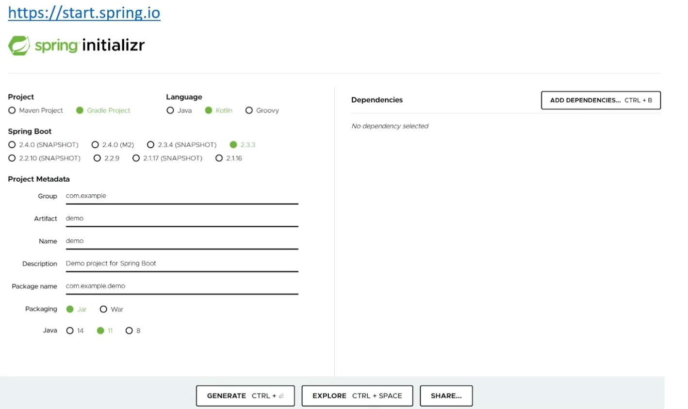

# Web 개발 개론
- World Wide Web, WWW, W3은 인터넷에 연결된 컴퓨터를 통해 사람들이 정보를 공유할 수 있는 전 세계적인 정보 공간
## Web의 기본 3가지 요소
- URI: Uniform Resource Identifier
  - 리소스 식별자
  - 특정 사이트
  - 특정 쇼핑 목록
  - 동영상 목록
  - 모든 정보에 접근할 수 있는 정보
- HTTP: Hypertext Transfer Protocol
  - Application Control
  - GET
  - POST
  - PUT
  - DELETE
  - OPTIONS
  - HEAD
  - TRACE
  - CONNECT
- HTML: Hyper Text Markup Language
 - 하이퍼 미디어 포맷
 - XML을 바탕으로 한 범용 문서 포맷
 - Chrome, Safari, Explorer에서 사용자가 알아보기 쉬운 형태로 표현
## REST
- **Representational State Transfer**의 약자
  - 자원의 상태 전달
### Rest의 특징  
- Client, Server
  - 클라이언트와 서버가 서로 독립적으로 분리되어 있어야 함
- Stateless
  - 요청에 대해서 클라이언트의 상태를 서버에 저장하지 않음
- Cache
  - 클라이언트는 서버의 응답을 Cache(임시저장) 할 수 있어야 함
  - 클라이언트가 Cache를 통해서 응답을 재사용할 수 있어야 함
  - 이를 통해 서버의 부하를 낮춤
- 계층화 (Layered System)    
  - 서버와 클라이언트 사이에 방화벽, 게이트웨이, Proxy 등 다양한 계층 형태로 구성이 가능해야 하며, 이를 확장할 수 있어야 함
- 인터페이스 일관성
  - 인터페이스의 일관성을 지키고, 아커텍처를 단순화시켜 작은 단위로 분리하여 클라이언트 서버가 독립적으로 개선 될 수 있어야 함
- Code on Demand (Optional)
  - 자바 애플릿, 자바스크립트, 플래시 등 특정한 기능을 서버로부터 클라이언트가 전달 받아 코드를 실행할 수 있어야 함
### REST를 잘 사용했는지 판단할 수 있는 근거
- 아래의 4가지 근거를 잘 갖춘 경우 **Restful**하다고 표현  
- 근거 01: 자원의 식별
  - 웹 기반의 REST에서는 리소스 접근을 할 때 URI를 사용
    - ``https://foo.co.kr/user/100``
    - Resource: user, 식별자: 100
- 근거 02: 메시지를 통한 리소스 조작
  - Web에서는 다양한 방식으로 데이터를 전달
    - 그 중에서 HTML, XML, JSON, TEXT 등이 있음
    - HTTP Header 부분에 content-type를 통해서 데이터 타입을 지정
  - 리소스 조작을 위해서 데이터 전체를 전달하지 않고, 메시지로 전달
    - 예: DB의 전화번호가 number라는 이름을 사용하다가, phone_number으로 변경되도 메시지에는 변경이 없어야 함
- 근거 03: 자기 서술적 메시지
  - 요청하는 데이터가 어떻게 처리되어져야 하는지 메시지에 포함
  - HTTP 기반의 REST는 HTTP Method와 Header 정보, URI의 포함되는 정보로 표현
    - GET: https://foo.co.kr/user/100, 사용자 정보 요청
    - POST: https://foo.co.kr/user, 사용자 정보 생성
    - PUT: https://foo.co.kr/user, 사용자 정보 생성 및 수정
    - DELETE: https://foo.co.kr/user/100, 사용자 정보 삭제
- 근거 04: Application 상태에 대한 엔진으로써 하이퍼미디어
  - 단순히 Client 요청에 대한 데이터만 응답해 주는 것이 아닌 관련된 리소스에 대한 Link 정보까지 같이 포함되어야 함
## URI 설계 패턴
- URI (Uniform Resource Identifier)
  - 인터넷에서 특정 자원을 나타내는 주소 값. 해당 값은 유일
  - 요청: https://www.fastcampus.co.kr/resource/sample/1
  - 응답: fastcampus.pdf, fastcampus.docx
- URL (Uniform Resource Locator)
  - 인터넷 상에서의 자원, 특정 파일이 어디에 위치하는지 식별하는 주소
  - 요청: https://www.fastcampus.co.kr/fastcampus.pdf
- URL은 URI의 하위 개념
### URI 설계 원칙 (RFC-3986)
- 슬래시 구분자(/)는 계층 관계를 나타내는데 사용
  - ``https://fastcampus.co.kr/classes/java/curriculums/web-master``
- URI 마지막 문자로 슬래시(/)는 포함하지 않음
  - ``https://fastcampus.co.kr/classes/java/curriculums/web-master/`` (X)
- 하이픈(-)은 URI 가독성을 높이는 데 사용
  - ``https://fastcampus.co.kr/classes/java/curriculums/web-master`` (O)
- 밑줄(_)은 사용하지 않음
  - ``https://fastcampus.co.kr/classes/java/curriculums/web_master`` (X)
- URI 경로에는 소문자가 적합
  - ``https://fastcampus.co.kr/classes/JAVA/curriculums/web-master``(X)
  - ``https://fastcampus.co.kr/classes/java/curriculums/web-master``(O)
- 파일 확장자는 URI에 포함하지 않음
  - ``https://fastcampus.co.kr/classes/java/curriculums/web-master.jsp``(X)
- 프로그래밍 언어에 의존적인 확장자를 사용하지 않음 (*.do)
  - ``https://fastcampus.co.kr/classes/java/curriculums/web-master.do``(X)
- 구현에 의존적인 경로를 사용하지 않음 (servlet)
  - ``https://fastcampus.co.kr/servlet/classes/java/curriculums/web-master``(X)
- 세션 ID를 포함하지 않음 (보안 이슈)
  - ``https://fastcampus.co.kr/classes/java/curriculums/web-master?session-id=abcdef``(X)
- 프로그래밍 언어의 Method 명을 이용하지 않음 (intro)
  - ``https://fastcampus.co.kr/classes/java/curriculums/web-master?action=intro`` (X)
- 명사에 단수형 보다는 복수형을 사용해야 함
  - 컬렉션에 대한 표현은 복수로 사용 (classes, curriculums)
  - ``https://fastcampus.co.kr/classes/java/curriculums/web-master`` (O)            
- controller 이름으로는 동사나 동사구를 사용
  - ``https://fastcampus.co.kr/classes/java/curriculums/web-master/re-order`` (O)
- 경로 부분 중, 변하는 부분은 유일한 값으로 대체 (Path Variable)
  - ``.../curriculums/web-master/lessons/{lesson-id}/users/{user-id}``
  - ``.../curriculums/web-master/lessons/2/users/100``
- CRUD 기능을 나타내는 것은 URI에 사용하지 않음
  - GET: ``.../curriculums/web-master/lessons/2/users/100/READ`` (X)
  - DELETE: ``.../curriculums/web-master/lessons/2/users/100`` (O)
- URI Query Parameter 디자인
  - URI 쿼리 부분으로 컬렉션 결과에 대해서 필터링할 수 있음
  - ``.../curriculums/web-master?chapter=2`` (O)
- URI 쿼리는 컬렉션 결과를 페이지로 구분하여 나타내는데 사용
  - ``.../curriculums/web-master?chapter=2&page=0&size=10&sort=asc`` (O)
- API에 있어서 서브 도메인은 일관성 있게 사용해야 한다
  - 도메인이 ``https://fastcampus.co.kr``인 경우, open api는 아래처럼 사용
    - ``https://api.fastcampus.co.kr``
    - ``https://api-fastcampus.co.kr``
- 클라이언트 개발자 포탈 서브 도메인은 일관성 있게 만듬
  - ``https://dev-fastcampus.co.kr``
  - ``https://developer-fastcampus.co.kr``
## HTTP Protocol
- HTTP(Hyper Text Transfer Protocol)로 RFC 2616에서 규정된 Web에서 데이터를 주고 받는 프로토콜
- 이름에는 하이퍼텍스트 전송용 프로토콜로 정의되어 있지만, 실제로는 HTML, XML, JSON, Image, Voice, Video, JavaScript, PDF등 다양한 컴퓨터에서 다룰 수 있는 것은 모두 전송할 수 있음
- HTTP는 TCP를 기반으로 한 REST의 특징을 모두 구현하고 있는 Web기반의 프로토콜
- HTTP는 메시지를 주고(Request) 받는(Response) 형태의 통신 방법

- HTTP 요청을 처리하는 8가지 Method (멱등성: 여러 번 요청해도 동일한 응답)

- HTTP Status Code: 응답의 상태를 나타내는 코드


# Spring Boot 시작하기
## Spring Boot 개념
- Spring Boot helps you to create ``stand-alone, production-grade Spring-based Applications`` that you can run. We take an optionated view of the Spring platform and third-party libraries, so that you can get started with minimum fuss. Most Sping Boot applications need ``very little Spring configuration``.
- You can use Spring Boot to create Java applications that can be started by using ``java -jar`` or more traditional war deployments. We also provide a command line tool that runs "spring scripts".
- Our primary goals are:
  - Provide a radically faster and widely accessible getting-started experience for all Spring development.
  - Be opinionated out of the box but get out of the way quickly as requirements start to diverge from the defaults.
  - Provide a range of non-functional features that are common to large classes of projects (such as embedded servers, security, metrics, health checks, and externalized configuration).
  - Absolutely no code generation and no requirement for XML configuration.
- https://docs.spring.io/spring-boot/docs/2.1.x/reference/html/getting-started-introducing-spring-boot.html
- Spring Boot는 단순히 실행되며, 프로덕션 제품 수준의 스프링 기반 어플리케이션을 쉽게 만들 수 있음
- Spring Boot 어플리케이션에는 Spring 구성이 거의 필요하지 않음
- ``Spring Boot java -jar로 실행하는 Java 어플리케이션``을 만들 수 있음 (tomcat를 내장)
- 주요 장점들
  - 어플리케이션 개발에 필수 요소들만을 모아 둠
  - 간단한 설정으로 개발 및 커스텀이 가능
  - 간단하고, 빠르게 어플리케이션 실행 및 배포가 가능
  - 대규모 프로젝트에 공통적인 비 기능적 기능도 제공 (보안, 모니터링 등등)
  - Spring에서 사용했던 불편한 설정들이 사라짐 (XML 설정 -> Annotation기반으로 구성 가능)
  - Spring 개발에 대해 빠르고, 광범위하게 적용할 수 있는 환경
  - 오랜 경험에서 나오는 안정적인 운영이 가능
- Build Tool (선택가능)

- Servlet Containers (선택가능)

- 스프링 프로젝트 생성 방법 (Spring Initializer - https://start.spring.io)

  - 프로젝트 생성 후, 다운로드 받아서 IntelliJ에서 Import하면 됨
## Hello World API를 만들어 보기
### Rest Client 설치하기
- Chrome Web Store > 스토어 검색 > rest api client
  - ``Talend API Tester - Free Edition`` 설치
  - 설치 후, 화면 우측에 ``확장 프로그램`` 아이콘에서 해당 프로그램 선택
### SpringBoot Project 생성하기
- ``https://start.spring.io/``에 접속하기

  - Gradle Project 선택
  - SpringBoot 2.6.7 선택
  - Artifact에 "hello"를 입력
  - Packaging에 Jar를 선택
  - Java Version에 ``11``을 선택
  - Add Dependencies
    - Spring Web 선택
  - Generate 선택 후, 생성된 zip 파일을 다운로드
    - 압축을 푼 후, ``D:\Workspace\springboot\practices\hello``로 복사
  - ``D:\Workspace\springboot\practices\hello`` 폴더에서 ``build.gradle`` 파일을 IntelliJ로 Open
    - IntellJ 우측 하단의 ``Show all``을 클릭하면, 현재 진행되는 상황을 볼 수 있음
    - IntellJ 우측 상단의 ``Gradle``을 클릭하면, Jar 파일들의 Dependency들을 확인 가능
      - 새로운 Jar를 추가했을 때, 새로고침 버튼을 눌러 ``Reload All Gradle Projects``를 수행할 수 있음
  - ``src > main > java > com.example.hello > HelloApplication``을 선택 후, 실행
    - 처음 실행 시, ``HelloApplication`` 선택 후, ``Ctrl + Shift + F10``
    - 다음 부터는 Run을 할 때는 ``Shift + F10``을 누르고, Debug할 때는 ``Shift + F9``을 누르면 됨
  - 만약 서버의 Port를 변경하고 싶다면?
    - ``src > main > resources > application.properties``에서 ``server.port=9090``을 입력
- Controller 클래스 작성
  - ``com.example.hello`` 아래에 ``controller`` 패키지 생성
  - 해당 패키지에서 새로운 클래스 ``ApiController`` 생성
  - 클래스명 위에 ``@RestController`` Annotation을 추가해서 Bean으로 등록
  - 클래스명 위에 ``@RequestMapping("/api")`` Annotation을 추가해서 URL을 맵핑시킴
  - ``hello()`` 메소드를 작성하고, ``@GetMapping("/hello")``을 통해 Get Method와 URL을 명시
    - 해당 메소드는 ``http://localhost:9090/api/hello`` URL에 맵핑
```java
package com.example.hello.controller;

import org.springframework.web.bind.annotation.GetMapping;
import org.springframework.web.bind.annotation.RequestMapping;
import org.springframework.web.bind.annotation.RestController;

@RestController
@RequestMapping("/api")
public class ApiController {
    @GetMapping("/hello")
    public String hello() {
        return "hello spring boot!";
    }
}
```
- Talend API Tester로 테스트
    
  - 왼쪽 하단의 ``+ Project``를 클릭하여 새로운 프로젝트 생성
  - ``Add a request``를 이용해서 새로운 Request 생성: Request 명을 지정
  - ``Open a request``를 이용해서 해당 Request를 Open 
  - Method를 선택한 후, URI를 입력해서 Send해서 결과값을 확인
  - 서버에서 결과값을 문자열로 Return
    - Response Header의 Content-type이 ``Content-Type:	text/plain;charset=UTF-8``