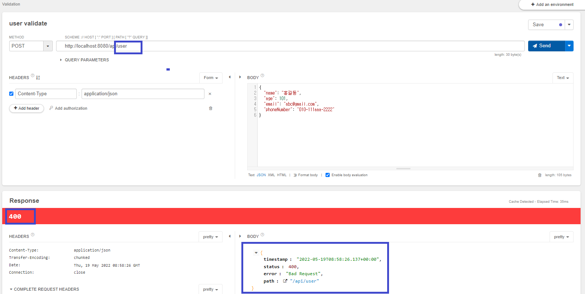

# IntelliJ 단축키 팁
- 코드 자동완성: ``Ctrl + Shift``
- 어플리케이션 실행
  - XXXApplication 클래스 선택 후, ``Ctrl + Shift + F10``
  - 다음 부터는 Run 시, ``Shift + F10``, Debug 시, ``Shift + F9``
- Code Generate for Constructor, Getter, Setter, toString etc: ``Alt + Ins``
- Settings 창 띄우기: ``Ctrl + Alt + s``
# IntelliJ 설정 팁
- 한글 관련 설정
  - IDE Encoding 관련
    - File > Settings (Ctrl + Alt + S) > Editor > File Encodings
    - Global Encoding, Project Encoding, Default encoding for properties files를 ``UTF-8`` 선택
  - 실행 시, ``Run``창의 한글이 깨지는 문제 해결 법
    - Help > Find Action (Ctrl+Shift+A)
    - ``custom vm``을 검색하고 [Edit Custom VM Options...] 클릭
    - ``-Dfile.encoding=UTF-8`` 추가
  - IntelliJ Restart 

출처: https://treasurebear.tistory.com/55 [나를 남기다]  
# Web 개발 개론
- World Wide Web, WWW, W3은 인터넷에 연결된 컴퓨터를 통해 사람들이 정보를 공유할 수 있는 전 세계적인 정보 공간
## Web의 기본 3가지 요소
- URI: Uniform Resource Identifier
  - 리소스 식별자
  - 특정 사이트
  - 특정 쇼핑 목록
  - 동영상 목록
  - 모든 정보에 접근할 수 있는 정보
- HTTP: Hypertext Transfer Protocol
  - Application Control
  - GET
  - POST
  - PUT
  - DELETE
  - OPTIONS
  - HEAD
  - TRACE
  - CONNECT
- HTML: Hyper Text Markup Language
 - 하이퍼 미디어 포맷
 - XML을 바탕으로 한 범용 문서 포맷
 - Chrome, Safari, Explorer에서 사용자가 알아보기 쉬운 형태로 표현
## REST
- **Representational State Transfer**의 약자
  - 자원의 상태 전달
### Rest의 특징  
- Client, Server
  - 클라이언트와 서버가 서로 독립적으로 분리되어 있어야 함
- Stateless
  - 요청에 대해서 클라이언트의 상태를 서버에 저장하지 않음
- Cache
  - 클라이언트는 서버의 응답을 Cache(임시저장) 할 수 있어야 함
  - 클라이언트가 Cache를 통해서 응답을 재사용할 수 있어야 함
  - 이를 통해 서버의 부하를 낮춤
- 계층화 (Layered System)    
  - 서버와 클라이언트 사이에 방화벽, 게이트웨이, Proxy 등 다양한 계층 형태로 구성이 가능해야 하며, 이를 확장할 수 있어야 함
- 인터페이스 일관성
  - 인터페이스의 일관성을 지키고, 아커텍처를 단순화시켜 작은 단위로 분리하여 클라이언트 서버가 독립적으로 개선 될 수 있어야 함
- Code on Demand (Optional)
  - 자바 애플릿, 자바스크립트, 플래시 등 특정한 기능을 서버로부터 클라이언트가 전달 받아 코드를 실행할 수 있어야 함
### REST를 잘 사용했는지 판단할 수 있는 근거
- 아래의 4가지 근거를 잘 갖춘 경우 **Restful**하다고 표현  
- 근거 01: 자원의 식별
  - 웹 기반의 REST에서는 리소스 접근을 할 때 URI를 사용
    - ``https://foo.co.kr/user/100``
    - Resource: user, 식별자: 100
- 근거 02: 메시지를 통한 리소스 조작
  - Web에서는 다양한 방식으로 데이터를 전달
    - 그 중에서 HTML, XML, JSON, TEXT 등이 있음
    - HTTP Header 부분에 content-type를 통해서 데이터 타입을 지정
  - 리소스 조작을 위해서 데이터 전체를 전달하지 않고, 메시지로 전달
    - 예: DB의 전화번호가 number라는 이름을 사용하다가, phone_number으로 변경되도 메시지에는 변경이 없어야 함
- 근거 03: 자기 서술적 메시지
  - 요청하는 데이터가 어떻게 처리되어져야 하는지 메시지에 포함
  - HTTP 기반의 REST는 HTTP Method와 Header 정보, URI의 포함되는 정보로 표현
    - GET: https://foo.co.kr/user/100, 사용자 정보 요청
    - POST: https://foo.co.kr/user, 사용자 정보 생성
    - PUT: https://foo.co.kr/user, 사용자 정보 생성 및 수정
    - DELETE: https://foo.co.kr/user/100, 사용자 정보 삭제
- 근거 04: Application 상태에 대한 엔진으로써 하이퍼미디어
  - 단순히 Client 요청에 대한 데이터만 응답해 주는 것이 아닌 관련된 리소스에 대한 Link 정보까지 같이 포함되어야 함
## URI 설계 패턴
- URI (Uniform Resource Identifier)
  - 인터넷에서 특정 자원을 나타내는 주소 값. 해당 값은 유일
  - 요청: https://www.fastcampus.co.kr/resource/sample/1
  - 응답: fastcampus.pdf, fastcampus.docx
- URL (Uniform Resource Locator)
  - 인터넷 상에서의 자원, 특정 파일이 어디에 위치하는지 식별하는 주소
  - 요청: https://www.fastcampus.co.kr/fastcampus.pdf
- URL은 URI의 하위 개념
### URI 설계 원칙 (RFC-3986)
- 슬래시 구분자(/)는 계층 관계를 나타내는데 사용
  - ``https://fastcampus.co.kr/classes/java/curriculums/web-master``
- URI 마지막 문자로 슬래시(/)는 포함하지 않음
  - ``https://fastcampus.co.kr/classes/java/curriculums/web-master/`` (X)
- 하이픈(-)은 URI 가독성을 높이는 데 사용
  - ``https://fastcampus.co.kr/classes/java/curriculums/web-master`` (O)
- 밑줄(_)은 사용하지 않음
  - ``https://fastcampus.co.kr/classes/java/curriculums/web_master`` (X)
- URI 경로에는 소문자가 적합
  - ``https://fastcampus.co.kr/classes/JAVA/curriculums/web-master``(X)
  - ``https://fastcampus.co.kr/classes/java/curriculums/web-master``(O)
- 파일 확장자는 URI에 포함하지 않음
  - ``https://fastcampus.co.kr/classes/java/curriculums/web-master.jsp``(X)
- 프로그래밍 언어에 의존적인 확장자를 사용하지 않음 (*.do)
  - ``https://fastcampus.co.kr/classes/java/curriculums/web-master.do``(X)
- 구현에 의존적인 경로를 사용하지 않음 (servlet)
  - ``https://fastcampus.co.kr/servlet/classes/java/curriculums/web-master``(X)
- 세션 ID를 포함하지 않음 (보안 이슈)
  - ``https://fastcampus.co.kr/classes/java/curriculums/web-master?session-id=abcdef``(X)
- 프로그래밍 언어의 Method 명을 이용하지 않음 (intro)
  - ``https://fastcampus.co.kr/classes/java/curriculums/web-master?action=intro`` (X)
- 명사에 단수형 보다는 복수형을 사용해야 함
  - 컬렉션에 대한 표현은 복수로 사용 (classes, curriculums)
  - ``https://fastcampus.co.kr/classes/java/curriculums/web-master`` (O)            
- controller 이름으로는 동사나 동사구를 사용
  - ``https://fastcampus.co.kr/classes/java/curriculums/web-master/re-order`` (O)
- 경로 부분 중, 변하는 부분은 유일한 값으로 대체 (Path Variable)
  - ``.../curriculums/web-master/lessons/{lesson-id}/users/{user-id}``
  - ``.../curriculums/web-master/lessons/2/users/100``
- CRUD 기능을 나타내는 것은 URI에 사용하지 않음
  - GET: ``.../curriculums/web-master/lessons/2/users/100/READ`` (X)
  - DELETE: ``.../curriculums/web-master/lessons/2/users/100`` (O)
- URI Query Parameter 디자인
  - URI 쿼리 부분으로 컬렉션 결과에 대해서 필터링할 수 있음
  - ``.../curriculums/web-master?chapter=2`` (O)
- URI 쿼리는 컬렉션 결과를 페이지로 구분하여 나타내는데 사용
  - ``.../curriculums/web-master?chapter=2&page=0&size=10&sort=asc`` (O)
- API에 있어서 서브 도메인은 일관성 있게 사용해야 한다
  - 도메인이 ``https://fastcampus.co.kr``인 경우, open api는 아래처럼 사용
    - ``https://api.fastcampus.co.kr``
    - ``https://api-fastcampus.co.kr``
- 클라이언트 개발자 포탈 서브 도메인은 일관성 있게 만듬
  - ``https://dev-fastcampus.co.kr``
  - ``https://developer-fastcampus.co.kr``
## HTTP Protocol
- HTTP(Hyper Text Transfer Protocol)로 RFC 2616에서 규정된 Web에서 데이터를 주고 받는 프로토콜
- 이름에는 하이퍼텍스트 전송용 프로토콜로 정의되어 있지만, 실제로는 HTML, XML, JSON, Image, Voice, Video, JavaScript, PDF등 다양한 컴퓨터에서 다룰 수 있는 것은 모두 전송할 수 있음
- HTTP는 TCP를 기반으로 한 REST의 특징을 모두 구현하고 있는 Web기반의 프로토콜
- HTTP는 메시지를 주고(Request) 받는(Response) 형태의 통신 방법

- HTTP 요청을 처리하는 8가지 Method (멱등성: 여러 번 요청해도 동일한 응답)

- HTTP Status Code: 응답의 상태를 나타내는 코드


# Spring Boot 시작하기
## Spring Boot 개념
- Spring Boot helps you to create ``stand-alone, production-grade Spring-based Applications`` that you can run. We take an optionated view of the Spring platform and third-party libraries, so that you can get started with minimum fuss. Most Sping Boot applications need ``very little Spring configuration``.
- You can use Spring Boot to create Java applications that can be started by using ``java -jar`` or more traditional war deployments. We also provide a command line tool that runs "spring scripts".
- Our primary goals are:
  - Provide a radically faster and widely accessible getting-started experience for all Spring development.
  - Be opinionated out of the box but get out of the way quickly as requirements start to diverge from the defaults.
  - Provide a range of non-functional features that are common to large classes of projects (such as embedded servers, security, metrics, health checks, and externalized configuration).
  - Absolutely no code generation and no requirement for XML configuration.
- https://docs.spring.io/spring-boot/docs/2.1.x/reference/html/getting-started-introducing-spring-boot.html
- Spring Boot는 단순히 실행되며, 프로덕션 제품 수준의 스프링 기반 어플리케이션을 쉽게 만들 수 있음
- Spring Boot 어플리케이션에는 Spring 구성이 거의 필요하지 않음
- ``Spring Boot java -jar로 실행하는 Java 어플리케이션``을 만들 수 있음 (tomcat를 내장)
- 주요 장점들
  - 어플리케이션 개발에 필수 요소들만을 모아 둠
  - 간단한 설정으로 개발 및 커스텀이 가능
  - 간단하고, 빠르게 어플리케이션 실행 및 배포가 가능
  - 대규모 프로젝트에 공통적인 비 기능적 기능도 제공 (보안, 모니터링 등등)
  - Spring에서 사용했던 불편한 설정들이 사라짐 (XML 설정 -> Annotation기반으로 구성 가능)
  - Spring 개발에 대해 빠르고, 광범위하게 적용할 수 있는 환경
  - 오랜 경험에서 나오는 안정적인 운영이 가능
- Build Tool (선택가능)

- Servlet Containers (선택가능)

- 스프링 프로젝트 생성 방법 (Spring Initializer - https://start.spring.io)

  - 프로젝트 생성 후, 다운로드 받아서 IntelliJ에서 Import하면 됨
## Hello World API를 만들어 보기
### Rest Client 설치하기
- Chrome Web Store > 스토어 검색 > rest api client
  - ``Talend API Tester - Free Edition`` 설치
  - 설치 후, 화면 우측에 ``확장 프로그램`` 아이콘에서 해당 프로그램 선택
### SpringBoot Project 생성하기
- ``https://start.spring.io/``에 접속하기

  - Gradle Project 선택
  - SpringBoot 2.6.7 선택
  - Artifact에 "hello"를 입력
  - Packaging에 Jar를 선택
  - Java Version에 ``11``을 선택
  - Add Dependencies
    - Spring Web 선택
  - Generate 선택 후, 생성된 zip 파일을 다운로드
    - 압축을 푼 후, ``D:\Workspace\springboot\practices\hello``로 복사
  - ``D:\Workspace\springboot\practices\hello`` 폴더에서 ``build.gradle`` 파일을 IntelliJ로 Open
    - IntellJ 우측 하단의 ``Show all``을 클릭하면, 현재 진행되는 상황을 볼 수 있음
    - IntellJ 우측 상단의 ``Gradle``을 클릭하면, Jar 파일들의 Dependency들을 확인 가능
      - 새로운 Jar를 추가했을 때, 새로고침 버튼을 눌러 ``Reload All Gradle Projects``를 수행할 수 있음
  - ``src > main > java > com.example.hello > HelloApplication``을 선택 후, 실행
  - 만약 서버의 Port를 변경하고 싶다면?
    - ``src > main > resources > application.properties``에서 ``server.port=9090``을 입력
- Controller 클래스 작성
  - ``com.example.hello`` 아래에 ``controller`` 패키지 생성
  - 해당 패키지에서 새로운 클래스 ``ApiController`` 생성
  - 클래스명 위에 ``@RestController`` Annotation을 추가해서 Bean으로 등록
  - 클래스명 위에 ``@RequestMapping("/api")`` Annotation을 추가해서 URL을 맵핑시킴
  - ``hello()`` 메소드를 작성하고, ``@GetMapping("/hello")``을 통해 Get Method와 URL을 명시
    - 해당 메소드는 ``http://localhost:9090/api/hello`` URL에 맵핑
```java
package com.example.hello.controller;

import org.springframework.web.bind.annotation.GetMapping;
import org.springframework.web.bind.annotation.RequestMapping;
import org.springframework.web.bind.annotation.RestController;

@RestController
@RequestMapping("/api")
public class ApiController {
    @GetMapping("/hello")
    public String hello() {
        return "hello spring boot!";
    }
}
```
- Talend API Tester로 테스트
    
  - 왼쪽 하단의 ``+ Project``를 클릭하여 새로운 프로젝트 생성
  - ``Add a request``를 이용해서 새로운 Request 생성: Request 명을 지정
  - ``Open a request``를 이용해서 해당 Request를 Open 
  - Method를 선택한 후, URI를 입력해서 Send해서 결과값을 확인
  - 서버에서 결과값을 문자열로 Return
    - Response Header의 Content-type이 ``Content-Type:	text/plain;charset=UTF-8``
## GET API

- Annotation
  - ``@GetMapping("/hello")``: ``@GetMapping(path = "/hello")``와 동일
  - ``@RequestMapping(path = "/hello", method = RequestMethod.GET)``: RequestMapping은 모든 메소드(GET, POST, PUT, DELETE, PATCH, HEAD...)에 사용가능하므로, method를 명시해야 함
- Request 전달 방법  
  - 방법1: Path Variable
    - ``@GetMapping(path = "/path-variable/{name}")``처럼, URI의 Path값이 변함 
    - 메소드의 인자에 대해서 ``@PathVariable`` annotation으로 명시
    - 제한 사항: ``@GetMapping``의 ``{ }``안에 입력한 값과 ``@PathVariable``의 인자의 변수명이 동일해야함
      - 다르게 사용하고 싶은 경우, ``@PathVariable``의 name 속성을 이용하여 명시 가능
  - 방법2: Query Parameter
    - URI의 ``?`` 뒤에 위치하는 ``key=value`` 형태의 값들
    - 여러 개의 값들은 ``&`` 연산자를 이용해서 연결
    - Controller에서 인자 처리 방법
      - Key 별로 받는 방법
        - ``@RequestParam 변수타입 key`` 형태로 개별적으로 key에 해당하는 변수를 선언
        - 변수가 많은 경우에 적용하기 힘듬
      - Map를 사용하는 방법
        - ``@RequestParam Map<String, String> ``을 통해서 key, value 형태로 받음
      - DTO를 선언해서 사용하는 방법: 가장 일반적인 방법
        - ``UserRequest userRequest``처럼, ``@RequestParam``없이 사용
        - Return type을 DTO로 사용하는 경우, JSON 형태로 전달 
```java
package com.example.hello.controller;

@RestController
@RequestMapping("/api/get")
public class GetApiController {
    @GetMapping(path = "/hello")  // http://localhost:9090/api/get/hello
    public String hello() {
        return "hello";
    }

    @RequestMapping(path = "/hi", method = RequestMethod.GET) // http://localhost:9090/api/get/hi
    public String hi() {
        return "hi";
    }

    // http://localhost:9090/api/get/path-variable/{name}
    @GetMapping(path = "/path-variable/{name}")
    public String pathVariable(@PathVariable String name) {
        System.out.println("PathVariable : " + name);
        return name;
    }

    // http://localhost:9090/api/get/path-variable2/{name}
    @GetMapping(path = "/path-variable2/{id}")
    public String pathVariable2(@PathVariable(name = "id") String pathName) {
        System.out.println("PathVariable2 : " + pathName);
        return pathName;
    }

    // http://localhost:90900/api/get/query-param?user=steve&email=steve@gmail.com&age=30
    @GetMapping(path = "/query-param")
    public String queryParam(@RequestParam Map<String, String> queryParams) {
        StringBuilder sb = new StringBuilder();
        queryParams.entrySet().forEach(entry -> {
            System.out.println("key: " + entry.getKey() + " value: " + entry.getValue());
            sb.append(entry.getKey() + "=" + entry.getValue() + "\n");
        });
        return sb.toString();
    }

    // http://localhost:90900/api/get/query-param02?user=steve&email=steve@gmail.com&age=30
    @GetMapping(path = "/query-param02")
    public String queryParam02(@RequestParam String name, @RequestParam String email, @RequestParam int age) {
        return name + "," + email + "," + age;
    }

    // http://localhost:90900/api/get/query-param03?user=steve&email=steve@gmail.com&age=30
    @GetMapping(path = "/query-param03")
    public String queryParam03(UserRequest userRequest) {
        return userRequest.toString();
    }
}

package com.example.hello.dto;

public class UserRequest {
    private String name;
    private String email;
    private int age;

    public void setName(String name) {
        this.name = name;
    }

    public void setEmail(String email) {
        this.email = email;
    }

    public void setAge(int age) {
        this.age = age;
    }

    public String getEmail() {
        return email;
    }

    public int getAge() {
        return age;
    }

    public String getName() {
        return name;
    }

    @Override
    public String toString() {
        return "UserRequest{" +
                "name='" + name + '\'' +
                ", email='" + email + '\'' +
                ", age=" + age +
                '}';
    }
}
```
## POST API

### JSON
- DataType
  - string
  - number
  - boolean
  - object: ``{ }``
  - array: ``[ ]``
- 표현 방식은 일반적으로 snake case 형태로 표현: 단어 구분 시, ``_``를 사용
  - camel case 형태로 사용할 수도 있음
```json
// user 상세 정보
{
  "phone_number": "010-1111-2222",  // "phoneNumber": "value2"
  "age": 10,
  "is_agree": false,
  "account": {
    "email": "gusami@gmail.com",
    "password": "1234"
  }
}

// users를 조회하는 경우
{
  "user_list": [
    {
      "account": "abcd",
      "password": "1235"
    },
    {
      "account": "aaaaa",
      "password": "1234"
    },
    {
      "account": "bbbbb",
      "password": "2wee"
    }
  ]
}
```
- Annotation
  - ``@PostMapping("/post")``: ``@PostMapping(path = "/post")``와 동일
  - ``@RequestMapping(path = "/post", method = RequestMethod.POST)``
    - RequestMapping은 모든 메소드(GET, POST, PUT, DELETE, PATCH, HEAD...)에 사용가능
    - method를 명시해야 함
- Request Body를 읽는 법
  - Map를 사용하는 방법
    - ``@RequestBody Map<String, Object> ``을 통해서 key, value 형태로 받음
  - DTO를 사용하는 방법
    - ``@RequestBody PostRequestDTO postRequestDTO``처럼 객체에 맵핑된 값을 받음
    - DTO의 변수명이 client request body의 json의 property key와 일치하여야 함
      - 일치하지 않는 경우, Jackson 또는 gson library를 사용해서 맵핑 시킴
- 실습 예제: client가 snake case의 property key값을 가지고, DTO는 camel case인 경우
  - 설정을 하지 않으면 null값이 읽힘
  - 해결 방법 01
    - 각 필드마다 ``@JsonProperty("phone_number")``처럼 request의 property key값을 명시
    - ``private String OTP;``처럼 필드가 약어인 경우에도 사용 가능
  - 해결 방법 02
    - ``@JsonNaming(value = PropertyNamingStrategy.SnakeCaseStrategy.class)``처럼 Class 전체에 명시: Deprecated된 방법
```json
// Client Request Body
{
  "account": "user01",
  "email": "gusami@gmail.com",
  "address": "서울시 하계동",
  "password": "abcd",
  "phone_number": "010-1111-2222",
  "OTP": "12345"
}
```
```java
package com.example.post.controller;
....
@RestController
@RequestMapping("/api")
public class PostApiController {
    @PostMapping("/post")
    public void post(@RequestBody Map<String, Object> requestData) {
        requestData.entrySet().forEach(item -> {
            System.out.println("key: " + item.getKey() + " value: " + item.getValue());
        });
    }

    @PostMapping("/post-dto")
    public void postWithDTO(@RequestBody PostRequestDTO postRequestDTO) {
        System.out.println(postRequestDTO);
    }
}


package com.example.post.dto;

import com.fasterxml.jackson.annotation.JsonProperty;

public class PostRequestDTO {
    private String account;
    private String email;
    private String address;
    private String password;
    @JsonProperty("phone_number") // request body의 Property의 key가 "phone_number"
    private String phoneNumber;
    @JsonProperty("OTP") // request body의 Property의 key가 "OTP"
    private String OTP;
    public String getPhoneNumber() {
        return phoneNumber;
    }

    public void setPhoneNumber(String phoneNumber) {
        this.phoneNumber = phoneNumber;
    }

    @Override
    public String toString() {
        return "PostRequestDTO{" +
                "account='" + account + '\'' +
                ", email='" + email + '\'' +
                ", address='" + address + '\'' +
                ", password='" + password + '\'' +
                ", phoneNumber='" + phoneNumber + '\'' +
                ", OTP='" + OTP + '\'' +
                '}';
    }

    public void setAccount(String account) {
        this.account = account;
    }

    public void setEmail(String email) {
        this.email = email;
    }

    public void setAddress(String address) {
        this.address = address;
    }

    public void setPassword(String password) {
        this.password = password;
    }

    public String getAccount() {
        return account;
    }

    public String getEmail() {
        return email;
    }

    public String getAddress() {
        return address;
    }

    public String getPassword() {
        return password;
    }
}
```
## PUT API

- Resource가 없으면 생성하고, 있으면 기존 데이터를 업데이트 처리
  - 멱등성이 성립
- Annotation
  - ``@PutMapping("/put")``: ``@PutMapping(path = "/put")``와 동일
  - ``@RequestMapping(path = "/put", method = RequestMethod.PUT)``
    - RequestMapping은 모든 메소드(GET, POST, PUT, DELETE, PATCH, HEAD...)에 사용가능
    - method를 명시해야 함
- Request Body를 읽는 법
  - DTO를 사용하는 방법
    - ``@RequestBody PutRequestDTO putRequestDTO``처럼 객체에 맵핑된 값을 받음
    - DTO의 변수명이 client request body의 json의 property key와 일치하여야 함
      - 일치하지 않는 경우, Jackson 또는 gson library를 사용해서 맵핑 시킴
- 실습 예제: client가 snake case의 property key값을 가지고, DTO는 camel case인 경우
  - 설정을 하지 않으면 null값이 읽힘
  - 해결 방법 01
    - 각 필드마다 ``@JsonProperty("phone_number")``처럼 request의 property key값을 명시
    - ``private String OTP;``처럼 필드가 약어인 경우에도 사용 가능
  - 해결 방법 02
    - ``@JsonNaming(value = PropertyNamingStrategy.SnakeCaseStrategy.class)``처럼 Class 전체에 명시: Deprecated된 방법
```json
// Client Request Header
Content-Type: application/json
// Client Request Body
{
  "name": "gusami",
  "age": 10,
  "car_list": [
    { 
      "name": "BMW",
      "car_number": "86노 1234"
    },
    { 
      "name": "Benz",
      "car_number": "43호 4321"
    }
  ]
}
```
```json
// Controller에서 DTO object를 Return하면, 알아서 CamelCase에서 snake case로 변환해서 내려감
// Client Response Header
Content-Type:	application/json
// Client Response Body
{
  "name": "gusami",
  "age": 10,
  "car_list":[
    {
      "name": "BMW",
      "car_number": "86노 1234"
    },
    {
      "name": "Benz",
      "car_number": "43호 4321"
    }
  ]
}
```
```java
package com.example.put.controller;
......
@RestController
@RequestMapping("/api")
public class PutApiController {
    @PutMapping("/put")
    public PutRequestDTO put(@RequestBody PutRequestDTO putRequestDTO) {
        System.out.println(putRequestDTO);

        return putRequestDTO;
    }

    @PutMapping("/put/{userId}")
    public PutRequestDTO put(@RequestBody PutRequestDTO putRequestDTO,
                             @PathVariable(name = "userId") Long id) {
        System.out.println(putRequestDTO);
        System.out.println(id);
        return putRequestDTO;
    }
}

package com.example.put.dto;
.....
@JsonNaming(value = PropertyNamingStrategy.SnakeCaseStrategy.class)
public class PutRequestDTO {
    private String name;
    private int age;
    private List<CarDTO> carList;

    public String getName() {
        return name;
    }

    public int getAge() {
        return age;
    }

    public List<CarDTO> getCarList() {
        return carList;
    }

    public void setName(String name) {
        this.name = name;
    }

    public void setAge(int age) {
        this.age = age;
    }

    public void setCarList(List<CarDTO> carList) {
        this.carList = carList;
    }

    @Override
    public String toString() {
        return "PutRequestDTO{" +
                "name='" + name + '\'' +
                ", age=" + age +
                ", carList=" + carList +
                '}';
    }
}


package com.example.put.dto;

public class CarDTO {
    private String name;
    @JsonProperty("car_number")
    private String carNumber;

    public String getName() {
        return name;
    }

    public String getCarNumber() {
        return carNumber;
    }

    public void setName(String name) {
        this.name = name;
    }

    public void setCarNumber(String carNumber) {
        this.carNumber = carNumber;
    }

    @Override
    public String toString() {
        return "CarDTO{" +
                "name='" + name + '\'' +
                ", carNumber='" + carNumber + '\'' +
                '}';
    }
}
```
## DELETE API

- Resource를 삭제 시, 사용
  - 멱등성이 성립
  - 삭제할 데이타가 없더라도, 200 OK를 응답: 멱등성이 성립하므로
- Annotation
  - ``@DeleteMapping("/delete")``: ``@DeleteMapping(path = "/delete")``와 동일
  - ``@RequestMapping(path = "/delete", method = RequestMethod.DELETE)``: RequestMapping은 모든 메소드(GET, POST, PUT, DELETE, PATCH, HEAD...)에 사용가능하므로, method를 명시해야 함
- Request 전달 방법  
  - 방법1: Path Variable (일반적인 방법)
    - ``@DeleteMapping("/delete/{userId}")``처럼, URI의 Path값이 변함 
    - 메소드의 인자에 대해서 ``@PathVariable`` annotation으로 명시
    - 제한 사항: ``@DeleteMapping``의 ``{ }``안에 입력한 값과 ``@PathVariable``의 인자의 변수명이 동일해야함
      - 다르게 사용하고 싶은 경우, ``@PathVariable``의 name 속성을 이용하여 명시 가능
  - 방법2: Query Parameter
    - URI의 ``?`` 뒤에 위치하는 ``key=value`` 형태의 값들
    - 여러 개의 값들은 ``&`` 연산자를 이용해서 연결
    - Controller에서 인자 처리 방법
      - Key 별로 받는 방법 (일반적인 방법)
        - ``@RequestParam 변수타입 key`` 형태로 개별적으로 key에 해당하는 변수를 선언
        - 변수가 많은 경우에 적용하기 힘듬
      - Map를 사용하는 방법 (일반적이지 않음)
        - ``@RequestParam Map<String, String> ``을 통해서 key, value 형태로 받음        
      - DTO를 선언해서 사용하는 방법 (일반적이지 않음)
        - ``UserRequest userRequest``처럼, ``@RequestParam``없이 사용
        - Return type을 DTO로 사용하는 경우, JSON 형태로 전달
```java
package com.example.delete.controller;
......
@RestController
@RequestMapping("/api")
public class DeleteApiController {
    @DeleteMapping("/delete/{userId}")
    public void delete(@PathVariable String userId, @RequestParam String account) {
        System.out.println(userId);
        System.out.println(account);
    }
}
```
## Response를 내려주는 다양한 방법
### 문자열로 Response하기
- 서버
```java
package com.example.response.controller;

@RestController
@RequestMapping("/api")
public class ApiController {
    @GetMapping("/text")
    public String text(@RequestParam String account) {
        return account;
    }
}
```
- 클라이언트

  - ``Content-Type: text/plain;charset=UTF-8``로 응답: 기본 encoding은 UTF-8임
### JSON로 Response하기
- Client로 내려가는 JSON의 문자열의 기본 인코딩은 "UTF-8"
- Client의 json 문자열 Request가 오면, 서버에서는 ObjectMapper에 의해 DTO object로 바뀜
  - JSON 문자열 Request -> ObjectMapper -> DTO Object
- 서버에서 Response가 DTO object로 전달하면, ObjectMapper를 거쳐 json 문자열로 변환되어 Client로 전달
  - DTO Object -> ObjectMapper -> JSON 문자열 Response
- 서버  
```java
package com.example.response.controller;

@RestController
@RequestMapping("/api")
public class ApiController {
    @PostMapping("/json")
    public User json(@RequestBody User user) {
        return user;
    }
}

package com.example.response.dto;

public class User {
    private String name;
    private int age;
    private String phoneNumber;
    private String address;

    @Override
    public String toString() {
        return "User{" +
                "name='" + name + '\'' +
                ", age=" + age +
                ", phoneNumber='" + phoneNumber + '\'' +
                ", address='" + address + '\'' +
                '}';
    }

    public void setName(String name) {
        this.name = name;
    }

    public void setAge(int age) {
        this.age = age;
    }

    public void setPhoneNumber(String phoneNumber) {
        this.phoneNumber = phoneNumber;
    }

    public void setAddress(String address) {
        this.address = address;
    }

    public String getName() {
        return name;
    }

    public int getAge() {
        return age;
    }

    public String getPhoneNumber() {
        return phoneNumber;
    }

    public String getAddress() {
        return address;
    }
}
```
- 클라이언트

  - ``Content-Type:	application/json``로 응답: 기본 encoding은 UTF-8임
- Snake case(client)와 Camel case(Server DTO) 변환
  - 해결 방법 01: 해당 필드에 ``@JsonProperty("phone_number")``처럼 request의 property key값을 직접 명시
    - ``private String OTP;``처럼 필드가 약어인 경우에도 사용 가능
  - 해결 방법 02
    - ``@JsonNaming(value = PropertyNamingStrategy.SnakeCaseStrategy.class)``처럼 Class 전체에 명시: Deprecated된 방법
### ResponseEntity<T>로 Response하기
- 제일 선호되는 방법
- 응답되는 값들을 사용자의 입맛에 맞게 커스터마이징이 가능함
- HTTP Status code를 명시할 수 있음
  - Put Method의 경우, Create/Update에 사용 가능하고 Create 성공 시 일반적으로 201을 응답
- Response Header 값도 추가할 수 있음
- Response Body에 데이터를 넣어 줄 수 있음
- Server
```java
package com.example.response.controller;

@RestController
@RequestMapping("/api")
public class ApiController {
    @PutMapping("/put")
    public ResponseEntity<User> put(@RequestBody User user) {
        return ResponseEntity.status(HttpStatus.CREATED).body(user);
    }
}

package com.example.response.dto;

import com.fasterxml.jackson.annotation.JsonProperty;

public class User {
    private String name;
    private int age;
    @JsonProperty("phone_number")
    private String phoneNumber;
    private String address;

    @Override
    public String toString() {
        return "User{" +
                "name='" + name + '\'' +
                ", age=" + age +
                ", phoneNumber='" + phoneNumber + '\'' +
                ", address='" + address + '\'' +
                '}';
    }

    public void setName(String name) {
        this.name = name;
    }

    public void setAge(int age) {
        this.age = age;
    }

    public void setPhoneNumber(String phoneNumber) {
        this.phoneNumber = phoneNumber;
    }

    public void setAddress(String address) {
        this.address = address;
    }

    public String getName() {
        return name;
    }

    public int getAge() {
        return age;
    }

    public String getPhoneNumber() {
        return phoneNumber;
    }

    public String getAddress() {
        return address;
    }
}
```
- 클라이언트
  
### HTML Page을 Response하기
- ``@RestController``가 아닌 ``@Controller``로 Controller를 Annotation해야 함
- 메소드를 ``@RequestMapping``로 Annotation해야 함
- return 값이 문자열인 경우, html 파일이름이라 생각하고, ``src/resource/static`` 폴더에 해당 html 파일을 찾아감
- 서버
```java
package com.example.response.controller;

@Controller
public class PageController {
    @RequestMapping("/main")
    public String main() {
        return "main.html";
    }
}
```
```html
<!-- src/resources/static/main.html -->
<!DOCTYPE html>
<html lang="en">
<head>
    <meta charset="UTF-8">
    <title>Title</title>
</head>
<body>
Main Html Spring Boot
</body>
</html>
```
- 클라이언트


#### @Controller에서 JSON을 내려주기
- ``@Controller``은 일반적으로 HTML을 내려주는 용도로 사용
- ``@ResponseBody`` Annotation을 통해서 DTO를 JSON형태로 내려 줄 수도 있음
- 서버
```java
package com.example.response.controller;

@Controller
public class PageController {    
    @ResponseBody
    @GetMapping("/user")
    public User user() {
        var user = new User();
        user.setName("KyuSham Kim");
        user.setAddress("서울시 하계동");
        return user;
    }
}

package com.example.response.dto;

public class User {
    private String name;
    private Integer age;
    @JsonProperty("phone_number")
    private String phoneNumber;
    private String address;

    @Override
    public String toString() {
        return "User{" +
                "name='" + name + '\'' +
                ", age=" + age +
                ", phoneNumber='" + phoneNumber + '\'' +
                ", address='" + address + '\'' +
                '}';
    }

    public void setName(String name) {
        this.name = name;
    }

    public void setAge(Integer age) {
        this.age = age;
    }

    public void setPhoneNumber(String phoneNumber) {
        this.phoneNumber = phoneNumber;
    }

    public void setAddress(String address) {
        this.address = address;
    }

    public String getName() {
        return name;
    }

    public Integer getAge() {
        return age;
    }

    public String getPhoneNumber() {
        return phoneNumber;
    }

    public String getAddress() {
        return address;
    }
}
```
- 클라이언트

  - setXXX()로 명시하지 않은 값들은 null값이 내려감
- 서버에서 Response할 때, Null값의 필드가 내려가지 않도록 설정 가능
  - ``@JsonInclude(JsonInclude.Include.NON_NULL)``사용
  - 다양한 옵션을 통해 빈문자열도 내려가지 않도록 설정 가능
- 서버  
```java
package com.example.response.controller;

@Controller
public class PageController {    
    @ResponseBody
    @GetMapping("/user")
    public User user() {
        var user = new User();
        user.setName("KyuSham Kim");
        user.setAddress("서울시 하계동");
        return user;
    }
}

package com.example.response.dto;

@JsonInclude(JsonInclude.Include.NON_NULL)
public class User {
    private String name;
    private Integer age;
    @JsonProperty("phone_number")
    private String phoneNumber;
    private String address;

    @Override
    public String toString() {
        return "User{" +
                "name='" + name + '\'' +
                ", age=" + age +
                ", phoneNumber='" + phoneNumber + '\'' +
                ", address='" + address + '\'' +
                '}';
    }

    public void setName(String name) {
        this.name = name;
    }

    public void setAge(Integer age) {
        this.age = age;
    }

    public void setPhoneNumber(String phoneNumber) {
        this.phoneNumber = phoneNumber;
    }

    public void setAddress(String address) {
        this.address = address;
    }

    public String getName() {
        return name;
    }

    public Integer getAge() {
        return age;
    }

    public String getPhoneNumber() {
        return phoneNumber;
    }

    public String getAddress() {
        return address;
    }
}
```
- 클라이언트: null값 필드는 내려오지 않음

## ObjectMapper
- JSON 문자열을 Java Object로 변환 또는 Java Object를 JSON 문자열로 변환
- controller에서 JSON 문자열의 Request를 Java Object로 변환 (자동)
- controller에서 Java Object를 JSON 문자열의 Response로 변환 (자동)
- 사용 방법
  - ObjectMapper가 Java Object를 JSON 문자열로 변경 시, 필드에 대한 getXXX() 메소드를 사용
    - Java Class에 필드에 대한 getXXX()를 정의해야 함
    - 필드가 아닌 별도의 getXXX() 메소드를 정의하면 에러가 발생
      - 메소드 이름에 get 접두어를 빼고 정의해야함
  - ObjectMapper가 JSON 문자열을 Java Object로 변경 시, Default 생성자를 사용
    - Java Class에 Default 생성자를 정의해야 함    
```java
package com.example.objectmapper;

import com.example.objectmapper.dto.User;
import com.fasterxml.jackson.core.JsonProcessingException;
import com.fasterxml.jackson.databind.ObjectMapper;
import org.junit.jupiter.api.Test;
import org.springframework.boot.test.context.SpringBootTest;

@SpringBootTest
class ObjectMapperApplicationTests {

	@Test
	void contextLoads() throws JsonProcessingException {
		// Text 형태의 JSON -> Java Object
        // Java Object -> Text 형태의 JSON
		var objectMapper = new ObjectMapper();

		// object -> json text
		var user = new User("KyuSham", 45, "010-2222-3333");
		var text = objectMapper.writeValueAsString(user);
		System.out.println(text);

		// json text -> object
		var objectUser = objectMapper.readValue(text, User.class);
		System.out.println(objectUser);
		// json text -> object
	}
}

package com.example.objectmapper.dto;

import com.fasterxml.jackson.annotation.JsonProperty;

public class User {
    private String name;
    private int age;
    @JsonProperty("phone_number")
    private String phoneNumber;

    public User() {
    }

    public User(String name, int age, String phoneNumber) {
        this.name = name;
        this.age = age;
        this.phoneNumber = phoneNumber;
    }

    public String getName() {
        return name;
    }

    public int getAge() {
        return age;
    }

    public String getPhoneNumber() {
        return phoneNumber;
    }

    //public User getDefaultUser() {
    public User defaultUser() {
        return new User("Default", 0, "010-1111-1111");
    }

    @Override
    public String toString() {
        return "User{" +
                "name='" + name + '\'' +
                ", age=" + age +
                ", phoneNumber='" + phoneNumber + '\'' +
                '}';
    }
}
```
# Spring Internal
## Spring의 핵심
- Spring 1.0 Version은 2004년 3월 출시
  - 20년 가까이 자바 엔터프라이즈 에플리케이션 개발의 최고의 자리를 수성
- Spring Framework의 구성은 20여 가지 모듈로 구성
  - https://spring.io/projects/spring-framework
  - 이러한 모듈들은 스프링의 핵심 기능(DI, AOP etc)을 제공해 주며, 필요한 모듈만 선택하여 사용 가능
- 현재는 Monorithic에서 마이크로 서비스 아키텍처(MSA)로 변환 중
  - 여기에 맞춰 스프링도 진화하고 있는 상태
- 여러 가지 모듈이 있지만, ``SpringBoot, Spring Cloud, Spring Data, Spring Batch, Spring Security``에 중점을 둠  
- Spring의 과제는 "테스트의 용이성", "느슨한 결합"에 중점을 두고 개발
- 2000년대 초의 자바 EE Application은 작성/테스트가 매우 어려웠으며, 한번 테스트 하기가 번거로웠음
  - 이로 인하여, 느슨한 결합이 된 애플리케이션 개발이 힘든 상태였으며, 특히 데이터 베이스와 같이 외부에 의존성을 두는 경우, 단위 테스트가 불가능하였음
- IoC의 등장
  - 스프링이 다른 프레임워크와 가장 큰 차이점이 IoC를 통한 개발 진행
- AOP
  - AOP를 사용하여 로깅, 트랜잭션 관리, Security에서의 적용 등 AspectJ와 같이 완벽하게 구현된 AOP와 통합하여 사용 가능
- Spring의 특징

## IoC/DI 
- IoC (Inversion Of Control)
  - Spring에서는 일반적인 Java 객체를 new로 생성하여 개발자가 관리하는 것이 아닌 Spring Container에 모두 맡김
  - 즉, 개발자에서 프레임워크로 객체 관리 제어의 권한이 넘어 갔음으로 ``제어의 역전``이라고 함
- DI (Dependency Injection)의 장점
  - 객체들간의 의존성으로부터 격리시켜 코드 테스트에 용이함
  - DI를 통하여 불가능한 상황을 Mock와 같은 기술을 통하여 안정적으로 테스트가 가능함
  - 코드를 확장하거나 변경할 때 영향을 최소화함 (추상화)
  - 순환참조를 막을 수 있음
- 생성자를 통한 Dependency Injection 실습
```java
package com.company.ioc;
...
public class Main {
    public static void main(String[] args) {
        String url = "www.naver.com/books/it?page=10&size=20&name=spring-boot";

        try {
            Encoder encoder = new Encoder(new UrlEncoder());
            String urlResult = encoder.encode(url);
            System.out.println(urlResult);
        } catch (UnsupportedEncodingException e) {
            e.printStackTrace();
        }
    }
}

package com.company.ioc.util;
...
public class Encoder {
    private IEncoder encoder;

    public Encoder(IEncoder encoder) {
        this.encoder = encoder;
    }

    public String encode(String message) throws UnsupportedEncodingException {
        return encoder.encode(message);
    }
}

package com.company.ioc.util;
...
public interface IEncoder {
    String encode(String message) throws UnsupportedEncodingException;
}

package com.company.ioc.util;
...
public class Base64Encoder implements IEncoder {

    @Override
    public String encode(String message) throws UnsupportedEncodingException {
        return Base64.getEncoder().encodeToString(message.getBytes());
    }
}

package com.company.ioc.util;
...
public class UrlEncoder implements IEncoder {
    public String encode(String message) throws UnsupportedEncodingException {
        return URLEncoder.encode(message, "UTF-8");
    }
}
```
- IoC 실습 (1): Application Context를 통해 직접 Bean Object 가져오기
  - ``@Component``를 클래스 이름 위에 Annotation처리: Bean Object로 Spring에 의해서 관리됨
  - Dependency Injection: 3가지 방법으로 가능
    - 변수
    - 생성자
    - setXXX() 메소드 
  - Spring Framework에서 Bean으로 등록된 Object를 꺼내는 방법
    - ``ApplicationContextAware``를 구현한 클래스를 정의
    - 해당 클래스를 ``@Componet``를 통해 Bean Object로 등록
    - Implement된 setApplicationContext() 메소드를 통해 Spring Framework으로부터 ApplicationContext를 입력 받음
    - 해당 클래스의 정적메소드를 통해 ApplicationContext를 사용
```java
package com.example.springioc;
......
@SpringBootApplication
public class SpringIocApplication {

	public static void main(String[] args)
	{
		SpringApplication.run(SpringIocApplication.class, args);

		// Base64 encoding
		try {
			ApplicationContext context = ApplicationContextProvider.getContext();

			Base64Encoder base64Encoder = context.getBean(Base64Encoder.class);
			UrlEncoder urlEncoder = context.getBean(UrlEncoder.class);

			String url = "www.naver.com/books/it?page=10&size=20&name=spring-boot";
			Encoder encoder = new Encoder(base64Encoder);
			String urlResult = encoder.encode(url);

			System.out.println("Base64 encodedUrl: " + urlResult);

			encoder.setEncoder(urlEncoder);
			urlResult = encoder.encode(url);
			System.out.println("UrlEncoder encodedUrl: " + urlResult);
		} catch (UnsupportedEncodingException e) {
			e.printStackTrace();
		}
	}
}

package com.example.springioc.context;
....
@Component
public class ApplicationContextProvider implements ApplicationContextAware {
    private static ApplicationContext context;

    @Override
    public void setApplicationContext(ApplicationContext applicationContext) throws BeansException {
        context = applicationContext;
    }

    public static ApplicationContext getContext() {
        return context;
    }
}

package com.example.springioc.util;
....
public class Encoder {
    private IEncoder encoder;

    public Encoder(IEncoder encoder) {
        this.encoder = encoder;
    }

    public void setEncoder(IEncoder encoder) {
        this.encoder = encoder;
    }

    public String encode(String message) throws UnsupportedEncodingException {
        return encoder.encode(message);
    }
}

package com.example.springioc.util;
....
public interface IEncoder {
    String encode(String message) throws UnsupportedEncodingException;
}

package com.example.springioc.util;
....
@Component
public class Base64Encoder implements IEncoder {

    @Override
    public String encode(String message) throws UnsupportedEncodingException {
        return Base64.getEncoder().encodeToString(message.getBytes());
    }
}

package com.example.springioc.util;
....
@Component
public class UrlEncoder implements IEncoder {
    public String encode(String message) throws UnsupportedEncodingException {
        return URLEncoder.encode(message, "UTF-8");
    }
}
```
- IoC 실습 (2): Interface를 구현한 여러 Bean Object들 중 하나 선택하기
  - ``Encoder`` 클래스도 ``@Component``를 통해 Bean Object로 등록
  - ``IEncoder``를 구현한 클래스가 ``Base64Encoder``와 ``UrlEncoder``로 두 개인 경우
  - 실행 시, 에러가 발생함. Dependency Injection이 실패
```java
package com.example.springioc.util;
....
@Component
public class Encoder {
    private IEncoder encoder;

    public Encoder(IEncoder encoder) {
        this.encoder = encoder;
    }

    public void setEncoder(IEncoder encoder) {
        this.encoder = encoder;
    }

    public String encode(String message) throws UnsupportedEncodingException {
        return encoder.encode(message);
    }
}
```
  - 실행 결과
```bash
***************************
APPLICATION FAILED TO START
***************************

Description:

Parameter 0 of constructor in com.example.springioc.util.Encoder required a single bean, but 2 were found:
	- base64Encoder: defined in file [D:\Workspace\springboot\practices\spring-ioc\build\classes\java\main\com\example\springioc\util\Base64Encoder.class]
	- urlEncoder: defined in file [D:\Workspace\springboot\practices\spring-ioc\build\classes\java\main\com\example\springioc\util\UrlEncoder.class]


Action:

Consider marking one of the beans as @Primary, updating the consumer to accept multiple beans, or using @Qualifier to identify the bean that should be consumed
```
  - 해결 방법: ``Encoder`` 클래스의 생성자 주입에 ``@Qualifier``을 사용해서 Bean Object Id를 명시
    - Bean Class에 별도로 ``@Component`` value를 통해 이름을 명시하지 않으면, 클래스 이름 첫글자가 소문자로 된 이름을 사용
```java
package com.example.springioc;
....
@SpringBootApplication
public class SpringIocApplication {

	public static void main(String[] args)
	{
		SpringApplication.run(SpringIocApplication.class, args);

		// Base64 encoding
		try {
			ApplicationContext context = ApplicationContextProvider.getContext();

			String url = "www.naver.com/books/it?page=10&size=20&name=spring-boot";
			Encoder encoder = context.getBean(Encoder.class);
			String urlResult = encoder.encode(url);
			System.out.println("encodedUrl: " + urlResult);
		} catch (UnsupportedEncodingException e) {
			e.printStackTrace();
		}
	}
}

package com.example.springioc.context;
....
@Component
public class ApplicationContextProvider implements ApplicationContextAware {
    private static ApplicationContext context;

    @Override
    public void setApplicationContext(ApplicationContext applicationContext) throws BeansException {
        context = applicationContext;
    }

    public static ApplicationContext getContext() {
        return context;
    }
}
package com.example.springioc.util;
....
@Component
public class Encoder {
    private IEncoder encoder;

    //public Encoder(@Qualifier("urlEncoder") IEncoder encoder) {
    public Encoder(@Qualifier("base64encoder") IEncoder encoder) {
        this.encoder = encoder;
    }

    public void setEncoder(IEncoder encoder) {
        this.encoder = encoder;
    }

    public String encode(String message) throws UnsupportedEncodingException {
        return encoder.encode(message);
    }
}
package com.example.springioc.util;
....
public interface IEncoder {
    String encode(String message) throws UnsupportedEncodingException;
}

package com.example.springioc.util;
....
@Component("base64encoder")
public class Base64Encoder implements IEncoder {

    @Override
    public String encode(String message) throws UnsupportedEncodingException {
        return Base64.getEncoder().encodeToString(message.getBytes());
    }
}

package com.example.springioc.util;
....
@Component
public class UrlEncoder implements IEncoder {
    public String encode(String message) throws UnsupportedEncodingException {
        return URLEncoder.encode(message, "UTF-8");
    }
}
```
- IoC 실습 (3): 여러 개의 Encoder를 함께 사용하고 싶을 때, 직접 구성하기
  - ``Encoder`` 클래스에 존재하는 ``@Component`` annotation을 제거
  - ``@Configuration``을 사용하는 클래스를 정의
    - 각각의 Encoder에 ``@Bean``에 별도의 이름을 부여하고, 메소드를 정의
```bash
package com.example.springioc;
....
@SpringBootApplication
public class SpringIocApplication {

	public static void main(String[] args)
	{
		SpringApplication.run(SpringIocApplication.class, args);

		// Base64 encoding
		try {
			ApplicationContext context = ApplicationContextProvider.getContext();

			String url = "www.naver.com/books/it?page=10&size=20&name=spring-boot";
			Encoder encoder = context.getBean("url-encoder", Encoder.class);
			String urlResult = encoder.encode(url);
			System.out.println("encodedUrl: " + urlResult);
		} catch (UnsupportedEncodingException e) {
			e.printStackTrace();
		}
	}
}

package com.example.springioc.config;
....
@Configuration
public class AppConfig {
    @Bean("base64-encoder")
    public Encoder encoder(Base64Encoder base64Encoder) {
        return new Encoder(base64Encoder);
    }

    @Bean("url-encoder")
    public Encoder encoder(UrlEncoder urlEncoder) {
        return new Encoder(urlEncoder);
    }
}

package com.example.springioc.context;
....
@Component
public class ApplicationContextProvider implements ApplicationContextAware {
    private static ApplicationContext context;

    @Override
    public void setApplicationContext(ApplicationContext applicationContext) throws BeansException {
        context = applicationContext;
    }

    public static ApplicationContext getContext() {
        return context;
    }
}

package com.example.springioc.util;
....
public class Encoder {
    private IEncoder encoder;

    public Encoder(IEncoder encoder) {
        this.encoder = encoder;
    }

    public void setEncoder(IEncoder encoder) {
        this.encoder = encoder;
    }

    public String encode(String message) throws UnsupportedEncodingException {
        return encoder.encode(message);
    }
}

package com.example.springioc.util;
....
public interface IEncoder {
    String encode(String message) throws UnsupportedEncodingException;
}

package com.example.springioc.util;
....
@Component
public class Base64Encoder implements IEncoder {

    @Override
    public String encode(String message) throws UnsupportedEncodingException {
        return Base64.getEncoder().encodeToString(message.getBytes());
    }
}

package com.example.springioc.util;
....
@Component
public class UrlEncoder implements IEncoder {
    public String encode(String message) throws UnsupportedEncodingException {
        return URLEncoder.encode(message, "UTF-8");
    }
}
```
## AOP (Aspect Oriented Programming)
- 관점지향 프로그램
- Spring의 MVC Web application은 Web Layer, Business Layer, Data Layer로 정의
  - Web Layer: REST API를 제공하며, Client 중심의 로직 적용
  - Business Layer: 내부 정책에 따른 logic를 개발하며, 주로 해당 부분을 개발
  - Data Layer: 데이터베이스 및 외부와의 연동을 처리
- 횡단 관심: 메소드 인자 로깅, 실행시간 로깅, 메소드 인코딩 등에 사용 가능 

- 주요 Annotation

| Annotation | 의미 |
| --------- | ----------- |
| @Aspect | 자바에서 널리 사용하는 AOP Framework에 포함되며 AOP를 정의하는 Class에 할당 |
| @Pointcut | 기능을 어디에 적용시킬지 결정. 메소드, Annotation 등 AOP를 적용시킬 지점을 설정 |
| @Before | 메소드를 실행하기 이전 |
| @After | 메소드가 성공적으로 실행 후, 예외가 발생되더라도 실행 |
| @AfterReturning | 메소드 호출 성공 실행 시(Not Throws) |
| @AfterThrowing | 메소드 호출 실패 예외 발생 (Throws) |
| @Around | Before/After 모두 제어 |
### AOP 실습 사례 (1)
- 메소드의 입력 인자와 Return Object 정보 남기기
- ``build.gradle``에 AOP와 관련된 dependency를 추가한 후
  - ``implementation 'org.springframework.boot:spring-boot-starter-aop'`` 추가
  - intelliJ 화면 우측의 gradle 버튼을 클릭한 후, 새로고침 버튼 클릭
  - 새로운 Dependency를 반영해서 빌드가 됨
```java
...
dependencies {
	implementation 'org.springframework.boot:spring-boot-starter-web'
	implementation 'org.springframework.boot:spring-boot-starter-aop'
	testImplementation 'org.springframework.boot:spring-boot-starter-test'
}
```
- ``@Pointcut`` 사용법 (1)
  - https://www.baeldung.com/spring-aop-pointcut-tutorial
  - ``com.example.aop.controller`` 패키지 아래의 모든 메소드의 실행에 대한 Pointcut 추가
    - ``@Pointcut("execution(* com.example.aop.controller..*.*(..))")``
      - ``execution``, which matches method execution join points
      - the first wildcard(``*``) matches any return value
      - the first ``..`` matches any packages
      - the second wildcard(``*``) matches any class name
      - the third wildcard(``*``) matches any method name
      - the ``(..)`` pattern matches any number of parameters (zero or more).
- 소스 코드    
```java
package com.example.aop;
....
@SpringBootApplication
public class AopApplication {

	public static void main(String[] args) {
		SpringApplication.run(AopApplication.class, args);
	}

}

package com.example.aop.aop;
....
@Aspect
@Component
public class ParameterAop {
    @Pointcut("execution(* com.example.aop.controller..*.*(..))")
    private void pointCutMethod() {

    }

    @Before("pointCutMethod()")
    public void before(JoinPoint joinPoint) {
        System.out.println("#### Before calling method ####");
        MethodSignature methodSignature = (MethodSignature)joinPoint.getSignature();
        Method method = methodSignature.getMethod();
        System.out.println("Method name: " + method.getName());
        Object[] args = joinPoint.getArgs();
        for (Object obj: args) {
            System.out.printf("argument type: %s, value: %s\n", obj.getClass().getSimpleName(), obj);
        }
    }

    @AfterReturning(value = "pointCutMethod()", returning = "returnObj")
    public void afterReturn(JoinPoint joinPoint, Object returnObj) {
        System.out.println("####After returning method ####");
        System.out.println("return object: " + returnObj);
    }
}

package com.example.aop.controller;
....
@RestController
@RequestMapping("/api")
public class RestApiController {
    @GetMapping("/get/{id}")
    public String get(@PathVariable Long id, @RequestParam String name) {
        System.out.printf("get method id: %s, name: %s\n", id, name);
        return id + "/" + name;
    }

    @PostMapping("/post")
    public User post(@RequestBody User user) {
        System.out.println("post method: " + user);
        return user;
    }
}

package com.example.aop.dto;

public class User {
    private String id;
    private String password;
    private String email;

    public String getId() {
        return id;
    }

    public void setId(String id) {
        this.id = id;
    }

    public String getPassword() {
        return password;
    }

    public void setPassword(String password) {
        this.password = password;
    }

    public String getEmail() {
        return email;
    }

    public void setEmail(String email) {
        this.email = email;
    }

    @Override
    public String toString() {
        return "User{" +
                "id='" + id + '\'' +
                ", password='" + password + '\'' +
                ", email='" + email + '\'' +
                '}';
    }
}
```
- 수행 결과
```bash
.....
#### Before calling method ####
Method name: get
argument type: Long, value: 100
argument type: String, value: steve
get method id: 100, name: steve
####After returning method ####
return object: 100/steve
#### Before calling method ####
Method name: post
argument type: User, value: User{id='gusami32', password='ehalthf93', email='gusami32@gmail.com'}
post method: User{id='gusami32', password='ehalthf93', email='gusami32@gmail.com'}
####After returning method ####
return object: User{id='gusami32', password='ehalthf93', email='gusami32@gmail.com'}
```
### AOP 실습 사례 (2)
- 메소드의 실행 시간 남기기
- Annotation을 정의해서 생성하고, 해당 Annotation을 사용하는 메소드에 대해서 실행 시간 남기기
  - ``@Timer`` annotation을 ``ElementType.TYPE, ElementType.METHOD``에 사용가능하도록 정의
- ``@Pointcut`` 사용법 (2)
  - https://www.baeldung.com/spring-aop-pointcut-tutorial
  - 특정 Annotation을 붙인 Method와 Class에 대해서만 Pointcut 추가
    - ``@Pointcut("@annotation(com.example.aop.annotation.Timer)")``
- 소스
  - ``com.example.aop.controller``의 하위패키지에 존재하는 클래스의 ``@Timer`` annotation이 있는 메소드에 대해서 실행시간을 로깅
  - 실제 메소드가 아닌 AOP의 ``@Around`` annotation을 사용해서 로깅    
  - ``@Around`` annotation을 사용하는 메소드는 ``ProceedingJoinPoint`` 타입의 인자를 사용
```java
package com.example.aop;
....
@SpringBootApplication
public class AopApplication {
	public static void main(String[] args) {
		SpringApplication.run(AopApplication.class, args);
	}
}

package com.example.aop.controller;
....
@RestController
@RequestMapping("/api")
public class RestApiController {
    @GetMapping("/get/{id}")
    public String get(@PathVariable Long id, @RequestParam String name) {
        System.out.printf("get method id: %s, name: %s\n", id, name);
        return id + "/" + name;
    }

    @PostMapping("/post")
    public User post(@RequestBody User user) {
        System.out.println("post method: " + user);
        return user;
    }

    @Timer
    @DeleteMapping("/delete")
    public void delete() {
        try {
            // db logic. It takes 2 seconds.
            Thread.sleep(1000 * 2);
        } catch (InterruptedException e) {
            e.printStackTrace();
        }
    }
}

package com.example.aop.aop;
....
@Aspect
@Component
public class TimerAop {
    @Pointcut("execution(* com.example.aop.controller..*.*(..))")
    private void pointCutMethod() {
    }

    @Pointcut("@annotation(com.example.aop.annotation.Timer)")
    private void enableTimer() {
    }

    // 두 개의 Point Cut을 동시에 적용
    // 결국, com.example.aop.controller아래의 Package에서 @Timer annotation을 사용한 메소드에 대해서 실행시간을 측정
    @Around("pointCutMethod() && enableTimer()")
    public void around(ProceedingJoinPoint joinPoint) {
        try {
            StopWatch stopWatch = new StopWatch();
            stopWatch.start();
            // 실제 메소드를 호출
            Object result = joinPoint.proceed();
            stopWatch.stop();
            MethodSignature methodSignature = (MethodSignature)joinPoint.getSignature();
            Method method = methodSignature.getMethod();
            System.out.printf("Total Execution Time for Method name: %s is [%f]seconds\n",
                    method.getName(), stopWatch.getTotalTimeSeconds());
        } catch (Throwable e) {
            e.printStackTrace();
        }
    }
}

package com.example.aop.aop;
....
@Aspect
@Component
public class ParameterAop {
    @Pointcut("execution(* com.example.aop.controller..*.*(..))")
    private void pointCutMethod() {

    }

    @Before("pointCutMethod()")
    public void before(JoinPoint joinPoint) {
        System.out.println("#### Before calling method ####");
        MethodSignature methodSignature = (MethodSignature)joinPoint.getSignature();
        Method method = methodSignature.getMethod();
        System.out.println("Method name: " + method.getName());
        Object[] args = joinPoint.getArgs();
        for (Object obj: args) {
            System.out.printf("argument type: %s, value: %s\n", obj.getClass().getSimpleName(), obj);
        }
    }

    @AfterReturning(value = "pointCutMethod()", returning = "returnObj")
    public void afterReturn(JoinPoint joinPoint, Object returnObj) {
        System.out.println("####After returning method ####");
        System.out.println("return object: " + returnObj);
    }
}

package com.example.aop.annotation;
....
@Target({ElementType.TYPE, ElementType.METHOD})
@Retention(RetentionPolicy.RUNTIME)
public @interface Timer {
}

package com.example.aop.dto;

public class User {
    private String id;
    private String password;
    private String email;

    public String getId() {
        return id;
    }

    public void setId(String id) {
        this.id = id;
    }

    public String getPassword() {
        return password;
    }

    public void setPassword(String password) {
        this.password = password;
    }

    public String getEmail() {
        return email;
    }

    public void setEmail(String email) {
        this.email = email;
    }

    @Override
    public String toString() {
        return "User{" +
                "id='" + id + '\'' +
                ", password='" + password + '\'' +
                ", email='" + email + '\'' +
                '}';
    }
}
```
### AOP 실습 사례 (3)
- 메소드의 입력값을 변환해 보기: 잘 사용하지는 않음
- 사용 예
  - 암호화된 값이 들어오면 복호화한 후, 메소드로 전달
  - 메소드의 리턴값을 다시 암호화해서 외부로 전달
- Annotation을 정의해서 생성하고, 해당 Annotation을 사용하는 메소드에 대해서 실행 시간 남기기
  - ``@Decoder`` annotation을 ``ElementType.TYPE, ElementType.METHOD``에 사용가능하도록 정의
- ``@Pointcut`` 사용법
  - https://www.baeldung.com/spring-aop-pointcut-tutorial
  - 특정 Annotation을 붙인 Method와 Class에 대해서만 Pointcut 추가
    - ``@Pointcut("@annotation(com.example.aop.annotation.Decoder)")``
- 소스
```java
package com.example.aop;
....
@SpringBootApplication
public class AopApplication {

	public static void main(String[] args) {
		SpringApplication.run(AopApplication.class, args);
		// email 주소의 인코딩 값을 확인		
		//System.out.println(Base64.getEncoder().encodeToString(("gusami32@gmail.com".getBytes(StandardCharsets.UTF_8))));
	}

}

package com.example.aop.aop;
....
@Aspect
@Component
public class DecoderAop {
    @Pointcut("execution(* com.example.aop.controller..*.*(..))")
    private void pointCutMethod() {
    }

    @Pointcut("@annotation(com.example.aop.annotation.Decoder)")
    private void enableDecoder() {
    }

    // 두 개의 Point Cut을 동시에 적용
    // 결국, com.example.aop.controller아래의 Package에서 @Decoder annotation을 사용한 메소드에 대해서 적용
    @Before("pointCutMethod() && enableDecoder()")
    public void before(JoinPoint joinPoint) {
        Object[] args = joinPoint.getArgs();

        for (Object arg: args) {
            if (arg instanceof User) {
                // 객체 형변환
                User user = User.class.cast(arg);
                try {
                    System.out.println("Before Decoding: " + user.getEmail());
                    String email = new String(Base64.getDecoder().decode(user.getEmail()), "UTF-8");
                    user.setEmail(email);
                    System.out.println("After Decoding: " + user.getEmail());
                } catch (UnsupportedEncodingException e) {
                    e.printStackTrace();
                }
            }
        }
    }

    // 두 개의 Point Cut을 동시에 적용
    // 결국, com.example.aop.controller아래의 Package에서 @Decoder annotation을 사용한 메소드에 대해서 적용
    @AfterReturning(value = "pointCutMethod() && enableDecoder()", returning = "returnObj")
    public void afterReturning(JoinPoint joinPoint, Object returnObj) {
        if (returnObj instanceof User) {
            User user = User.class.cast(returnObj);
            System.out.println("Before Encoding: " + user.getEmail());
            String base64Email = Base64.getEncoder().encodeToString(user.getEmail().getBytes());
            user.setEmail(base64Email);
            System.out.println("After Encoding: " + user.getEmail());
        }
    }
}

package com.example.aop.annotation;
....
@Target({ElementType.TYPE, ElementType.METHOD})
@Retention(RetentionPolicy.RUNTIME)
public @interface Decoder {
}

package com.example.aop.controller;
....
@RestController
@RequestMapping("/api")
public class RestApiController {
    @GetMapping("/get/{id}")
    public String get(@PathVariable Long id, @RequestParam String name) {
        System.out.printf("get method id: %s, name: %s\n", id, name);
        return id + "/" + name;
    }

    @PostMapping("/post")
    public User post(@RequestBody User user) {
        System.out.println("post method: " + user);
        return user;
    }

    @Timer
    @DeleteMapping("/delete")
    public void delete() {
        try {
            // db logic. It takes 2 seconds.
            Thread.sleep(1000 * 2);
        } catch (InterruptedException e) {
            e.printStackTrace();
        }
    }

    @Decoder
    @PutMapping("/put")
    public User put(@RequestBody User user) {
        System.out.println("put method: " + user);
        return user;
    }
}

package com.example.aop.dto;

public class User {
    private String id;
    private String password;
    private String email;

    public String getId() {
        return id;
    }

    public void setId(String id) {
        this.id = id;
    }

    public String getPassword() {
        return password;
    }

    public void setPassword(String password) {
        this.password = password;
    }

    public String getEmail() {
        return email;
    }

    public void setEmail(String email) {
        this.email = email;
    }

    @Override
    public String toString() {
        return "User{" +
                "id='" + id + '\'' +
                ", password='" + password + '\'' +
                ", email='" + email + '\'' +
                '}';
    }
}
```
- REST Client

- 서버 출력
```bash
...
Before Decoding: Z3VzYW1pMzJAZ21haWwuY29t
After Decoding: gusami32@gmail.com
put method: User{id='gusami32', password='ehalthf93', email='gusami32@gmail.com'}
Before Encoding: gusami32@gmail.com
After Encoding: Z3VzYW1pMzJAZ21haWwuY29t
```
## ObjectMapper
- Client와 JSON형태로 데이터를 주고 받은 때는 반드시 ``UTF-8`` 인코딩을 사용해라!
  - Windows의 경우, MSWIN949가 기본으로 사용되므로, 설정을 모두 변경
  - Mac OS의 경우, UTF-8이 기본 인코딩이므로 문제가 없음
- Json Node에 접근하는 방법을 알아보자
- Gson도 Jackson ObjectMapper과 유사한 역할 수행
- SpringBoot Project가 아니라 Java Project로 실습
  - IntelliJ > New > Project > Gradle > Java > Next > 상세 정보 > finish

- ``build.gradle``에 dependency를 추가하는 법
  - Google에서 ``maven repository`` 검색 > https://mvnrepository.com/ 접속
  - Search에서 필요한 library를 검색
  - object mapper 검색 > usage가 제일 높은 ``Jackson Databind`` 선택
  - 최신 버전에서 가까운 것 중에 사용률이 높은 것을 선택
  - ``Gradle`` Tab를 선택
    - name 속성이 실제 jar 파일명
    - group 속성은 Package명
  - 복사 후, ``build.gradle``의 dependencies에 추가 후, ``Load Gradle Changes`` 클릭
- Json Formatter & Validator
  - 주어진 문자열이 정상적인 JSON 형태인지 검증
  - https://jsonformatter.curiousconcept.com/
    
- 실습
  - JSON 문자열을 읽어서 특정 Object로 바로 Mapping하지 않고, Json Node에 접근 가능
  - 배열과 같은 Type은 TypeReference를 이용하여 원하는 Java 타입(Array, List, Set)으로 변경 가능
  - 특정 Node 값을 읽을 수도 있고, 변경할 수도 있음
    - JsonNode의 메소드들은 읽기만 가능하므로, 하위 클래스인 ObjectNode로 변경 가능
```java
import com.fasterxml.jackson.core.JsonProcessingException;
import com.fasterxml.jackson.core.type.TypeReference;
import com.fasterxml.jackson.databind.JsonNode;
import com.fasterxml.jackson.databind.ObjectMapper;
import com.fasterxml.jackson.databind.node.ArrayNode;
import com.fasterxml.jackson.databind.node.ObjectNode;
import dto.Car;
import dto.User;

import java.util.ArrayList;
import java.util.List;
import java.util.Set;

public class Main {
    public static void main(String[] args) {
        ObjectMapper objectMapper = new ObjectMapper();

        User user = new User();
        user.setName("홍길동");
        user.setAge(10);

        List<Car> carList = new ArrayList<>();

        Car car1 = new Car();
        car1.setName("K5");
        car1.setCarNumber("11가 1111");
        car1.setType("sedan");
        carList.add(car1);

        Car car2 = new Car();
        car2.setName("Q5");
        car2.setCarNumber("22가 2222");
        car2.setType("suv");
        carList.add(car2);

        user.setCarList(carList);

        System.out.println("=========================================================================================");
        System.out.println(user);

        String json = null;
        try {
            //json = objectMapper.writeValueAsString(user);
            json = objectMapper.writerWithDefaultPrettyPrinter().writeValueAsString(user);
            System.out.println("=====================================================================================");
            System.out.printf("json string: %s\n", json);

            // JSON 문자열에서 JSON Node에 Access하기
            JsonNode rootNode = objectMapper.readTree(json);
            String name = rootNode.get("name").asText();
            int age = rootNode.get("age").asInt();
            System.out.println("=====================================================================================");
            System.out.printf("name: %s, age: %d\n", name, age);

            // JSON의 배열은 ArrayNode를 통해서 접근
            JsonNode carListNode = rootNode.get("car_list");
            ArrayNode arrayNode = (ArrayNode)carListNode;

            // TypeReference를 통해 원하는 Type으로 변경
            Car[] carArray = objectMapper.convertValue(arrayNode, new TypeReference<Car[]>(){});
            System.out.println("=====================================================================================");
            System.out.print("car array: [");
            for (Car car: carArray) {
                System.out.printf("%s ", car);
            }
            System.out.println("]");

            // TypeReference를 통해 원하는 Type으로 변경
            List<Car> carList1 = objectMapper.convertValue(arrayNode, new TypeReference<List<Car>>(){});
            System.out.println("=====================================================================================");
            System.out.printf("car list: %s\n", carList1);

            // TypeReference를 통해 원하는 Type으로 변경
            Set<Car> carSet = objectMapper.convertValue(arrayNode, new TypeReference<Set<Car>>(){});
            System.out.println("=====================================================================================");
            System.out.printf("car set: %s\n", carSet);

            // JsonNode는 값을 변경하는 메소드를 제공하지 않지만, ObjectNode는 메소드를 제공
            // ObjectNode가 JsonNode의 하위 클래스
            // AOP 또는 filter, intercepter에서 특정 데이터 값을 수정 가능
            ObjectNode objectNode = (ObjectNode) rootNode;
            objectNode.put("name", "steve");
            objectNode.put("age", 20);
            System.out.println("=====================================================================================");
            System.out.println(objectNode.toPrettyString());
        } catch (JsonProcessingException e) {
            e.printStackTrace();
        }
    }
}

package dto;
import com.fasterxml.jackson.annotation.JsonProperty;
import java.util.List;

public class User {
    private String name;
    private int age;
    @JsonProperty("car_list")
    private List<Car> carList;

    public String getName() {
        return name;
    }

    public void setName(String name) {
        this.name = name;
    }

    public int getAge() {
        return age;
    }

    public void setAge(int age) {
        this.age = age;
    }

    public List<Car> getCarList() {
        return carList;
    }

    public void setCarList(List<Car> carList) {
        this.carList = carList;
    }

    @Override
    public String toString() {
        return "User{" +
                "name='" + name + '\'' +
                ", age=" + age +
                ", carList=" + carList +
                '}';
    }
}

package dto;
import com.fasterxml.jackson.annotation.JsonProperty;

public class Car {
    private String name;
    @JsonProperty("car_number")
    private String carNumber;
    @JsonProperty("TYPE")
    private String type;

    public String getName() {
        return name;
    }

    public void setName(String name) {
        this.name = name;
    }

    public String getCarNumber() {
        return carNumber;
    }

    public void setCarNumber(String carNumber) {
        this.carNumber = carNumber;
    }

    public String getType() {
        return type;
    }

    public void setType(String type) {
        this.type = type;
    }

    @Override
    public String toString() {
        return "Car{" +
                "name='" + name + '\'' +
                ", carNumber='" + carNumber + '\'' +
                ", type='" + type + '\'' +
                '}';
    }
}
```
```bash
# 출력 결과
=========================================================================================
User{name='홍길동', age=10, carList=[Car{name='K5', carNumber='11가 1111', type='sedan'}, Car{name='Q5', carNumber='22가 2222', type='suv'}]}
=====================================================================================
json string: {
  "name" : "홍길동",
  "age" : 10,
  "car_list" : [ {
    "name" : "K5",
    "car_number" : "11가 1111",
    "TYPE" : "sedan"
  }, {
    "name" : "Q5",
    "car_number" : "22가 2222",
    "TYPE" : "suv"
  } ]
}
=====================================================================================
name: 홍길동, age: 10
=====================================================================================
car array: [Car{name='K5', carNumber='11가 1111', type='sedan'} Car{name='Q5', carNumber='22가 2222', type='suv'} ]
=====================================================================================
car list: [Car{name='K5', carNumber='11가 1111', type='sedan'}, Car{name='Q5', carNumber='22가 2222', type='suv'}]
=====================================================================================
car set: [Car{name='K5', carNumber='11가 1111', type='sedan'}, Car{name='Q5', carNumber='22가 2222', type='suv'}]
=====================================================================================
{
  "name" : "steve",
  "age" : 20,
  "car_list" : [ {
    "name" : "K5",
    "car_number" : "11가 1111",
    "TYPE" : "sedan"
  }, {
    "name" : "Q5",
    "car_number" : "22가 2222",
    "TYPE" : "suv"
  } ]
}
```
## SpringBoot Annotations
| Annotation | 의미 |
| --------- | ----------- |
| @SpringBootApplication | SpringBoot application으로 설정 |
| @Controller | View를 제공하는 Controller로 설정 |
| @RestController | REST API를 제공하는 Controller로 설정 |
| @RequestMapping | URL 주소를 맵핑 (클래스와 메소드에 모두 사용가능)|
| @GetMapping | Http GetMethod URL 주소 맵핑 |
| @PostMapping | Http PostMethod URL 주소 맵핑 |
| @PutMapping | Http PutMethod URL 주소 맵핑 |
| @DeleteMapping | Http DeleteMethod URL 주소 맵핑 |
| @RequestParam | URL Query Parameter 맵핑 |
| @RequestBody | Http Body를 Parsing 맵핑 |
| @Valid | POJO Java Class의 검증 |
| @Configuration | 동일한 Interface의 2개 이상의 bean을 등록할 때 설정 |
| @Component | 1개의 Class 단위로 등록할 때 사용 |
| @Bean | 1개의 외부 library로부터 생성한 객체를 등록 시 메소드에 사용 |
| @Autowired | Dependency Injection을 위한 곳에 사용 |
| @Qualifier | @Autowired 사용 시, 동일한 Interface의 bean이 2개 이상일 때 명시적 사용 |
| @Resource | @Autowired + @Qualifier의 개념으로 이해 |
| @Aspect | AOP. 자바에서 널리 사용하는 AOP Framework에 포함되며 AOP를 정의하는 Class에 할당 |
| @Pointcut | AOP. 기능을 어디에 적용시킬지 결정. 메소드, Annotation 등 AOP를 적용시킬 지점을 설정 |
| @Before | AOP. 메소드를 실행하기 이전 |
| @After | AOP. 메소드가 성공적으로 실행 후, 예외가 발생되더라도 실행 |
| @AfterReturning | AOP. 메소드 호출 성공 실행 시(Not Throws) |
| @AfterThrowing | AOP. 메소드 호출 실패 예외 발생 (Throws) |
| @Around | AOP. Before/After 모두 제어. 예외 발생 포함 |
# 스프링 기능의 활용
## SpringBoot Validation
- Validation이란?
  - Validation은 프로그래밍에 있어서 가장 필요한 부분입니다. 특히 Java에서는 null 값에 대해서 접근하려고 할 때 ``Null Pointer Exception``이 발생하기 때문에, 이러한 부분을 방지하기 위해서 미리 검증을 하는 과정을 Validation이라고 한다.
  - 단순하게는 아래와 같은 코드들이다.
```java
public void run(String account, String pw, int age) {
  if (account == null || pw == null) {
    return;
  }

  if (age <= 0) {
    return;
  }

  // 정상 로직 수행
}
```
- Valication 시 주의 사항
  - 검증해야 할 값이 많은 경우, 코드의 길이가 길어진다
  - 구현에 따라서 달라질 수 있지만, Service Logic와의 분리가 필요하다
  - 흩어져 있는 경우, 어디에서 검증을 하는지 알기 어려우며, 재사용의 한계가 있다
  - 구현에 따라 달라질 수 있지만, 검증 Logic이 변경되는 경우 테스트 코드 등 참조하는 클래스에서 Logic이 변경되어야 하는 부분이 발생할 수 있다
- Important Validation Annotation

| Annotation | 의미 | 특징 |
| --------- | ----------- | ----------- |
| @Size | 문자 길이 측정 | Int Type에는 불가 |
| @NotNull | null 불가 | |
| @NotEmpty | null, "" 불가 | |
| @NotBlank | null, "", " " 불가 | |
| @Past | 과거 날짜 | |
| @PastOrPresent | 오늘이거나 과거 날짜 | |
| @Future | 미래 날짜 | |
| @FutureOrPresent | 오늘이거나 미래 날짜 | |
| @Pattern | 정규식 적용 | |
| @Email | 이메일 형식인지 검사 | |
| @Max | 최대값 | |
| @Min | 최소값 | |
| @AssertTrue/False | 별도 Logic 적용 | |
| @Valid | 해당 object validation 실행 | |
- bean validation spec
  - https://beanvalidation.org/2.0-jsr380/
- gradle dependencies
  - ``implementation("org.springframework.boot;spring-boot-starter-validation")``
- 정규표현식 예
  - 핸드폰번호 정규표현식: ``^\\d{2,3}-\\d{3,4}-\\d{4}$``
- Controller Method의 인자값이 ``@RequestBody``인 경우, 사용 방법  
  - 인자에 ``@Valid``를 붙여야 Object Validation
    - 예: ``public ResponseEntity<User> user(@Valid @RequestBody User user) {}``
  - DTO class이 필드에 사용하고자 하는 annotation을 붙여줌
  - 클라이언트에 HTTPStatus 400이 전달되고, 원인은 서버의 로그를 통해 확인 가능  
- Controller Method에 ``BindingResult`` 인자를 추가해서 실제 에러 정보를 추출하는 것도 가능
  - 실습 코드 참조
- Validation Annotation에 ``message`` 속성을 추가하여 사용자가 원하는 메시지를 입력 가능
- 실습
```bash
# build.gradle
implementation group: 'org.springframework.boot', name: 'spring-boot-starter-validation', version: '2.6.6'
```
```java
package com.example.validation;
....
@SpringBootApplication
public class ValidationApplication {

	public static void main(String[] args) {
		SpringApplication.run(ValidationApplication.class, args);
	}

}

package com.example.validation.controller;
....
@RestController
@RequestMapping("/api")
public class ApiController {
    @PostMapping("/user")
    public ResponseEntity<User> user(@Valid @RequestBody User user) {
        System.out.println(user);

// manual check
//        if (user.getAge() > 50) {
//            return ResponseEntity.status(HttpStatus.BAD_REQUEST).body(user);
//        }

        return ResponseEntity.ok(user);
    }

    @PostMapping("/user2")
    public ResponseEntity<Object> user(@Valid @RequestBody User user, BindingResult bindingResult) {
        System.out.println(user);
        if (bindingResult.hasErrors()) {
            StringBuilder sb = new StringBuilder();
            bindingResult.getAllErrors().forEach(error -> {
                FieldError fieldError = (FieldError) error;
                String message = error.getDefaultMessage();
                System.out.printf("Validation error - field: %s, message: %s\n", fieldError.getField(), message);
                sb.append("Validation error - field: ").append(fieldError.getField());
                sb.append(", message: ").append(message).append("\n");
            });

            return ResponseEntity.status(HttpStatus.BAD_REQUEST).body(sb.toString());
        }

        return ResponseEntity.ok(user);
    }
}

package com.example.validation.dto;
....
public class User {
    @NotBlank(message = "이름은 필수 입려사항입니다")
    private String name;
    @Max(value = 100, message = "나이는 100살이하이어야 합니다")
    private int age;
    @Email
    private String email;
    @Pattern(regexp ="^\\d{2,3}-\\d{3,4}-\\d{4}$", message = "핸드폰 번호의 양식과 맞지 않습니다.")
    private String phoneNumber;

    public String getName() {
        return name;
    }

    public void setName(String name) {
        this.name = name;
    }

    public int getAge() {
        return age;
    }

    public void setAge(int age) {
        this.age = age;
    }

    public String getEmail() {
        return email;
    }

    public void setEmail(String email) {
        this.email = email;
    }

    public String getPhoneNumber() {
        return phoneNumber;
    }

    public void setPhoneNumber(String phoneNumber) {
        this.phoneNumber = phoneNumber;
    }

    @Override
    public String toString() {
        return "User{" +
                "name='" + name + '\'' +
                ", age=" + age +
                ", email='" + email + '\'' +
                ", phoneNumber='" + phoneNumber + '\'' +
                '}';
    }
}
```


